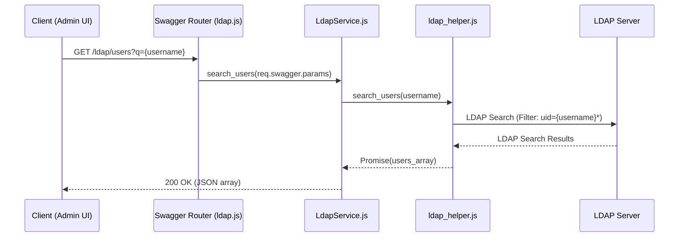
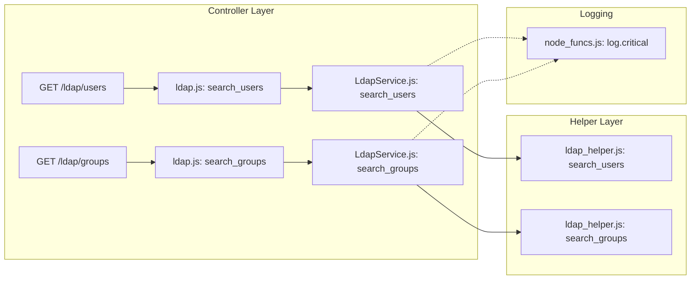

# LDAP Service

Relevant source files

The following files were used as context for generating this wiki page:

- [auth_service/api/controllers/LdapService.js](auth_service/api/controllers/LdapService.js)
- [auth_service/api/controllers/ldap.js](auth_service/api/controllers/ldap.js)

The **LDAP Service** provides a direct interface for querying an external LDAP directory without requiring users or groups to be pre-provisioned in the local MySQL database. While the standard RBAC endpoints (`/users`, `/groups`) return records already associated with the Ingenium system, the `/ldap` endpoints allow administrators to discover entities within the enterprise directory for the purpose of assignment and just-in-time provisioning.

## Overview and Purpose

The primary role of the LDAP Service is to support the Admin UI during the group-to-role assignment process. Before a role can be assigned to an LDAP group, the system must verify that the group exists in the external directory. 

Unlike the `UserService` or `GroupService`, which query the local `User` and `Group` models via Sequelize, the `LdapService` acts as a proxy to `ldap_helper.js`, which executes raw LDAP queries against the configured `LDAP_URL`.

### Key Differences: Local RBAC vs. LDAP Service

| Feature | RBAC Endpoints (`/users`, `/groups`) | LDAP Endpoints (`/ldap/users`, `/ldap/groups`) |
| :--- | :--- | :--- |
| **Data Source** | Local MySQL Database [auth_service/models/index.js:1-30]() | External LDAP Directory [auth_service/api/helpers/ldap_helper.js:1-10]() |
| **Content** | Only users/groups that have logged in or been assigned roles. | All entities matching the search criteria in the directory. |
| **Use Case** | Managing existing permissions and auditing. | Discovering new groups/users to add to the system. |
| **Logic Layer** | `UserService.js` / `GroupService.js` | `LdapService.js` |

Sources: [auth_service/api/controllers/LdapService.js:1-38](), [auth_service/api/controllers/ldap.js:1-13]()

---

## Request Flow: LDAP Discovery

The following diagram illustrates how a request from the Swagger-Node router flows through the LDAP controller to the helper module.

### LDAP Search Sequence

Sources: [auth_service/api/controllers/ldap.js:7-9](), [auth_service/api/controllers/LdapService.js:10-23]()

---

## Implementation Details

The LDAP Service is implemented across two primary files in the controller layer: `ldap.js` (the Swagger stub) and `LdapService.js` (the business logic).

### Controller Stub: ldap.js
The file `ldap.js` serves as the entry point defined in the Swagger specification. It extracts the parameters from the `req.swagger` object and passes them to the service implementation.

*   **search_users**: Proxies to `LdapService.search_users` [auth_service/api/controllers/ldap.js:7-9]().
*   **search_groups**: Proxies to `LdapService.search_groups` [auth_service/api/controllers/ldap.js:11-13]().

### Service Logic: LdapService.js
`LdapService.js` handles the asynchronous resolution of LDAP queries and error reporting.

#### User Search
The `search_users` function takes a query string (usually a partial username) and returns a list of matching LDAP user objects.
*   It calls `ldap_helper.search_users(username)` [auth_service/api/controllers/LdapService.js:12]().
*   If no users are found, it returns a `404 Not Found` with a descriptive message [auth_service/api/controllers/LdapService.js:13-14]().
*   In the event of a connection failure or LDAP error, it logs a `critical` error via `node_funcs.log` and returns a `400 Bad Request` [auth_service/api/controllers/LdapService.js:18-21]().

#### Group Search
The `search_groups` function is used primarily by the Admin UI to find LDAP groups to associate with roles.
*   It calls `ldap_helper.search_groups(groupname)` [auth_service/api/controllers/LdapService.js:27]().
*   Like the user search, it handles null results with a `404` and catches exceptions to log them as critical system errors [auth_service/api/controllers/LdapService.js:28-37]().

### Data Flow to Code Entity Mapping
This diagram maps the logical search operations to the specific functions and external helper calls.

Sources: [auth_service/api/controllers/LdapService.js:10-38](), [auth_service/api/controllers/ldap.js:1-13](), [auth_service/node_funcs.js:1-20]()

---

## Error Handling and Logging

The LDAP service differentiates between "Empty Results" and "System Failures":

1.  **Empty Results (404)**: This is considered a valid application state where the search criteria did not match any entries in the directory.
2.  **System Failures (400)**: These occur if the LDAP server is unreachable, credentials in `env_config.js` are invalid, or the search times out. These are logged using `log.critical` because they indicate an infrastructure issue preventing authentication or group management [auth_service/api/controllers/LdapService.js:19-21]().

Sources: [auth_service/api/controllers/LdapService.js:18-22](), [auth_service/api/controllers/LdapService.js:33-37]()
