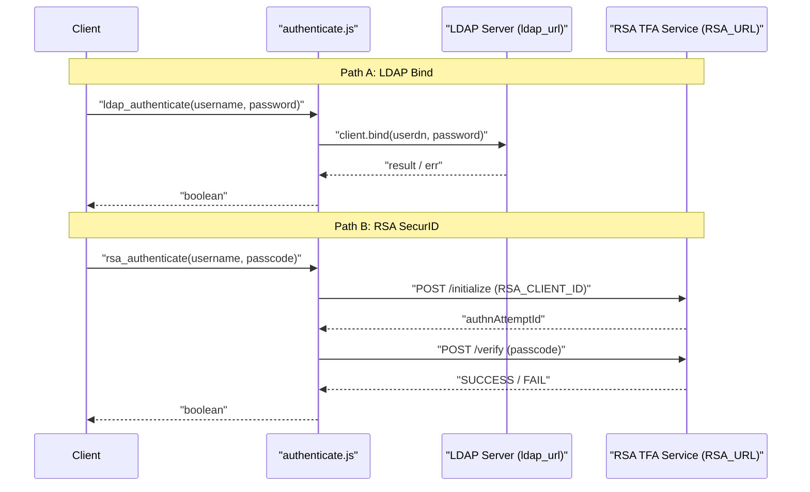

# LDAP and RSA Authentication Helpers

<details>
<summary>Relevant source files</summary>

The following files were used as context for generating this wiki page:

- [auth_service/api/helpers/authenticate.js](auth_service/api/helpers/authenticate.js)
- [auth_service/api/helpers/ldap_helper.js](auth_service/api/helpers/ldap_helper.js)
- [auth_service/ldap.conf](auth_service/ldap.conf)
- [auth_service/ntp.conf](auth_service/ntp.conf)

</details>


This page details the technical implementation of external authentication and directory service lookups within the Ingenium Auth Service. Credential verification is handled via `authenticate.js`, while directory searches and group membership validation are managed by `ldap_helper.js`.

## Authentication Implementation

The service supports two primary methods for verifying user credentials: standard LDAP Bind and RSA SecurID two-factor authentication. These are invoked during the `basicAuth` security handler flow.

### LDAP Authentication (ldap_authenticate)
The `ldap_authenticate` function performs a synchronous BIND operation against the configured LDAP server.

*   **DN Construction**: It builds a User Distinguished Name (DN) using the pattern `uid=<username>,ou=personnel,dc=dir,dc=jpl,dc=nasa,dc=gov` [auth_service/api/helpers/authenticate.js:15-16]().
*   **TLS Configuration**: The client is initialized with `secureProtocol: "TLSv1_method"` [auth_service/api/helpers/authenticate.js:27-27]().
*   **Bind Flow**: It attempts to bind with the provided password. If `ldap.InvalidCredentialsError` is encountered, it resolves to `false` [auth_service/api/helpers/authenticate.js:34-38]().
*   **Cleanup**: The LDAP client is destroyed regardless of the outcome using `client.destroy()` [auth_service/api/helpers/authenticate.js:46-46]().

### RSA SecurID Authentication (rsa_authenticate)
The RSA flow is a two-step asynchronous process communicating with a JPL-specific TFA (Two-Factor Authentication) primary service via `axios` [auth_service/api/helpers/authenticate.js:5-5]().

1.  **Initialize**: Sends a POST request to `${RSA_URL}/initialize` with a `clientId` and a generated `uuid.v4()` message ID [auth_service/api/helpers/authenticate.js:56-63]().
2.  **Verify**: Uses the `authnAttemptId` from the initialization response to send a second POST to `${RSA_URL}/verify`. It passes the user's passcode under the `SECURID` method ID [auth_service/api/helpers/authenticate.js:77-95]().
3.  **Validation**: Returns `true` only if the response `attemptResponseCode` is exactly `'SUCCESS'` [auth_service/api/helpers/authenticate.js:102-103]().

**Sources:**
*   [auth_service/api/helpers/authenticate.js:13-53]()
*   [auth_service/api/helpers/authenticate.js:55-111]()

---

## LDAP Directory Helper (ldap_helper.js)

The `ldap_helper.js` module provides an abstraction layer for searching the directory and validating the existence of users and groups. It uses `bluebird` to promisify the `ldapjs` client [auth_service/api/helpers/ldap_helper.js:6-23]().

### Key Functions and Logic

| Function | Purpose | Implementation Detail |
| :--- | :--- | :--- |
| `create_client` | Internal helper | Creates a client using `env_config.ldap_url` and attaches an error listener [auth_service/api/helpers/ldap_helper.js:15-25](). |
| `validate_ldap_group_exists` | Single group check | Searches with filter `(&(objectclass=jplgroup)(cn=<groupname>))` [auth_service/api/helpers/ldap_helper.js:61-92](). |
| `validate_ldap_groups_exist` | Batch group check | Joins multiple group names into a single LDAP OR filter: `(|(cn=gp1)(cn=gp2))` [auth_service/api/helpers/ldap_helper.js:26-59](). |
| `validate_user_exists` | User check | Searches with filter `(&(objectclass=person)(uid=<username>))` [auth_service/api/helpers/ldap_helper.js:129-162](). |
| `getGroupsForUser` | Membership lookup | First fetches all group names from the local MySQL `Group` model, then queries LDAP to see which of those groups contain the user as a `uniqueMember` [auth_service/api/helpers/ldap_helper.js:165-182](). |
| `get_user_info` | Attribute retrieval | Retrieves `givenName`, `sn` (surname), and `mail` for a specific `uid` [auth_service/api/helpers/ldap_helper.js:228-235](). |

### User and Group Search
The `LdapService.js` controller exposes search capabilities used by the RBAC UI to find entities to add to roles.

*   **search_users**: Searches for users where `uid` or `cn` matches the query string [auth_service/api/helpers/ldap_helper.js:311-325]().
*   **search_groups**: Searches for groups where `cn` matches the query string [auth_service/api/helpers/ldap_helper.js:358-372]().

**Sources:**
*   [auth_service/api/helpers/ldap_helper.js:15-25]()
*   [auth_service/api/helpers/ldap_helper.js:165-195]()
*   [auth_service/api/helpers/ldap_helper.js:311-372]()

---

## Configuration Files

The LDAP client behavior is influenced by local configuration files used during the underlying library's operation.

*   **ldap.conf**: Configures global LDAP defaults, specifically setting `TLS_REQCERT never` to bypass certificate verification and specifying the CA certificate path at `/etc/ssl/certs/cacert.pem` [auth_service/ldap.conf:17-18]().
*   **ntp.conf**: Ensures time synchronization with `time.jpl.nasa.gov`, which is critical for RSA SecurID passcode validity windows [auth_service/ntp.conf:15-15]().

**Sources:**
*   [auth_service/ldap.conf:1-19]()
*   [auth_service/ntp.conf:1-27]()

---

## Data Flow Diagrams

### Authentication Sequence
This diagram maps the natural language "Login Flow" to the code entities in `authenticate.js` and `env_config.js`.


**Sources:**
*   [auth_service/api/helpers/authenticate.js:13-111]()
*   [auth_service/env_config.js:1-50]()

### LDAP Group Validation Flow
This diagram shows how `ldap_helper.js` interacts with both the local `Sequelize` models and the remote LDAP server to determine a user's effective groups.

```mermaid
graph TD
    subgraph "Code Entity Space"
        LH["ldap_helper.js"]
        MD["models.Group (MySQL)"]
        LC["ldapjs Client"]
    end

    subgraph "External / Data Space"
        DS[("LDAP Directory")]
        DB[("Auth DB")]
    end

    LH -- "1. models.Group.findAll({attributes:['name']})" --> MD
    MD -- "SQL Query" --> DB
    LH -- "2. Construct Filter" --> LC
    Note right of LH: "(&(objectclass=jplgroup)(uniqueMember=userdn)(|(cn=gp1)(cn=gp2)))"
    LC -- "3. searchAsync" --> DS
    DS -- "Entries" --> LH
    LH -- "4. Return Group List" --> Caller["login_helper.js"]
```
**Sources:**
*   [auth_service/api/helpers/ldap_helper.js:165-185]()
*   [auth_service/server/models/index.js:1-30]()

---

## LDAP Search Controllers

The following endpoints are defined in `ldap.js` and implemented in `LdapService.js` to provide the API interface for directory lookups.

| Endpoint | Controller Function | Helper Function | Description |
| :--- | :--- | :--- | :--- |
| `GET /ldap/users` | `search_users` [auth_service/api/controllers/ldap.js:7-9]() | `ldap_helper.search_users` | Returns a list of LDAP users matching a query string. |
| `GET /ldap/groups` | `search_groups` [auth_service/api/controllers/ldap.js:11-13]() | `ldap_helper.search_groups` | Returns a list of LDAP groups matching a query string. |

### Error Handling
If the LDAP search fails or the client cannot connect, `LdapService.js` catches the error, logs a `warning` or `critical` message via `node_funcs.log`, and returns a `400 Bad Request` to the client.

**Sources:**
*   [auth_service/api/controllers/ldap.js:1-13]()
*   [auth_service/api/helpers/ldap_helper.js:20-22]()
*   [auth_service/node_funcs.js:1-50]()
