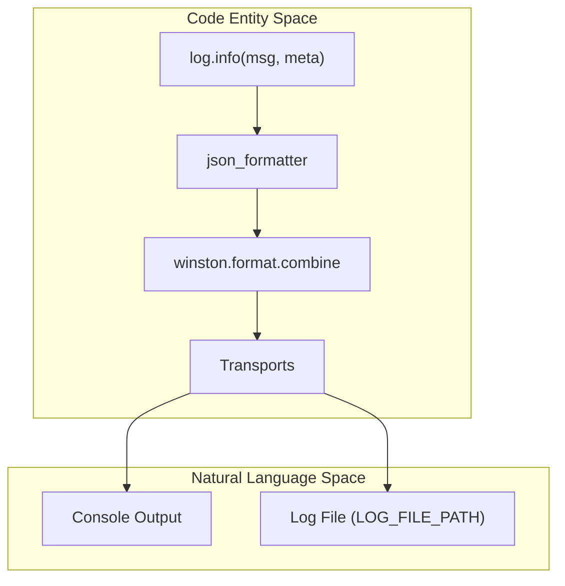
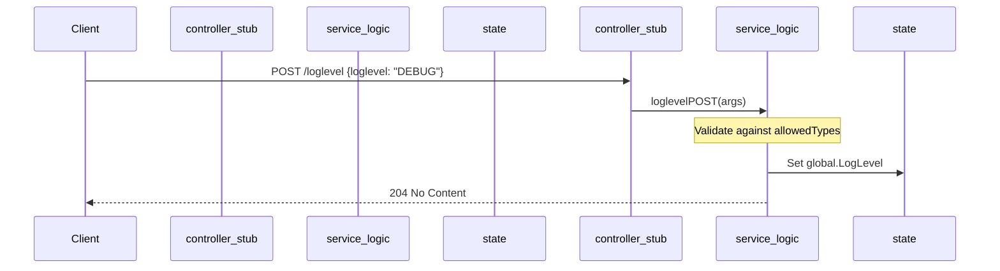

# Logging and Utility Functions

Relevant source files

The following files were used as context for generating this wiki page:

- [auth_service/api/controllers/LoggingService.js](auth_service/api/controllers/LoggingService.js)
- [auth_service/api/controllers/logging.js](auth_service/api/controllers/logging.js)
- [auth_service/node_funcs.js](auth_service/node_funcs.js)

This section details the logging infrastructure and shared utility functions defined in `node_funcs.js`. The Ingenium Auth Service utilizes a customized Winston-based logging system to provide structured JSON logs, supporting multiple severity levels and transport mechanisms. Additionally, it provides global string extensions and token parsing helpers used across the service.

## Logger Implementation

The service uses the `winston` library to create a centralized `log` object. It is configured with custom severity levels and a JSON formatter to ensure logs are machine-readable and consistent across different environments.

### Custom Log Levels
The logger defines a specific hierarchy of levels, extending the standard Winston set to include `critical` and `trace`.

| Level | Priority | Description |
| :--- | :--- | :--- |
| `critical` | 0 | Severe failures requiring immediate attention. |
| `error` | 1 | Runtime errors that do not stop the service but indicate a failure. |
| `warning` | 2 | Exceptional occurrences that are not errors. |
| `info` | 3 | Interesting runtime events (e.g., service start). |
| `debug` | 4 | Detailed information for workflow diagnosis. |
| `trace` | 5 | Highly granular informational logs. |

Sources: [auth_service/node_funcs.js:19-23]()

### JSON Formatting and Data Flow
All log entries are processed by a `json_formatter`. This function transforms log metadata into a structured JSON object. If an object is passed as metadata to a log call, it is merged into the top-level JSON structure.

1.  **Timestamping**: Every log entry is assigned a `new Date()` [auth_service/node_funcs.js:26]().
2.  **Level Normalization**: The level is converted to uppercase [auth_service/node_funcs.js:27]().
3.  **Metadata Handling**: 
    *   Strings are placed in a `details` array [auth_service/node_funcs.js:37-38]().
    *   Arrays are inspected and stored in `details` [auth_service/node_funcs.js:39-43]().
    *   Objects are merged directly into the root of the JSON log entry using `Object.assign` [auth_service/node_funcs.js:47-49]().

**Log Processing Pipeline**

Title: Logging Data Flow

Sources: [auth_service/node_funcs.js:25-55](), [auth_service/node_funcs.js:69-74]()

### Transports
The logger supports two primary transports:
*   **Console**: Always active [auth_service/node_funcs.js:57]().
*   **File**: Enabled if the `LOG_FILE_PATH` environment variable is set. It includes log rotation logic, limited to 5MB per file and a maximum of 2 files [auth_service/node_funcs.js:59-67]().

## Dynamic Log Level Management

The service provides an API interface to query and update the log level at runtime via the `global.LogLevel` variable. This logic is handled by the `LoggingService.js` controller.

*   **GET /loglevel**: Returns the current value of `global.LogLevel` [auth_service/api/controllers/LoggingService.js:16-24]().
*   **POST /loglevel**: Updates the log level. It validates the input against allowed types: `ERROR`, `WARNING`, `INFO`, `DEBUG`, `TRACE` [auth_service/api/controllers/LoggingService.js:26-47]().

Title: Log Level Management Logic

Sources: [auth_service/api/controllers/logging.js:15-17](), [auth_service/api/controllers/LoggingService.js:33-47]()

## Utility Functions

### String.prototype.format
A convenience extension added to the `String` prototype to allow positional parameter injection, similar to C# or Python formatting.
*   **Implementation**: Uses a regular expression `/{(\d+)}/g` to replace placeholders with corresponding arguments [auth_service/node_funcs.js:13-16]().
*   **Example**: `'Hello {0}'.format('World')` results in `'Hello World'`.

### parse_username
Extracts the username from a JWT provided in an Authorization header.
1.  Calls `parse_token` to strip the `Bearer ` prefix [auth_service/node_funcs.js:85-95]().
2.  Uses `jwt.verify` with `PUBLIC_PEM` and the `RS256` algorithm [auth_service/node_funcs.js:79]().
3.  Returns the `username` field from the decoded payload [auth_service/node_funcs.js:80-82]().

Sources: [auth_service/node_funcs.js:76-83](), [auth_service/node_funcs.js:85-95]()

## Health Check
The `LoggingService` also hosts the basic health check endpoint for the service.
*   **Endpoint**: `GET /health`
*   **Function**: `exports.health` [auth_service/api/controllers/LoggingService.js:7-14]()
*   **Response**: Returns a `200 OK` status with `{"message": "ok"}` to indicate the Node.js process is responsive [auth_service/api/controllers/LoggingService.js:13]().

Sources: [auth_service/api/controllers/LoggingService.js:7-14](), [auth_service/api/controllers/logging.js:7-9]()
