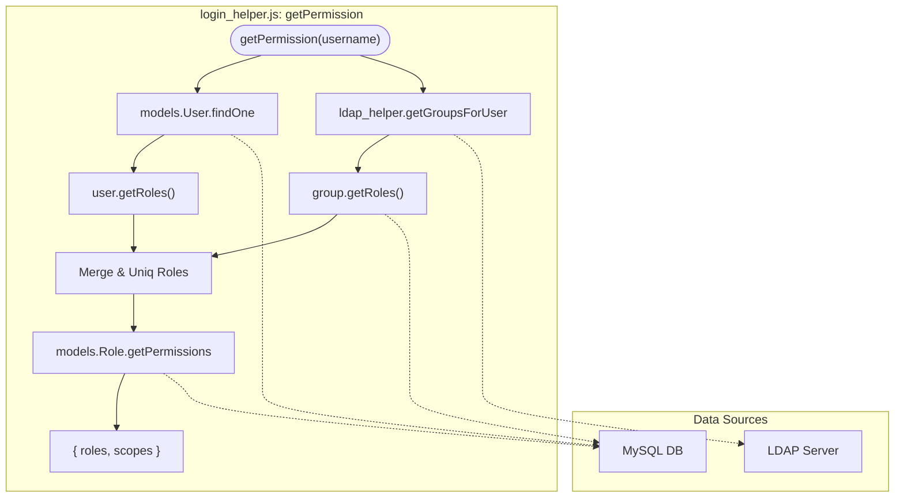
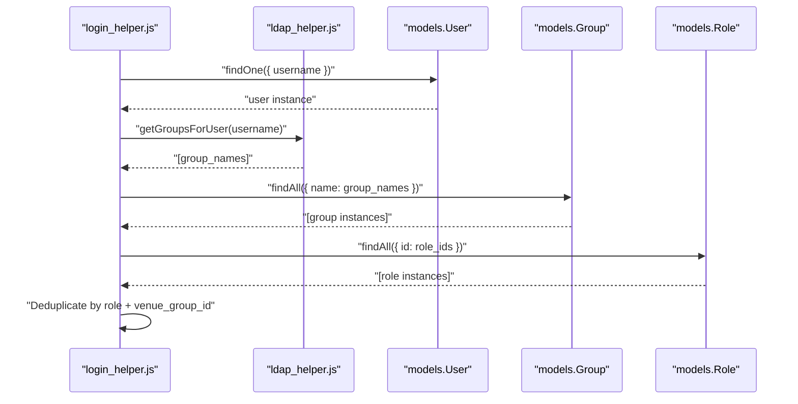

# Login Helper — Permission Aggregation

Relevant source files

The following files were used as context for generating this wiki page:

- [auth_service/api/helpers/README.md](auth_service/api/helpers/README.md)
- [auth_service/api/helpers/login_helper.js](auth_service/api/helpers/login_helper.js)

The `login_helper.js` module is a critical component of the Ingenium Auth Service, responsible for consolidating authorization data from multiple sources. It performs just-in-time provisioning of user records and aggregates permissions by merging local database assignments with LDAP group memberships.

## Permission Aggregation Flow

The primary function of this module is `getPermission`, which constructs a flat payload of roles and scopes (permissions) for a given user. This payload is subsequently used by the `jwt_helper.js` to sign the access token.

### The Aggregation Logic
The function follows a multi-step process to ensure all sources of authority are considered:
1.  **Local User Roles**: It retrieves roles assigned directly to the user in the MySQL database via `models.User.findOne` and `user.getRoles()` [auth_service/api/helpers/login_helper.js:22-39]().
2.  **LDAP Group Roles**: It queries LDAP via `ldap_helper.getGroupsForUser` to find which groups the user belongs to [auth_service/api/helpers/login_helper.js:42](). It then retrieves the roles associated with those specific groups from the `models.Group` and `group.getRoles()` associations [auth_service/api/helpers/login_helper.js:43-66]().
3.  **Deduplication and Venue Filtering**: It merges these roles and fetches their associated permissions (scopes) via `rolesObject.getPermissions()` [auth_service/api/helpers/login_helper.js:83-89](). Finally, it deduplicates them using `_.uniqBy` based on a composite key of name and `venue_group_id` [auth_service/api/helpers/login_helper.js:92-94]().

**Permission Aggregation Logic**

Sources: [auth_service/api/helpers/login_helper.js:13-101](), [auth_service/api/helpers/ldap_helper.js:7-8]()

## Just-In-Time Provisioning

The service implements a "lazy" provisioning strategy where user records are created in the local database only upon their first successful login.

### ensure_user
The `ensure_user` function checks if a `username` exists in the `models.User` table [auth_service/api/helpers/login_helper.js:105-109](). If the user is missing, it fetches the `displayName` from LDAP via `ldap_helper.get_user_info` and creates a new record using `models.User.create` [auth_service/api/helpers/login_helper.js:113-123](). This ensures that the local database remains a cache of users who have actually authenticated via LDAP.

### Batch Provisioning Helpers
Two additional helpers facilitate batch operations, typically used during administrative tasks or role assignments:
*   **ensure_users(usernames)**: Takes an array of usernames and uses `models.User.findOrCreate` to ensure they exist in the database [auth_service/api/helpers/login_helper.js:126-139]().
*   **ensure_groups(groupnames)**: Takes an array of LDAP group names and uses `models.Group.findOrCreate` to ensure they are represented in the local RBAC system [auth_service/api/helpers/login_helper.js:141-154]().

**Provisioning and Mapping**

| Function | Input | Entity Space Entity | Action |
| :--- | :--- | :--- | :--- |
| `ensure_user` | `username` | `models.User` | Creates user with LDAP `displayName` if missing. |
| `ensure_users` | `[username]` | `models.User` | Batch `findOrCreate` for user list. |
| `ensure_groups` | `[groupname]` | `models.Group` | Batch `findOrCreate` for LDAP groups. |

Sources: [auth_service/api/helpers/login_helper.js:103-154]()

## Key Functions and Data Flow

The module bridges the gap between the LDAP directory and the Sequelize models defined in the `server/models` directory.

### Entity Interaction Diagram

### Data Payload Structure
The final object returned by `getPermission` contains two arrays of objects, formatted for inclusion in the JWT:

1.  **Roles**: An array of `{ role: string, venue_group_id: string }` [auth_service/api/helpers/login_helper.js:97]().
2.  **Scopes**: An array of `{ scope: string, venue_group_id: string }` [auth_service/api/helpers/login_helper.js:98]().

This structure allows the consuming application to determine not just *what* a user can do, but *where* (at which venue/group) they are permitted to do it. The aggregation logic specifically concatenates the name and `venue_group_id` with a `#` separator during the uniqueness check to ensure distinct permissions across different venues are preserved [auth_service/api/helpers/login_helper.js:70-72](), [auth_service/api/helpers/login_helper.js:92-94]().

Sources: [auth_service/api/helpers/login_helper.js:69-99](), [auth_service/api/helpers/ldap_helper.js:7-8]()
