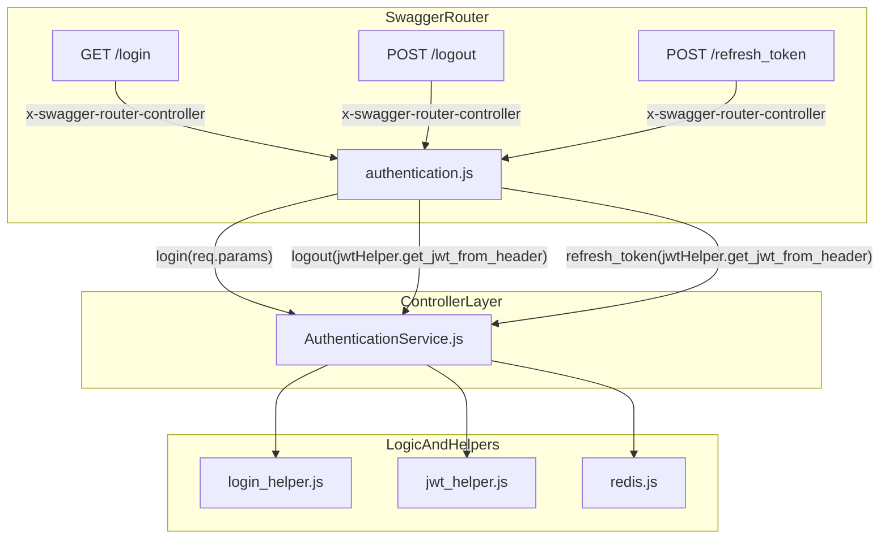
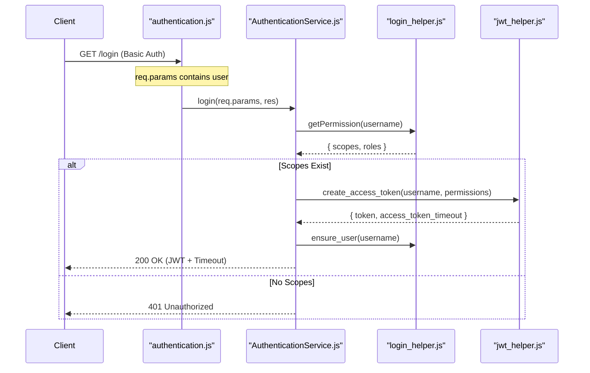
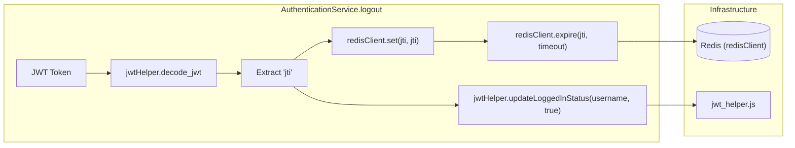

# Login, Logout, and Token Refresh Endpoints

Relevant source files

The following files were used as context for generating this wiki page:

- [auth_service/api/controllers/AuthenticationService.js](auth_service/api/controllers/AuthenticationService.js)
- [auth_service/api/controllers/authentication.js](auth_service/api/controllers/authentication.js)

This page details the implementation and data flow of the three primary authentication management endpoints in the Ingenium Auth Service. These endpoints handle the lifecycle of a user session, from initial credential verification to session termination and token renewal.

## Overview of Authentication Endpoints

The service exposes three routes for session management, all routed through the `authentication` controller.

| Endpoint | Method | Security | Description |
| :--- | :--- | :--- | :--- |
| `/login` | `GET` | `basicAuth` | Verifies credentials and issues a JWT. |
| `/logout` | `POST` | `ingenium_auth` | Invalidates the current session via Redis blacklisting. |
| `/refresh_token` | `POST` | `ingenium_auth` | Issues a new access token using a valid refresh token. |

Sources: [auth_service/api/controllers/authentication.js:1-19](), [auth_service/api/controllers/AuthenticationService.js:1-80]()

## Request Routing and Controller Mapping

The Ingenium Auth Service uses a Swagger-based routing system. The `swagger.yaml` file defines the `x-swagger-router-controller` for these paths as `authentication`, which maps to the `authentication.js` stub. This stub then delegates the actual business logic to `AuthenticationService.js`.

### Authentication Routing Flow
The following diagram illustrates how a request moves from the Swagger router to the core service logic.

**Diagram: Request Dispatch to AuthenticationService**

Sources: [auth_service/api/controllers/authentication.js:8-18](), [auth_service/api/controllers/AuthenticationService.js:2-7]()

---

## Login Endpoint (`GET /login`)

The login process is triggered after the `basicAuth` security handler has already verified the user's credentials (either via LDAP or the local RSA path). 

### Implementation Logic
1.  **Permission Aggregation**: The controller calls `login_helper.getPermission(username)` to aggregate roles and scopes from both the MySQL database and LDAP groups [auth_service/api/controllers/AuthenticationService.js:18-18]().
2.  **Token Creation**: If the user has valid scopes, `jwtHelper.create_access_token` is called to sign a new RS256 JWT [auth_service/api/controllers/AuthenticationService.js:22-23]().
3.  **JIT Provisioning**: The system ensures the user exists in the local database via `login_helper.ensure_user(username)` [auth_service/api/controllers/AuthenticationService.js:26-26]().
4.  **Response**: Returns a JSON object containing the `access_token` and the `access_token_timeout` [auth_service/api/controllers/AuthenticationService.js:24-24]().

### Data Flow: Login

Sources: [auth_service/api/controllers/AuthenticationService.js:11-30](), [auth_service/api/controllers/authentication.js:8-10]()

---

## Logout Endpoint (`POST /logout`)

Logout in this service is "server-side invalidation." Since JWTs are stateless, the service uses Redis to blacklist the unique identifier (`jti`) of the token.

### Implementation Logic
1.  **Token Extraction**: The `authentication.js` stub extracts the JWT from the `Authorization` header using `jwtHelper.get_jwt_from_header(req)` [auth_service/api/controllers/authentication.js:13-13]().
2.  **Blacklisting**: The `jti` (JWT ID) is extracted from the decoded token and stored in Redis via `redisClient.set(jti, jti)` [auth_service/api/controllers/AuthenticationService.js:45-50]().
3.  **Expiration**: The Redis key is set to expire automatically after the `ACCESS_TOKEN_TIMEOUT` duration using `redisClient.expire`, ensuring the blacklist doesn't grow indefinitely [auth_service/api/controllers/AuthenticationService.js:55-55]().
4.  **Status Update**: The user's `logged_in` status in the database is updated via `jwtHelper.updateLoggedInStatus(username, true)` [auth_service/api/controllers/AuthenticationService.js:57-57]().

**Diagram: Token Blacklisting Logic**

Sources: [auth_service/api/controllers/AuthenticationService.js:33-60](), [auth_service/api/controllers/authentication.js:12-14]()

---

## Token Refresh Endpoint (`POST /refresh_token`)

The refresh endpoint allows clients to obtain a new access token without re-entering credentials, provided they possess a valid, non-expired refresh token.

### Implementation Logic
1.  **Refresh Logic**: The controller delegates to `jwtHelper.refresh_token(token)` [auth_service/api/controllers/AuthenticationService.js:70-70]().
2.  **Error Handling**:
    *   If the token is invalid, it returns `401 Unauthorized` [auth_service/api/controllers/AuthenticationService.js:71-72]().
    *   If the token has exceeded the "long expire" limit, it returns `403 Forbidden` [auth_service/api/controllers/AuthenticationService.js:73-74]().
3.  **Success**: Returns a new `access_token` and its corresponding `access_token_timeout` [auth_service/api/controllers/AuthenticationService.js:76-76]().

### Response Shapes

| Status Code | Condition | Response Body |
| :--- | :--- | :--- |
| `200 OK` | Successful refresh | `{"access_token": "...", "access_token_timeout": "..."}` |
| `401 Unauthorized` | Invalid/Malformed token | `{"message": "Unauthorized"}` |
| `403 Forbidden` | Token expired (Long expire) | `{"message": "Long expire, Unauthorized"}` |

Sources: [auth_service/api/controllers/AuthenticationService.js:62-78](), [auth_service/api/controllers/authentication.js:16-18]()
