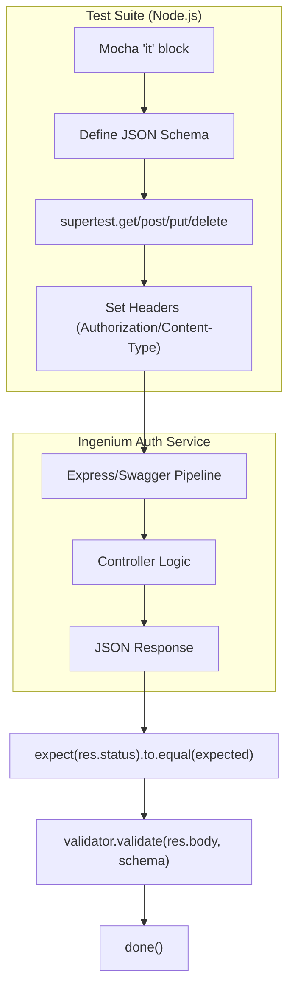

# Node.js Client Test Suite

Relevant source files

The following files were used as context for generating this wiki page:

- [auth_service/test/api/client/groups-test.js](auth_service/test/api/client/groups-test.js)
- [auth_service/test/api/client/healthcheck-test.js](auth_service/test/api/client/healthcheck-test.js)
- [auth_service/test/api/client/ldap-groups-test.js](auth_service/test/api/client/ldap-groups-test.js)
- [auth_service/test/api/client/ldap-users-test.js](auth_service/test/api/client/ldap-users-test.js)
- [auth_service/test/api/client/login-test.js](auth_service/test/api/client/login-test.js)
- [auth_service/test/api/client/loglevel-test.js](auth_service/test/api/client/loglevel-test.js)
- [auth_service/test/api/client/logout-test.js](auth_service/test/api/client/logout-test.js)
- [auth_service/test/api/client/permissions-test.js](auth_service/test/api/client/permissions-test.js)
- [auth_service/test/api/client/refresh_token-test.js](auth_service/test/api/client/refresh_token-test.js)
- [auth_service/test/api/client/roles-test.js](auth_service/test/api/client/roles-test.js)
- [auth_service/test/api/client/swagger-test.js](auth_service/test/api/client/swagger-test.js)
- [auth_service/test/api/client/users-test.js](auth_service/test/api/client/users-test.js)
- [auth_service/test/api/controllers/README.md](auth_service/test/api/controllers/README.md)
- [auth_service/test/api/controllers/hello_world.js](auth_service/test/api/controllers/hello_world.js)
- [auth_service/test/api/helpers/README.md](auth_service/test/api/helpers/README.md)

The Node.js Client Test Suite provides a comprehensive set of automated API tests located within `auth_service/test/api/client/`. These tests are designed to validate the Ingenium Auth Service (IAS) against its Swagger (OpenAPI) specification, ensuring that every endpoint adheres to the defined request/response contracts and security requirements.

## Test Architecture and Tools

The suite is built using a standard Node.js testing stack, leveraging `mocha` as the test runner and several key libraries for API interaction and validation.

| Library | Role |
| :--- | :--- |
| `supertest` | Handles HTTP requests to the API endpoints [auth_service/test/api/client/groups-test.js:53-54](). |
| `chai` | Provides the assertion interface (`expect`) [auth_service/test/api/client/groups-test.js:6,55](). |
| `z-schema` | Validates JSON response bodies against defined JSON Schema objects [auth_service/test/api/client/groups-test.js:7,52](). |
| `dotenv` | Loads environment variables (like `INGENIUM_AUTH` tokens) from `.env` files [auth_service/test/api/client/ldap-users-test.js:53](). |

### Custom Format Validation
To support Swagger-specific data formats that are not native to standard JSON Schema, the test suite implements a `customFormats` helper. This ensures that values like `int32`, `double`, and `dateTime` are correctly validated during API tests [auth_service/test/api/client/groups-test.js:8-48]().

**Data Validation Logic:**
- **int32**: Uses bitwise shifting (`val >> 0`) to ensure the value fits in a 32-bit signed integer [auth_service/test/api/client/groups-test.js:21-24]().
- **double**: Uses a regex pattern `decimalPattern` to validate floating-point precision [auth_service/test/api/client/groups-test.js:13-18]().
- **dateTime**: Validates strings using `Date.parse()` [auth_service/test/api/client/groups-test.js:40-42]().
- **password**: Simply validates that the input is a string [auth_service/test/api/client/groups-test.js:44-47]().

**Sources:** [auth_service/test/api/client/groups-test.js:6-55](), [auth_service/test/api/client/login-test.js:1-51]()

---

## Test Execution Pattern

The tests follow a consistent "Arrange-Act-Assert" pattern. Every test file typically defines a JSON Schema at the start of the `it` block, executes the request via `supertest`, and then validates the response status and body.

### Data Flow: API Request to Schema Validation

The following diagram illustrates how a test case interacts with the service and validates the result.

**Test Execution Flow**

**Sources:** [auth_service/test/api/client/login-test.js:57-82](), [auth_service/test/api/client/groups-test.js:84-96]()

---

## Core Test Modules

### Authentication and Session Tests
These tests cover the lifecycle of a user session, including credential verification and token management.

*   **Login (`login-test.js`)**: Validates `GET /login`. It checks for the presence of `access_token` and `access_token_timeout` in successful responses [auth_service/test/api/client/login-test.js:59-69](). It also tests 401 (Unauthorized) and 404 (User Not Found) scenarios [auth_service/test/api/client/login-test.js:84,110]().
*   **Logout (`logout-test.js`)**: Validates `POST /logout`. It ensures that the endpoint returns a 200 status and a null/empty body upon successful token invalidation [auth_service/test/api/client/logout-test.js:57-70]().
*   **Refresh Token (`refresh_token-test.js`)**: Validates the rotation of JWTs using the `POST /refresh_token` endpoint, checking for a new `access_token` in the response [auth_service/test/api/client/refresh_token-test.js:57-83]().

### RBAC Management Tests
The suite includes granular tests for Roles, Users, Groups, and Permissions. These tests often include sub-resource validation.

*   **Groups (`groups-test.js`)**: Validates listing all groups with query parameters (`limit`, `offset`, `q`) [auth_service/test/api/client/groups-test.js:84-87]().
*   **Roles (`roles-test.js`)**: Validates listing all roles and creating new roles via `POST /roles` [auth_service/test/api/client/roles-test.js:56,177](). It ensures roles contain `id`, `name`, and `description` fields [auth_service/test/api/client/roles-test.js:60-82]().
*   **Users (`users-test.js`)**: Validates listing users with pagination metadata (`total`, `results`) [auth_service/test/api/client/users-test.js:59-80]().
*   **Permissions (`permissions-test.js`)**: Validates the retrieval of the flat permission list [auth_service/test/api/client/permissions-test.js:57-72]().
*   **LDAP Integration (`ldap-users-test.js`, `ldap-groups-test.js`)**: Tests the proxy endpoints that query the configured LDAP server for users and groups directly [auth_service/test/api/client/ldap-users-test.js:57-72](), [auth_service/test/api/client/ldap-groups-test.js:57-64]().

### System and Utility Tests
*   **Healthcheck (`healthcheck-test.js`)**: A simple test ensuring the `/healthcheck` endpoint is reachable and returns 200 OK [auth_service/test/api/client/healthcheck-test.js:10-20]().
*   **Loglevel (`loglevel-test.js`)**: Validates the ability to dynamically `GET` the current log level and `POST` updates to change the Winston logger's verbosity [auth_service/test/api/client/loglevel-test.js:56,104]().
*   **Swagger (`swagger-test.js`)**: Placeholder for validating that the `/swagger` endpoint correctly serves the API documentation [auth_service/test/api/client/swagger-test.js:1]().

**Sources:** [auth_service/test/api/client/login-test.js:55-164](), [auth_service/test/api/client/logout-test.js:55-102](), [auth_service/test/api/client/groups-test.js:57-188](), [auth_service/test/api/client/loglevel-test.js:55-152](), [auth_service/test/api/client/healthcheck-test.js:1-24]()

---

## Code Entity Mapping

The test suite maps directly to the API controllers and the environment configuration.

**System Name to Code Entity Map**
| API Endpoint | Test File | Primary Controller (Target) |
| :--- | :--- | :--- |
| `GET /login` | `login-test.js` | `AuthenticationService.login` |
| `POST /logout` | `logout-test.js` | `AuthenticationService.logout` |
| `GET /groups` | `groups-test.js` | `GroupService.list_groups` |
| `GET /loglevel` | `loglevel-test.js` | `hello_world.get_loglevel` |
| `POST /loglevel` | `loglevel-test.js` | `hello_world.set_loglevel` |

### Hello World Controller Stub
The `auth_service/test/api/controllers/hello_world.js` file serves as a utility controller for system-level operations that do not fit into the standard RBAC services. It specifically handles the `loglevel` management logic and basic connectivity stubs.

**Sources:** [auth_service/test/api/client/loglevel-test.js:64,106](), [auth_service/test/api/controllers/hello_world.js:1-20]()

---

## Test Environment Requirements

The Node.js client tests require a running instance of the Auth Service and valid credentials.

1.  **API URL**: The suite is hardcoded to target `https://100.64.153.9` by default [auth_service/test/api/client/groups-test.js:54]().
2.  **Authentication**:
    *   `INGENIUM_AUTH`: An environment variable containing a valid Bearer token for authenticated requests [auth_service/test/api/client/groups-test.js:88]().
    *   `BASIC_AUTH`: An environment variable containing Base64 encoded `username:password` for login tests [auth_service/test/api/client/login-test.js:73]().
3.  **TLS**: In development environments, `NODE_TLS_REJECT_UNAUTHORIZED=0` may be required to bypass self-signed certificate errors [auth_service/test/api/client/groups-test.js:3]().

**Sources:** [auth_service/test/api/client/groups-test.js:3,54,88](), [auth_service/test/api/client/login-test.js:73]()
