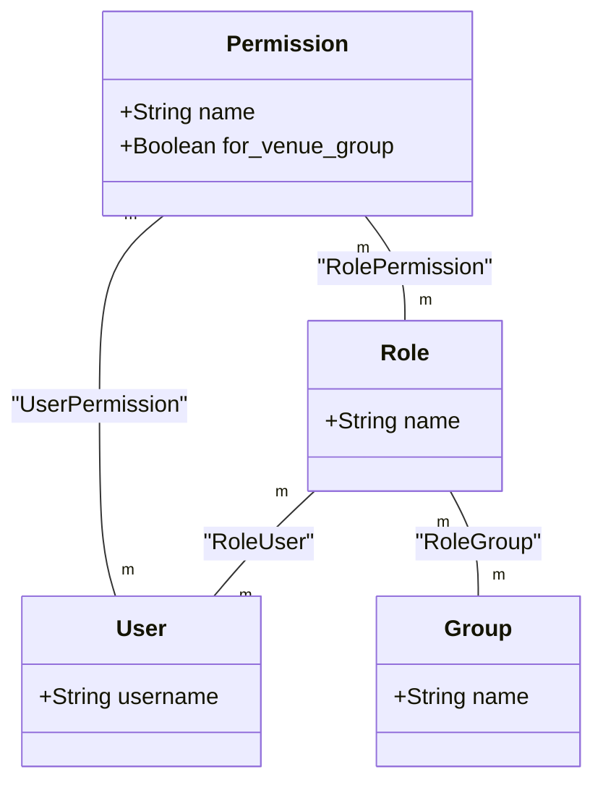
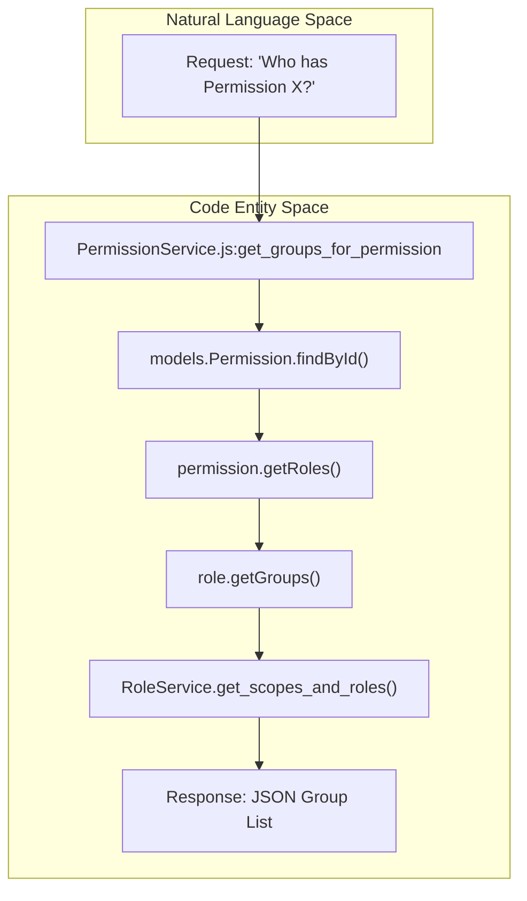
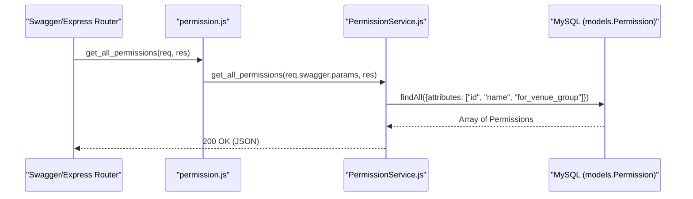

# Permission Service

Relevant source files

The following files were used as context for generating this wiki page:

- [auth_service/api/controllers/PermissionService.js](auth_service/api/controllers/PermissionService.js)
- [auth_service/api/controllers/permission.js](auth_service/api/controllers/permission.js)

The Permission Service manages the granular access control units within the Ingenium Auth Service. Permissions are not assigned directly to users or groups in a standard flow; instead, they are typically associated with **Roles**, which act as containers. This service provides endpoints to list all available permissions, retrieve specific permission metadata, and perform reverse lookups to identify which users or groups hold a specific permission through role traversal.

## Permission Model and Data Structure

The `Permission` model defines the individual capabilities within the system.

*   **`name`**: A unique string identifying the permission (e.g., "read:users"). [auth_service/api/controllers/PermissionService.js:21-21]()
*   **`for_venue_group`**: A boolean flag indicating if the permission is restricted to a specific venue group context. [auth_service/api/controllers/PermissionService.js:21-21]()

### Associations
The `Permission` model maintains many-to-many relationships with Roles and Users via join tables (managed via Sequelize associations):
*   **Roles**: Linked via the `RolePermission` through-table. Accessing these is done via `permission.getRoles()`. [auth_service/api/controllers/PermissionService.js:40-40]()
*   **Users**: Linked via the `UserPermission` through-table. Accessing these is done via `role.getUsers()`. [auth_service/api/controllers/PermissionService.js:104-104]()

**Permission Entity Relationships**

Sources: [auth_service/api/controllers/PermissionService.js:40-45](), [auth_service/api/controllers/PermissionService.js:101-107]()

## Implementation Details

The logic is split between `permission.js` (the Swagger-compatible stub) and `PermissionService.js` (the business logic controller).

### Core Functions

#### Listing and Retrieval
*   **`get_all_permissions`**: Fetches all permissions from the database using `models.Permission.findAll`, returning their `id`, `name`, and `for_venue_group` status. [auth_service/api/controllers/PermissionService.js:12-29]()
*   **`get_permission`**: Retrieves a single permission by its unique ID using `models.Permission.findById`. [auth_service/api/controllers/PermissionService.js:70-90]()

#### Reverse Traversal (Users and Groups)
Because permissions are usually granted via Roles, finding who has a permission requires traversing the relationship graph.

1.  **`get_groups_for_permission`**: 
    *   Finds the permission by ID. [auth_service/api/controllers/PermissionService.js:38-38]()
    *   Calls `permission.getRoles()` to find all associated roles. [auth_service/api/controllers/PermissionService.js:40-40]()
    *   Iterates through roles using `Promise.map` to collect groups via `role.getGroups()`. [auth_service/api/controllers/PermissionService.js:42-46]()
    *   Deduplicates the resulting group list using `_.uniqBy` and enriches it using `RoleService.get_scopes_and_roles`. [auth_service/api/controllers/PermissionService.js:49-53]()

2.  **`get_users_for_permission`**:
    *   Finds the permission and retrieves associated roles via `permission.getRoles()`. [auth_service/api/controllers/PermissionService.js:101-102]()
    *   Traverses roles to find users via `role.getUsers()`. [auth_service/api/controllers/PermissionService.js:104-107]()
    *   Deduplicates the users via `_.uniqBy` and enriches the objects via `UserService.get_user_full`. [auth_service/api/controllers/PermissionService.js:110-114]()

**Traversal Logic: Permission to Entities**

Sources: [auth_service/api/controllers/PermissionService.js:31-68](), [auth_service/api/controllers/PermissionService.js:92-128]()

## API Mapping

The service is exposed via the following endpoints defined in the Swagger specification and routed through `permission.js`. [auth_service/api/controllers/permission.js:1-21]()

| Operation | Controller Function | Description |
| :--- | :--- | :--- |
| `GET /permissions` | `get_all_permissions` | Lists all permissions in the system. |
| `GET /permissions/{id}` | `get_permission` | Returns metadata for a specific permission. |
| `GET /permissions/{id}/groups` | `get_groups_for_permission` | Returns all groups associated with roles containing this permission. |
| `GET /permissions/{id}/users` | `get_users_for_permission` | Returns all users associated with roles containing this permission. |

**Request Routing Diagram**

Sources: [auth_service/api/controllers/permission.js:7-9](), [auth_service/api/controllers/PermissionService.js:12-29]()
