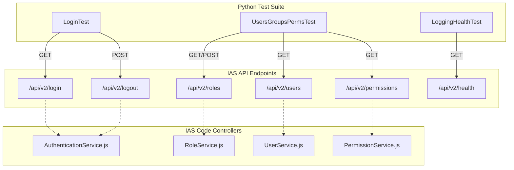
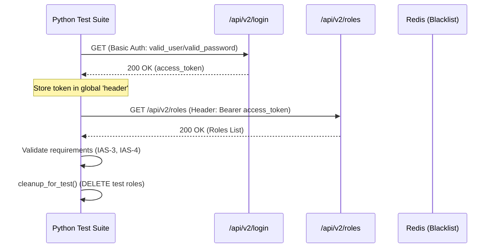

# Python Integration Test Suite

Relevant source files

The following files were used as context for generating this wiki page:

- [tests/auth_unit_test.py](tests/auth_unit_test.py)
- [tests/requirements.txt](tests/requirements.txt)

The Python Integration Test Suite provides comprehensive end-to-end validation of the Ingenium Auth Service (IAS). It verifies that the service meets formal functional requirements (IAS-1 through IAS-9) by interacting with the live API endpoints. These tests ensure that authentication, Role-Based Access Control (RBAC), token management, and logging systems operate correctly in a deployed environment.

## Requirement Traceability

The test suite is explicitly mapped to the Ingenium Auth Service requirements to ensure full coverage of the system's specifications.

| Requirement ID | Description | Test Implementation |
| :--- | :--- | :--- |
| **IAS-1** | Authenticate users via LDAP | `LoginTest.test_valid_login` |
| **IAS-2** | Provide JWT with timeout (27 mins) | `LoginTest.test_jwt_payload` |
| **IAS-3** | Assign specific users to user defined categories (roles) | `UsersGroupsPermsTest.test_user_role_assignment` |
| **IAS-4** | Assign specific Ingenium permissions (or scopes) to roles | `UsersGroupsPermsTest.test_role_permission_assignment` |
| **IAS-5** | Assign groups of users (LDAP groups) to roles | `UsersGroupsPermsTest.test_group_role_assignment` |
| **IAS-6** | Access privileges based on combination of assigned roles | `UsersGroupsPermsTest.test_combined_permissions` |
| **IAS-7** | Token blacklisting on user logout | `LoginTest.test_logout_blacklist` |
| **IAS-8** | Logout requests to external service managers | `LoginTest.test_logout_flow` |
| **IAS-9** | Support specific scopes (admin, execute, config_mgmt, etc.) | `UsersGroupsPermsTest.test_scope_definitions` |

Sources: [tests/auth_unit_test.py:5-15](), [tests/test_ci_auth.py:5-15]()

## Environment Setup and Dependencies

The test suite relies on specific environment variables to authenticate against the service and locate the server instance.

### Environment Variables
*   `INGENIUM_TESTUSER`: The LDAP username used for testing [tests/auth_unit_test.py:157-157]().
*   `INGENIUM_TESTPASS`: The password for the test user [tests/auth_unit_test.py:158-158]().
*   `AUTH_SERVICE_URL`: The base URL of the service (defaults to `http://localhost:8007` in CI) [tests/test_ci_auth.py:55-55]().

### Dependencies
The suite requires the following Python packages defined in `requirements.txt`:
*   `PyJWT`: For decoding and verifying issued tokens [tests/requirements.txt:1-1]().
*   `requests`: For making HTTP calls to the API endpoints [tests/requirements.txt:2-2]().
*   `cryptography`: Backend for JWT signing operations [tests/requirements.txt:3-3]().
*   `unittest-xml-reporting`: To generate XML test reports for Jenkins integration [tests/requirements.txt:4-4]().

## Test Data Flow and Entity Mapping

The following diagram illustrates how the Python test classes interact with the specific API endpoints and underlying code entities within the Auth Service.

### Integration Test to Code Entity Mapping

Sources: [tests/auth_unit_test.py:59-68](), [tests/test_ci_auth.py:66-75]()

## Key Test Functions and Lifecycle

### Initialization and Cleanup
Before and after test execution, the suite performs environment preparation to ensure idempotency.

*   **`set_login_info()`**: Determines credentials. It checks for environment variables first; if missing, it prompts the user via `getpass` [tests/auth_unit_test.py:150-162]().
*   **`cleanup_for_test()`**: A critical utility that purges existing test roles (e.g., `TESTROLE`, `REALLYTESTING`, `ROLE_MGMT_TEST`) to prevent primary key collisions or state pollution between runs [tests/auth_unit_test.py:163-189]().
*   **`setup_logging()`**: Configures the `logging.StreamHandler` and optional `FileHandler` to capture test execution details with configurable verbosity [tests/auth_unit_test.py:103-146]().

### Test Execution Logic
The following diagram describes the typical flow of an integration test targeting a protected resource.

Sources: [tests/auth_unit_test.py:170-187](), [tests/test_ci_auth.py:178-195]()

## Test Classes and Coverage

### LoginTest
Focuses on the authentication lifecycle.
*   **Token Verification**: Decodes the JWT using `jwt.decode` to verify the payload contains the expected `sub` (username), `scopes`, and `roles` [tests/auth_unit_test.py:42-42]().
*   **Refresh Flow**: Tests the `/api/v2/refresh_token` endpoint to ensure session continuity [tests/auth_unit_test.py:60-60]().
*   **Logout**: Verifies that once `/api/v2/logout` is called, the token is invalidated in the Redis blacklist [tests/auth_unit_test.py:61-61]().

### UsersGroupsPermsTest
Tests the RBAC management API.
*   **Role CRUD**: Creates roles, updates them, and deletes them using `/api/v2/roles` [tests/auth_unit_test.py:65-65]().
*   **Associations**: Adds and removes users and LDAP groups from roles, then verifies the resulting `scopes` in the JWT payload after a fresh login.
*   **Pagination**: Validates that listing users/groups supports query parameters for filtering and pagination [tests/auth_unit_test.py:64-66]().

### LoggingHealthTest
Validates system observability.
*   **Health Check**: Calls `/api/v2/health` to ensure the service and its dependencies (MySQL, Redis) are reachable [tests/auth_unit_test.py:62-62]().
*   **Log Level Management**: Tests the `/api/v2/logging` endpoint to dynamically change the Winston logger's verbosity [tests/auth_unit_test.py:63-63]().

### Two-Factor Authentication Example
The `tests/tfa_example.py` script provides a reference implementation for handling RSA SecurID two-step authentication, simulating the interaction between the user and the `/api/v2/login` endpoint when an RSA passcode is required.

Sources: [tests/auth_unit_test.py:59-68](), [tests/test_ci_auth.py:66-75](), [tests/tfa_example.py:1-20]()
