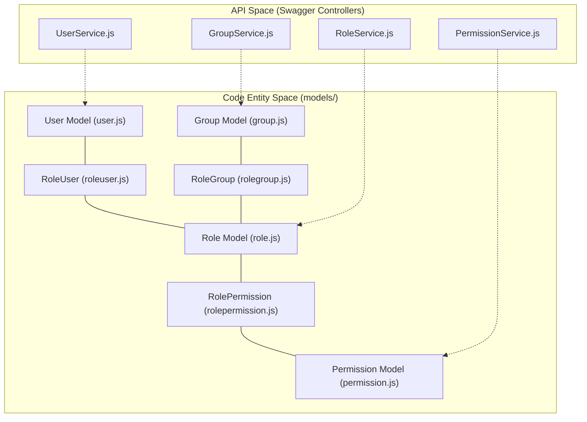
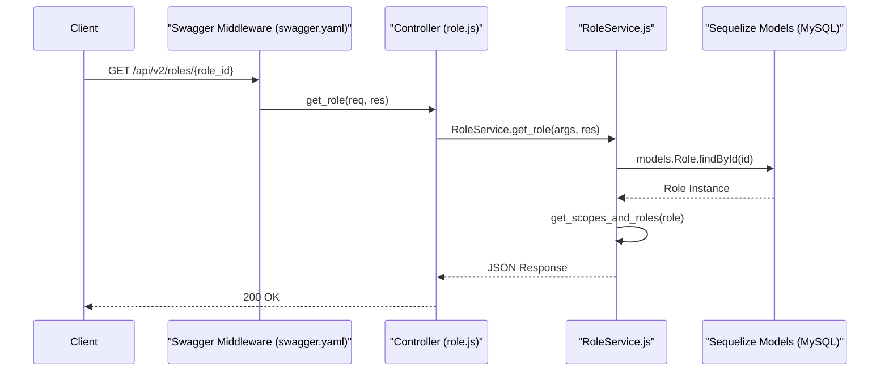

# RBAC API — Roles, Permissions, Users, and Groups

Relevant source files

The following files were used as context for generating this wiki page:

- [auth_service/api/controllers/GroupService.js](auth_service/api/controllers/GroupService.js)
- [auth_service/api/controllers/PermissionService.js](auth_service/api/controllers/PermissionService.js)
- [auth_service/api/controllers/README.md](auth_service/api/controllers/README.md)
- [auth_service/api/controllers/RoleService.js](auth_service/api/controllers/RoleService.js)
- [auth_service/api/controllers/UserService.js](auth_service/api/controllers/UserService.js)

The Role-Based Access Control (RBAC) API provides the administrative interface for managing the Ingenium platform's security model. It governs the relationships between four primary resource types: **Users**, **Groups**, **Roles**, and **Permissions**. The API is defined via Swagger and implemented through a series of specialized services that interface with the MySQL persistence layer via the Sequelize ORM.

### Resource Model and Relationships

The authorization model follows a hierarchical structure where permissions are not granted directly to users, but rather aggregated through roles. Roles can be assigned to individual users or to LDAP groups.

-   **Permissions**: The smallest unit of access (e.g., `admin`, `author`, `redline`). These correspond to "scopes" in the JWT.
-   **Roles**: Containers for one or more permissions.
-   **Groups**: LDAP-backed collections of users that can be assigned roles.
-   **Users**: Individual accounts that inherit permissions via direct role assignment or group membership.

#### Entity Relationship Mapping
The following diagram maps the natural language concepts to the specific Sequelize models and database join tables used in the codebase.

**Title: RBAC Entity Relationship Diagram**

Sources: [auth_service/server/models/index.js:28-66](), [auth_service/api/controllers/RoleService.js:2-7](), [auth_service/api/controllers/UserService.js:2-6]()

---

### API Architecture

The RBAC system is exposed via a standard Controller-Service-Model architecture. Swagger handles request routing and validation, directing calls to controller stubs which delegate logic to specialized Service classes.

**Title: RBAC Request Flow (Example: Role Retrieval)**

Sources: [auth_service/api/controllers/RoleService.js:237-260](), [auth_service/api/controllers/RoleService.js:464-508]()

---

### Core Resource Components

#### 1. Role Service
The `RoleService` manages the lifecycle of roles and their associations. It handles the logic for attaching permissions to roles and assigning those roles to users or LDAP groups. It also implements specialized filtering for `venue_group_id` to support multi-tenant venue isolation.
*   **Key Logic**: Validates LDAP groups and users exist via `ldap_helper` before assignment [auth_service/api/controllers/RoleService.js:31-33]() and calculates the union of scopes for a role using `get_scopes_and_roles` [auth_service/api/controllers/RoleService.js:464-464]().
*   **For details, see [Role Service](#4.1)**.

#### 2. User Service
The `UserService` provides management for user identities. While authentication happens via LDAP or RSA, the `User` model tracks local metadata, such as the `login_expire` timestamp.
*   **Key Logic**: Pagination and complex filtering (e.g., listing users by `rolefilter`, `scopefilter`, or `loggedin` status) [auth_service/api/controllers/UserService.js:44-164]().
*   **For details, see [User Service](#4.2)**.

#### 3. Group Service
The `GroupService` manages LDAP groups that have been "onboarded" into the RBAC system. It allows administrators to treat collections of LDAP users as a single entity for role assignment.
*   **Key Logic**: In-memory deduplication using `_.uniqBy` and manual pagination (`_.drop`, `_.take`) when traversing associations from Roles or Permissions to Groups [auth_service/api/controllers/GroupService.js:57-76]().
*   **For details, see [Group Service](#4.3)**.

#### 4. Permission Service
The `Permission Service` acts as a registry of available system scopes. It allows the system to query which users or groups ultimately hold a specific permission by traversing the Role hierarchy.
*   **Key Logic**: Traversal logic to find all users associated with a permission via `permission.getRoles()` then `role.getUsers()` [auth_service/api/controllers/PermissionService.js:101-108]().
*   **For details, see [Permission Service](#4.4)**.

#### 5. LDAP Service
The `LdapService` provides direct access to the LDAP directory for searching users and groups that have not yet been provisioned in the local database.
*   **For details, see [LDAP Service](#4.5)**.

---

### Summary of RBAC Endpoints

The following table summarizes the primary management endpoints defined in the Swagger specification and implemented in the controllers.

| Resource | Base Path | Key Operations | Controller |
| :--- | :--- | :--- | :--- |
| **Roles** | `/roles` | GET (list), POST (create), GET/PUT/DELETE `{id}` | `RoleService.js` |
| **Users** | `/users` | GET (list), GET/PUT/DELETE `{id}` | `UserService.js` |
| **Groups** | `/groups` | GET (list), GET/DELETE `{id}` | `GroupService.js` |
| **Permissions** | `/permissions` | GET (list), GET `{id}` | `PermissionService.js` |

Sources: [auth_service/api/controllers/RoleService.js:127-140](), [auth_service/api/controllers/UserService.js:11-24](), [auth_service/api/controllers/GroupService.js:10-25](), [auth_service/api/controllers/PermissionService.js:12-21]()
