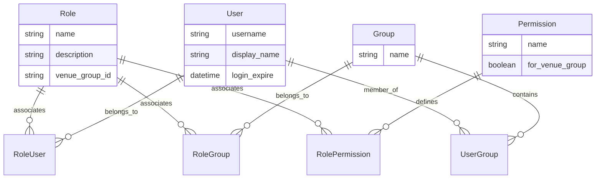
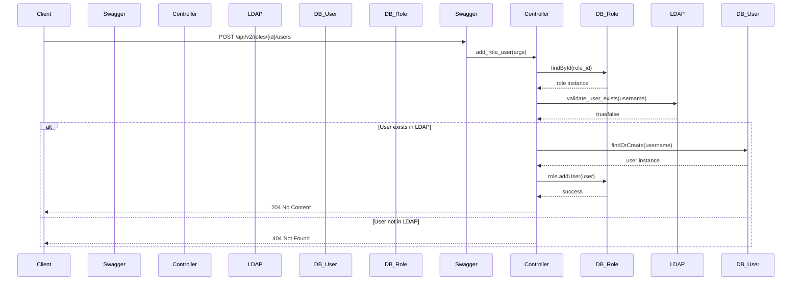

# RBAC Management Endpoints (/roles, /users, /groups, /permissions, /ldap)

Relevant source files

The following files were used as context for generating this wiki page:

- [auth_service/api/controllers/GroupService.js](auth_service/api/controllers/GroupService.js)
- [auth_service/api/controllers/LdapService.js](auth_service/api/controllers/LdapService.js)
- [auth_service/api/controllers/PermissionService.js](auth_service/api/controllers/PermissionService.js)
- [auth_service/api/controllers/RoleService.js](auth_service/api/controllers/RoleService.js)
- [auth_service/api/controllers/UserService.js](auth_service/api/controllers/UserService.js)
- [auth_service/api/swagger/swagger.yaml](auth_service/api/swagger/swagger.yaml)

This page provides a detailed technical reference for the Role-Based Access Control (RBAC) management APIs. These endpoints allow administrators to manage the lifecycle of roles, users, groups, and permissions, as well as perform lookups against the external LDAP directory.

The RBAC system is implemented using a "Controller-Service-Model" pattern. Swagger-node routes requests to controller stubs defined in the `x-swagger-router-controller` property of `swagger.yaml`, which invoke logic in Service files (e.g., `RoleService.js`), which in turn interact with Sequelize models to persist data in MySQL.

## Resource Relationship Overview

The following diagram illustrates how the different RBAC entities relate to one another within the codebase and the database schema.

### RBAC Entity Relationship Diagram

**Sources:** [auth_service/api/swagger/swagger.yaml:1223-1348](), [auth_service/server/models/index.js:1-50]().

---

## Role Management (/roles)

The `/roles` endpoints manage the primary containers for permissions. Roles can be assigned to both individual users and LDAP groups.

### Core Operations
*   **GET /roles**: Lists all roles. Supports pagination (`limit`, `offset`), sorting (`order`), and filtering by `name` or `venue_group_id` [auth_service/api/swagger/swagger.yaml:131-187]().
*   **POST /roles**: Creates a new role. This operation can atomically assign users, groups, and permissions during creation [auth_service/api/swagger/swagger.yaml:188-221](). It uses `login_helper.ensure_users` and `login_helper.ensure_groups` to provision entities if they don't exist in the local DB but exist in LDAP [auth_service/api/controllers/RoleService.js:136-141]().
*   **GET /roles/{role_id}**: Returns a role's details, including aggregated scopes and members [auth_service/api/controllers/RoleService.js:255-275]().

### Role Sub-resources
The API allows granular management of role memberships:
*   **Users**: `GET /roles/{id}/users`, `POST /roles/{id}/users` (via `add_role_user`), and `DELETE /roles/{id}/users/{username}` [auth_service/api/swagger/swagger.yaml:268-330]().
*   **Groups**: `GET /roles/{id}/groups`, `POST /roles/{id}/groups` (via `add_role_group`), and `DELETE /roles/{id}/groups/{groupname}` [auth_service/api/swagger/swagger.yaml:332-395]().
*   **Permissions**: `GET /roles/{id}/permissions`, `POST /roles/{id}/permissions`, and `DELETE /roles/{id}/permissions/{permission_id}` [auth_service/api/swagger/swagger.yaml:397-460]().

**Sources:** [auth_service/api/controllers/RoleService.js:15-125](), [auth_service/api/swagger/swagger.yaml:131-460]().

---

## User Management (/users)

The `/users` endpoints provide visibility into provisioned users and their active sessions.

### Listing and Filtering
The `get_all_users` function in `UserService.js` implements complex filtering logic:
*   **loggedin**: Filters users by `login_expire`. If `Yes`, it returns users where `login_expire >= Date.now()` [auth_service/api/controllers/UserService.js:44-53]().
*   **rolefilter**: Returns users associated with roles matching the query [auth_service/api/controllers/UserService.js:55-100]().
*   **scopefilter**: Returns users who hold a specific permission (traverses Permission -> Role -> User) [auth_service/api/controllers/UserService.js:102-164]().
*   **groupfilter**: Returns users belonging to a specific LDAP group [auth_service/api/controllers/UserService.js:166-224]().

### Implementation Detail: User Enrichment
When retrieving user data, the service calls `get_user_full(user)`, which aggregates the user's roles and permissions from both direct assignments and group memberships to provide a complete view of their access [auth_service/api/controllers/UserService.js:278-305]().

**Sources:** [auth_service/api/controllers/UserService.js:11-224](), [auth_service/api/swagger/swagger.yaml:462-580]().

---

## Group Management (/groups)

Groups represent LDAP groups synchronized into the local database for RBAC assignment.

### Traversal Pattern
Because permissions are not directly linked to groups in the schema, the `GroupService` performs multi-step lookups. For example, `get_all_groups` with a `scopefilter` performs the following flow:
1.  Find `Permission` by name using `models.Permission.findAndCountAll` [auth_service/api/controllers/GroupService.js:137-141]().
2.  Get all `Roles` associated with that permission using `permission.getRoles()` [auth_service/api/controllers/GroupService.js:144-146]().
3.  Get all `Groups` associated with those roles using `role.getGroups()` [auth_service/api/controllers/GroupService.js:152-155]().
4.  Deduplicate and paginate the resulting list in-memory using Lodash (`_.uniqBy`, `_.drop`, `_.take`) [auth_service/api/controllers/GroupService.js:158-177]().

**Sources:** [auth_service/api/controllers/GroupService.js:10-186](), [auth_service/api/swagger/swagger.yaml:582-660]().

---

## Permission Management (/permissions)

Permissions (or "scopes") are the most granular unit of access control.

| Endpoint | Logic |
| :--- | :--- |
| `GET /permissions` | Returns all permissions including the `for_venue_group` flag using `models.Permission.findAll` [auth_service/api/controllers/PermissionService.js:12-29](). |
| `GET /permissions/{id}/groups` | Traverses Permission -> Role -> Group to find all groups holding the permission [auth_service/api/controllers/PermissionService.js:31-68](). |
| `GET /permissions/{id}/users` | Traverses Permission -> Role -> User to find all users holding the permission [auth_service/api/controllers/PermissionService.js:92-128](). |

**Sources:** [auth_service/api/controllers/PermissionService.js:1-128](), [auth_service/api/swagger/swagger.yaml:662-730]().

---

## LDAP Lookup (/ldap)

The `/ldap` endpoints provide a proxy to the LDAP server, allowing the administrative UI to search for users and groups before adding them to roles.

*   **GET /ldap/users?q={name}**: Calls `ldap_helper.search_users(username)` to query the external directory [auth_service/api/controllers/LdapService.js:10-23]().
*   **GET /ldap/groups?q={name}**: Calls `ldap_helper.search_groups(groupname)` to query external groups [auth_service/api/controllers/LdapService.js:25-38]().

**Sources:** [auth_service/api/controllers/LdapService.js:1-39]().

---

## Data Flow: Adding a User to a Role

This diagram traces the execution flow when a client adds a user to a role, highlighting the mandatory validation against LDAP to ensure only valid enterprise identities are assigned roles.

### Request Pipeline for add_role_user

**Sources:** [auth_service/api/controllers/RoleService.js:73-125](), [auth_service/api/swagger/swagger.yaml:300-330]().
