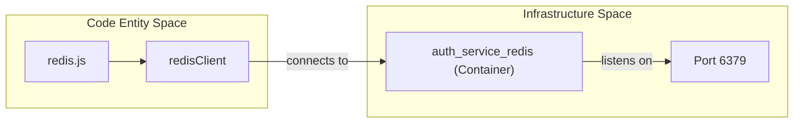
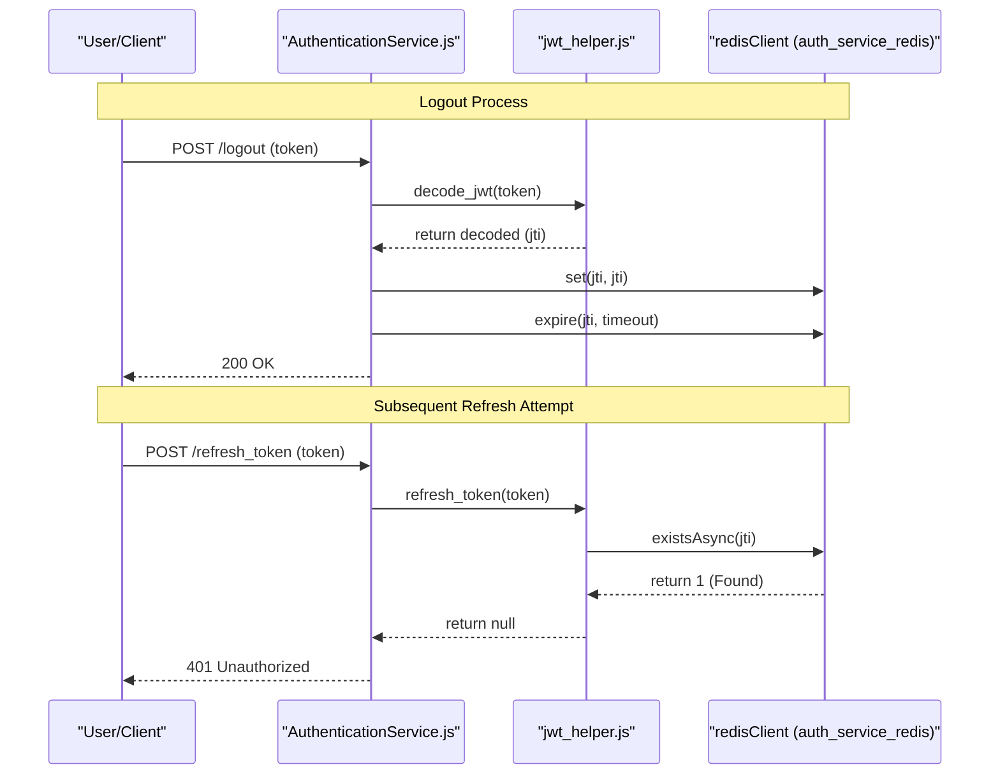

# Redis Session Store

Relevant source files

The following files were used as context for generating this wiki page:

- [auth_service/redis.js](auth_service/redis.js)

The Redis Session Store provides a high-performance, in-memory data layer used primarily for JWT (JSON Web Token) invalidation and session state tracking. While the `auth_service` uses MySQL for persistent RBAC data, it relies on Redis to maintain a real-time blacklist of tokens that have been invalidated via logout before their natural expiration time.

## Client Initialisation

The Redis client is configured in `redis.js`. It establishes a connection to a Redis instance named `auth_service_redis` on the standard port `6379` [auth_service/redis.js:6-6](). This hostname corresponds to the service name defined in the Docker Compose infrastructure.

The client is initialised using the `redis` library and exported as `redisClient` [auth_service/redis.js:2-16]().

### Connection Handling
The service monitors the connection state and logs status updates using the internal logging utility [auth_service/redis.js:3-4]():
*   **Success**: Logs "Connected to REDIS" upon a successful `connect` event [auth_service/redis.js:8-10]().
*   **Failure**: Logs an error message with a full inspection of the error object using `util.inspect` if the connection fails [auth_service/redis.js:12-14]().

### Code-to-Entity Mapping: Redis Connection
The following diagram illustrates how the Node.js environment connects to the infrastructure components.

Sources: [auth_service/redis.js:1-17]()

## Token Blacklisting Implementation

The primary functional role of Redis in the `auth_service` is the implementation of a token blacklist. Because JWTs are stateless, they cannot be natively "revoked" once issued. To support secure logouts, the service stores the unique identifier (`jti`) of revoked tokens in Redis.

### Logout Flow (SET/EXPIRE)
When a user calls the `logout` endpoint, the `AuthenticationService.js` controller processes the request as follows:
1.  **Decode**: The JWT is decoded to extract the `jti` (JSON Token Identifier) [auth_service/api/controllers/AuthenticationService.js:45-49]().
2.  **Store**: The `jti` is stored as a key in Redis using `redisClient.set(jti, jti)` [auth_service/api/controllers/AuthenticationService.js:50-50]().
3.  **TTL (Time to Live)**: An expiration is set on the key using `redisClient.expire`. The timeout is calculated based on `ACCESS_TOKEN_TIMEOUT` converted to seconds [auth_service/api/controllers/AuthenticationService.js:55-55](). This ensures that the blacklist entry is automatically removed once the token would have naturally expired anyway, preventing memory bloat.

### Blacklist Verification (GET)
During every authenticated request and specifically during token refresh operations, the service checks if the provided token's `jti` exists in the blacklist.

*   **Check Function**: `jwt_helper.js` defines `is_token_blacklisted(jti)`, which wraps `redisClient.getAsync(jti)` in a Promise [auth_service/api/helpers/jwt_helper.js:103-119]().
*   **Refresh Logic**: In `refresh_token`, the service calls `redisClient.existsAsync(jti)`. If the `jti` is found (reply != 0), the refresh request is denied as the token has been revoked [auth_service/api/helpers/jwt_helper.js:73-86]().

### Data Flow: Blacklist Lifecycle
The diagram below traces the lifecycle of a `jti` from logout to a subsequent (failed) refresh attempt.

Sources: [auth_service/api/controllers/AuthenticationService.js:33-60](), [auth_service/api/helpers/jwt_helper.js:61-92](), [auth_service/api/helpers/jwt_helper.js:103-119]()

## Integration Summary

| Feature | Function/Method | File | Description |
| :--- | :--- | :--- | :--- |
| **Initialisation** | `redis.createClient` | `redis.js` | Connects to `auth_service_redis:6379` [auth_service/redis.js:6-6]() |
| **Revocation** | `redisClient.set` | `AuthenticationService.js` | Adds `jti` to Redis during logout [auth_service/api/controllers/AuthenticationService.js:50-50]() |
| **Cleanup** | `redisClient.expire` | `AuthenticationService.js` | Sets TTL based on token expiry [auth_service/api/controllers/AuthenticationService.js:55-55]() |
| **Validation** | `is_token_blacklisted` | `jwt_helper.js` | Returns true if `jti` exists in Redis [auth_service/api/helpers/jwt_helper.js:103-119]() |
| **Async Support** | `bluebird.promisifyAll` | `jwt_helper.js` | Enables `getAsync` and `existsAsync` methods [auth_service/api/helpers/jwt_helper.js:4-6]() |

Sources: [auth_service/redis.js:6-16](), [auth_service/api/controllers/AuthenticationService.js:50-55](), [auth_service/api/helpers/jwt_helper.js:4-6](), [auth_service/api/helpers/jwt_helper.js:103-119]()
