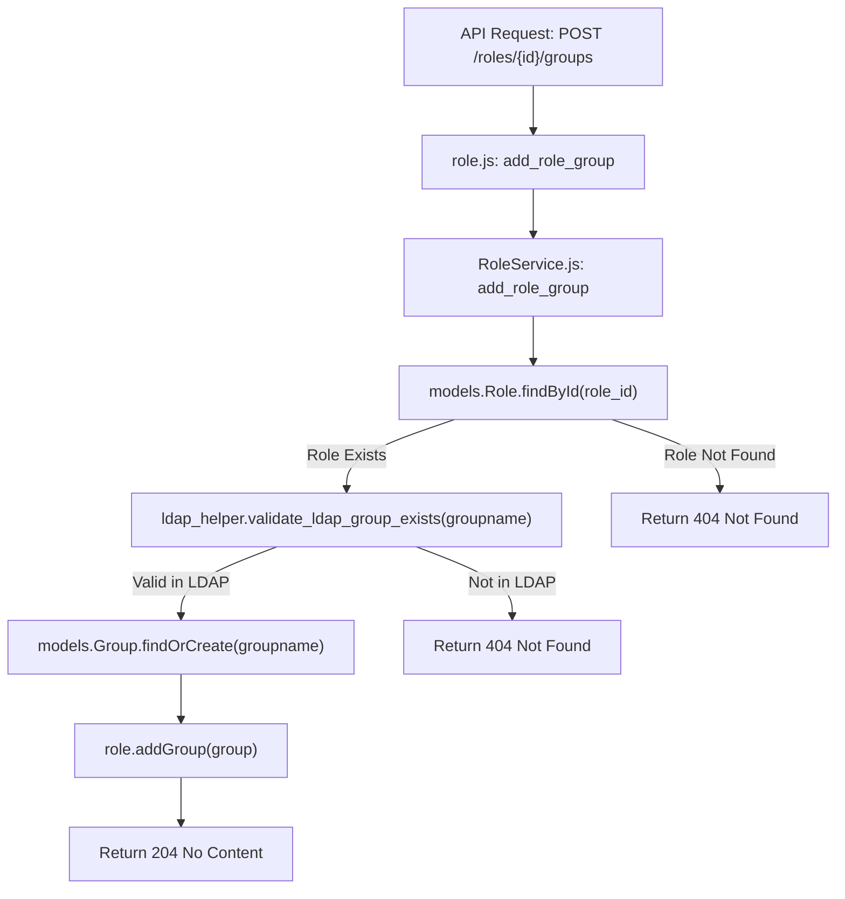
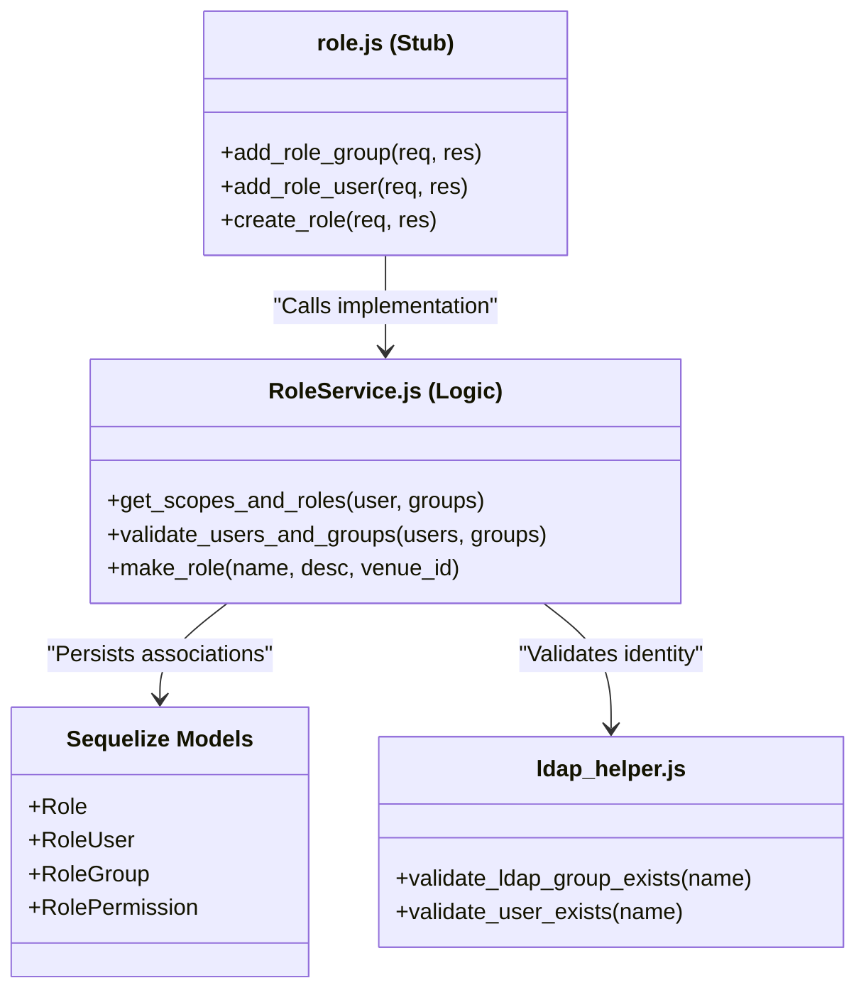

# Role Service

Relevant source files

The following files were used as context for generating this wiki page:

- [auth_service/api/controllers/RoleService.js](auth_service/api/controllers/RoleService.js)
- [auth_service/api/controllers/role.js](auth_service/api/controllers/role.js)

The Role Service is the central component for managing Role-Based Access Control (RBAC) within the Ingenium Auth Service. It provides the logic for Create, Read, Update, and Delete (CRUD) operations on roles and manages the complex many-to-many associations between roles, users, LDAP groups, and permissions.

## Overview and Purpose

The Role Service facilitates the grouping of permissions into logical "Roles" which can then be assigned to individual users or entire LDAP groups [auth_service/api/controllers/RoleService.js:127-130](). A key feature of this service is the validation of users and groups against the external LDAP directory before allowing them to be associated with a role in the local database [auth_service/api/controllers/RoleService.js:31-33](), [auth_service/api/controllers/RoleService.js:85-87]().

### Key Responsibilities
*   **Role Management**: CRUD operations for the `Role` model, including support for `venue_group_id` filtering [auth_service/api/controllers/RoleService.js:127-141]().
*   **Membership Management**: Adding or removing users and groups from specific roles [auth_service/api/controllers/RoleService.js:15-125]().
*   **Permission Mapping**: Associating granular permissions (scopes) with roles [auth_service/api/controllers/RoleService.js:241-274]().
*   **Identity Enrichment**: Helping the login flow by aggregating all scopes and roles applicable to a user based on their direct role assignments and their LDAP group memberships [auth_service/api/controllers/RoleService.js:386-422]().

**Sources:** [auth_service/api/controllers/RoleService.js:1-14](), [auth_service/api/controllers/role.js:1-78]()

---

## Data Flow: Adding a Group to a Role

The following diagram illustrates the flow when the `add_role_group` function is called. It highlights the interaction between the controller, the local MySQL database (via Sequelize), and the external LDAP service.

### Role-Group Assignment Workflow
Title: "Group Assignment Workflow"

**Sources:** [auth_service/api/controllers/RoleService.js:15-71](), [auth_service/api/controllers/role.js:7-9]()

---

## Role Service Implementation Details

### Role Controller and Stub
The service is split into two files:
1.  **`role.js`**: Acts as the Swagger-node stub, extracting parameters from `req.swagger.params` and passing them to the service layer [auth_service/api/controllers/role.js:7-77]().
2.  **`RoleService.js`**: Contains the core business logic, database queries, and LDAP validation calls [auth_service/api/controllers/RoleService.js:1-422]().

### Identity Enrichment: `get_scopes_and_roles`
This internal helper is critical for the JWT issuance process. It retrieves all roles and permissions for a user by checking two paths:
1.  **Direct User-Role Links**: Roles assigned directly to the user record [auth_service/api/controllers/RoleService.js:393-395]().
2.  **Indirect Group-Role Links**: Roles assigned to LDAP groups that the user belongs to [auth_service/api/controllers/RoleService.js:401-403]().

The function returns a flattened object containing unique `roles` and `scopes` [auth_service/api/controllers/RoleService.js:415-420]().

### CRUD and Association Functions

| Function | Description | Source |
| :--- | :--- | :--- |
| `create_role` | Creates a new role and optionally bulk-assigns users, groups, and permissions. | [auth_service/api/controllers/RoleService.js:127-172]() |
| `edit_role` | Updates role metadata (name, description, venue_group_id). | [auth_service/api/controllers/RoleService.js:203-239]() |
| `add_role_user` | Validates user existence in LDAP before creating a local `User` and `RoleUser` link. | [auth_service/api/controllers/RoleService.js:73-125]() |
| `get_all_roles` | Lists roles with support for `venue_group_id` and `name` filtering. | [auth_service/api/controllers/RoleService.js:330-384]() |

**Sources:** [auth_service/api/controllers/RoleService.js:15-422](), [auth_service/api/controllers/role.js:1-78]()

---

## Code Entity Map

The following diagram maps the logical RBAC operations to the specific functions and models used in the implementation.

Title: "RBAC Code Entity Mapping"

**Sources:** [auth_service/api/controllers/RoleService.js:1-14](), [auth_service/api/controllers/role.js:1-5](), [auth_service/api/helpers/ldap_helper.js:1-10]()

---

## Role Model and Associations

The `Role` model is defined using Sequelize and includes several many-to-many associations managed through join tables.

### Database Schema (Sequelize)
*   **Fields**: `name` (Unique), `description` (Text), `venue_group_id` (String) [auth_service/api/controllers/RoleService.js:335-345]().
*   **Associations**:
    *   `Users`: Linked via `RoleUser` join table.
    *   `Permissions`: Linked via `RolePermission` join table.
    *   `Groups`: Linked via `RoleGroup` join table.

### Join Tables
The following models represent the junction tables for the many-to-many relationships:
*   `RoleUser`: Associates a Role with a User.
*   `RoleGroup`: Associates a Role with an LDAP Group.
*   `RolePermission`: Associates a Role with a Permission (Scope).

**Sources:** [auth_service/api/controllers/RoleService.js:156-160](), [auth_service/api/controllers/RoleService.js:386-410]()
