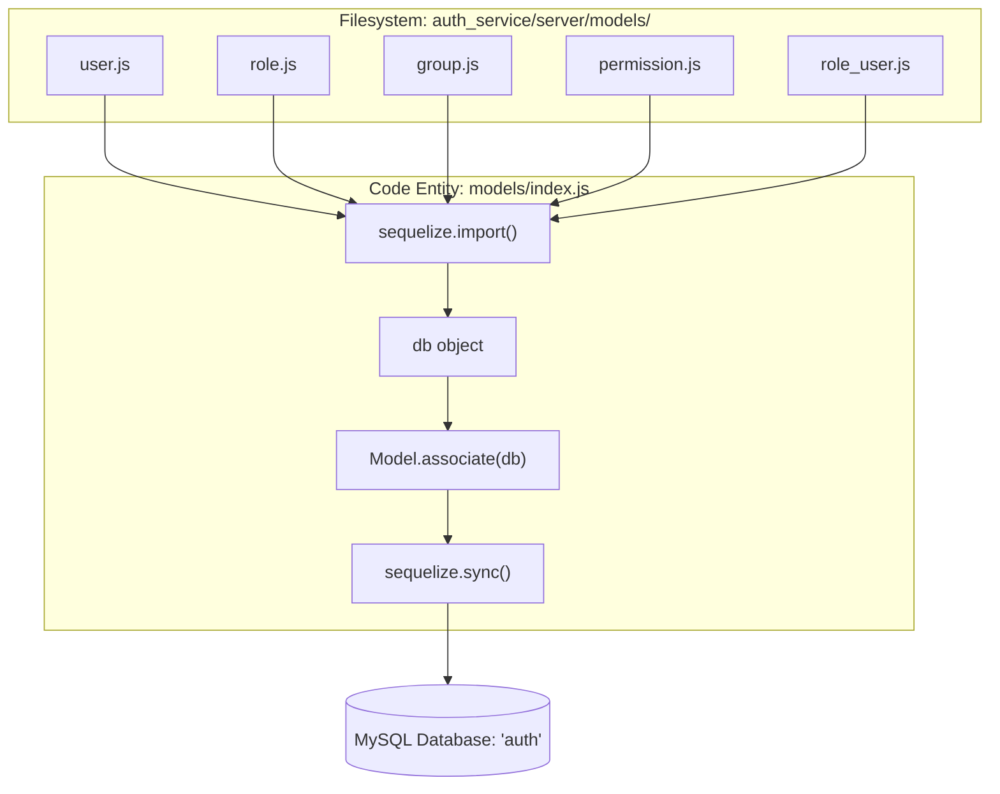

# Sequelize Models and Associations

<details>
<summary>Relevant source files</summary>

The following files were used as context for generating this wiki page:

- [auth_service/server/models/group.js](auth_service/server/models/group.js)
- [auth_service/server/models/index.js](auth_service/server/models/index.js)
- [auth_service/server/models/permission.js](auth_service/server/models/permission.js)
- [auth_service/server/models/role.js](auth_service/server/models/role.js)
- [auth_service/server/models/role_group.js](auth_service/server/models/role_group.js)
- [auth_service/server/models/role_permission.js](auth_service/server/models/role_permission.js)
- [auth_service/server/models/role_user.js](auth_service/server/models/role_user.js)
- [auth_service/server/models/user.js](auth_service/server/models/user.js)
- [auth_service/server/models/user_group.js](auth_service/server/models/user_group.js)
- [auth_service/server/models/user_permission.js](auth_service/server/models/user_permission.js)

</details>


This page describes the persistence layer of the Ingenium Auth Service, which utilizes the Sequelize ORM to manage a MySQL database. It covers the definitions of core entities (Users, Roles, Permissions, Groups), the join tables that facilitate many-to-many relationships, and the initialization logic used to synchronize the schema and handle database migrations.

## Database Initialization and Model Loading

The entry point for the data layer is `auth_service/server/models/index.js`. This file is responsible for initializing the Sequelize instance, auto-loading models from the filesystem, and establishing associations.

### Initialization Flow
1.  **Sequelize Instance**: A connection is established using configuration from `env_config.js` [auth_service/server/models/index.js:11-24]().
2.  **Database Creation**: If the `auth` database does not exist, it is created using a raw query [auth_service/server/models/index.js:30-43]().
3.  **Model Loading**: The script reads all files in the `models/` directory, excluding itself, and imports them into the `db` object [auth_service/server/models/index.js:70-78]().
4.  **Association Invocation**: After all models are loaded, it iterates through them and calls the `associate` function on any model that defines one [auth_service/server/models/index.js:80-84]().

### `init_db` Retry Logic
The `init_db(count)` function provides a resilient way to start the service, especially in containerized environments where MySQL might take longer to initialize than the Node.js application [auth_service/server/models/index.js:45-68]().

| Feature | Description |
| :--- | :--- |
| **Retry Mechanism** | Recursively calls itself until `count` reaches 0 [auth_service/server/models/index.js:65](). |
| **Schema Detection** | Queries `information_schema.tables` to check if the `auth` schema is populated [auth_service/server/models/index.js:52](). |
| **Migration Trigger** | If no tables exist, it runs `cmdHardReset` followed by `cmdMigrate`. If tables exist, it only runs `cmdMigrate` to apply incremental updates [auth_service/server/models/index.js:53-62](). |

**Sources:** [auth_service/server/models/index.js:1-98]()

## Model Definitions and Fields

The system uses four primary entities to manage access control.

### Primary Entities

| Model | File | Fields | Purpose |
| :--- | :--- | :--- | :--- |
| **User** | [auth_service/server/models/user.js:3-7]() | `display_name`, `username` (Unique), `login_expire` | Represents an authenticated identity. |
| **Role** | [auth_service/server/models/role.js:3-7]() | `name` (Unique), `description`, `venue_group_id` | A container for permissions that can be assigned to users or groups. |
| **Permission** | [auth_service/server/models/permission.js:3-6]() | `name` (Unique), `for_venue_group` (Boolean) | The smallest unit of access (scope). |
| **Group** | [auth_service/server/models/group.js:21-23]() | `name` (Unique) | Represents LDAP groups mapped into the local RBAC system. |

### Join Tables (Many-to-Many)
These models are defined as empty objects to serve as the "through" table for Sequelize associations:
*   `RoleUser`: Connects Roles and Users [auth_service/server/models/role_user.js:2]().
*   `RolePermission`: Connects Roles and Permissions [auth_service/server/models/role_permission.js:2]().
*   `RoleGroup`: Connects Roles and Groups [auth_service/server/models/role_group.js:2]().
*   `UserGroup`: Connects Users and Groups [auth_service/server/models/user_group.js:2]().
*   `UserPermission`: Connects Users directly to Permissions [auth_service/server/models/user_permission.js:2]().

**Sources:** [auth_service/server/models/user.js:1-25](), [auth_service/server/models/role.js:1-25](), [auth_service/server/models/permission.js:1-20](), [auth_service/server/models/group.js:1-37](), [auth_service/server/models/role_user.js:1-5](), [auth_service/server/models/role_permission.js:1-5](), [auth_service/server/models/role_group.js:1-5](), [auth_service/server/models/user_group.js:1-5](), [auth_service/server/models/user_permission.js:1-5]()

## Entity Relationship Diagram

The following diagram illustrates the associations defined in the code via the `.belongsToMany()` method in each model's `associate` function.

**Database Schema Associations**
```mermaid
erDiagram
    "User" }|--|{ "Role" : "RoleUser"
    "User" }|--|{ "Group" : "UserGroup"
    "User" }|--|{ "Permission" : "UserPermission"
    "Role" }|--|{ "Permission" : "RolePermission"
    "Role" }|--|{ "Group" : "RoleGroup"

    "User" {
        String "display_name"
        String "username"
        Date "login_expire"
    }
    "Role" {
        String "name"
        Text "description"
        String "venue_group_id"
    }
    "Permission" {
        String "name"
        Boolean "for_venue_group"
    }
    "Group" {
        String "name"
    }
```
**Sources:** [auth_service/server/models/user.js:9-22](), [auth_service/server/models/role.js:9-22](), [auth_service/server/models/permission.js:8-17](), [auth_service/server/models/group.js:25-34]()

## Code Entity Mapping

This diagram bridges the Sequelize model definitions to the actual file structure and the internal `db` object created by `models/index.js`.

**Model Loading and Association Logic**

**Sources:** [auth_service/server/models/index.js:70-94]()

## Key Implementation Details

### Sequelize Sync
The service calls `sequelize.sync()` at the end of the model loading process [auth_service/server/models/index.js:90-94](). While `force: true` is present in the code, it is commented out to prevent accidental data loss in production, though the comment suggests it can be used during development to wipe and recreate the schema based on model changes [auth_service/server/models/index.js:89-94]().

### Singular and Plural Aliases
When defining associations, the codebase explicitly sets `as` aliases for both singular and plural forms. This ensures consistent accessor naming (e.g., `user.getRoles()` and `user.addRole()`).

Example from `Group` model:
```javascript
models.Group.belongsToMany(models.Role, {
  as: { singular: 'Role', plural: 'Roles' },
  through: models.RoleGroup
});
```
[auth_service/server/models/group.js:26-29]()

**Sources:** [auth_service/server/models/group.js:26-29](), [auth_service/server/models/user.js:10-21](), [auth_service/server/models/role.js:10-21](), [auth_service/server/models/permission.js:9-16]()
