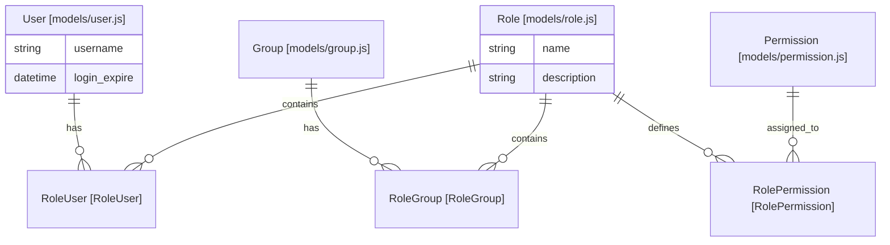
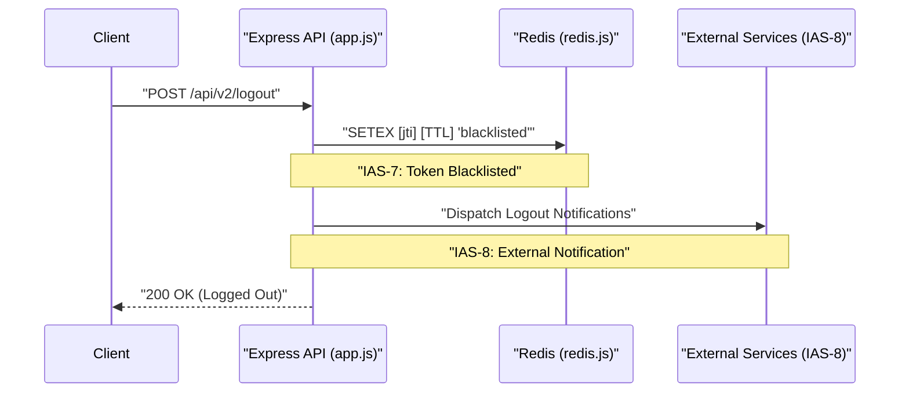

# System Requirements and Functional Specifications

<details>
<summary>Relevant source files</summary>

The following files were used as context for generating this wiki page:

- [README.md](README.md)
- [auth_service/README.md](auth_service/README.md)

</details>


This page documents the formal Ingenium Auth Service (IAS) requirements that govern the service's behavior, security protocols, and data management. These requirements (IAS-1 through IAS-9) serve as the functional baseline for the implementation of LDAP authentication, JWT lifecycle management, and Role-Based Access Control (RBAC).

## Formal Requirements (IAS-1 to IAS-9)

The following requirements are tracked within the integration test suites to ensure compliance across the service.

| ID | Requirement Description | Implementation Detail |
|:---|:---|:---|
| **IAS-1** | The IAS shall authenticate users via LDAP. | Handled via `ldap_helper.js` and `authenticate.js`. |
| **IAS-2** | The IAS shall provide JWT for access to Ingenium services with a timeout of 27 minutes. | Configured in `env_config.js` via `ACCESS_TOKEN_TIMEOUT`. |
| **IAS-3** | The IAS shall support assigning specific users to user defined categories (roles). | Managed via `RoleUser` associations in `models/index.js`. |
| **IAS-4** | The IAS shall support assigning specific Ingenium permissions (scopes) to roles. | Managed via `RolePermission` associations in `models/index.js`. |
| **IAS-5** | The IAS shall support assigning LDAP groups to roles. | Managed via `RoleGroup` associations in `models/index.js`. |
| **IAS-6** | Users shall have privileges based on the combination of all assigned roles. | Aggregated in `login_helper.js` via `getPermission`. |
| **IAS-7** | On logout, the IAS shall ensure the token cannot be used again (blacklist). | Implemented using Redis `SET` with expiry in `redis.js`. |
| **IAS-8** | On logout or expiration, the IAS shall issue logout requests to external managers. | Logic triggered in `AuthenticationService.js`. |
| **IAS-9** | The IAS shall support specific scopes: admin, execute:*, config_mgmt, etc. | Defined in `seed` migrations and validated in `jwt_helper.js`. |

**Sources:** [tests/auth_unit_test.py:6-15](), [tests/test_ci_auth.py:6-15]()

---

## Authentication and JWT Issuance

The core functional flow of the IAS involves verifying credentials against an external provider (LDAP or RSA) and issuing a signed JSON Web Token (JWT).

### Credential Verification (IAS-1)
The service supports multiple authentication methods defined by the `AUTH_METHOD` environment variable. While LDAP is the primary requirement, the system also supports an RSA SecurID path [README.md:3-3]().

### Token Lifecycle (IAS-2, IAS-7)
Tokens are signed using the RS256 algorithm. The service maintains a "Blacklist" in Redis to invalidate tokens before their natural expiration (e.g., upon explicit logout) [README.md:3-3]().

### Natural Language to Code Entity: Authentication Flow
The following diagram maps the logical authentication requirements to the specific code entities responsible for execution.

**Authentication Entity Map**
```mermaid
graph TD
    subgraph "NaturalLanguageSpace"
        ["REQ1: IAS-1: LDAP Authentication"]
        ["REQ2: IAS-2: JWT Issuance"]
        ["REQ7: IAS-7: Token Blacklisting"]
    end

    subgraph "CodeEntitySpace"
        ["AuthenticationService.js"]
        ["ldap_helper.js"]
        ["jwt_helper.js"]
        ["redis.js"]
        
        ["GET /login"]
        ["POST /logout"]
    end

    ["REQ1: IAS-1: LDAP Authentication"] --> ["GET /login"]
    ["GET /login"] --> ["AuthenticationService.js"]
    ["AuthenticationService.js"] --> ["ldap_helper.js"]
    
    ["REQ2: IAS-2: JWT Issuance"] --> ["jwt_helper.js"]
    ["AuthenticationService.js"] --> ["jwt_helper.js"]
    
    ["REQ7: IAS-7: Token Blacklisting"] --> ["POST /logout"]
    ["POST /logout"] --> ["redis.js"]
```
**Sources:** [README.md:3-3](), [tests/auth_unit_test.py:59-61](), [tests/test_ci_auth.py:66-68]()

---

## Role-Based Access Control (RBAC)

The IAS implements a flexible RBAC model where permissions are not assigned to users directly, but rather through Roles [README.md:9-10](). Roles act as containers for permissions and can be granted to individual users or entire LDAP groups.

### Permission Aggregation (IAS-6)
When a user logs in, the service performs a "Just-In-Time" (JIT) provisioning and permission lookup. It queries:
1. Roles assigned directly to the `User` (via `RoleUser` association) [README.md:13-13]().
2. Roles assigned to `Groups` that the user belongs to (via `RoleGroup` and `UserGroup` associations) [README.md:15-15]().

The resulting scopes are flattened and encoded into the JWT payload.

### RBAC Data Relationship Map
This diagram shows how the requirements for Users, Groups, and Roles (IAS-3, IAS-4, IAS-5) are structured within the Sequelize ORM.

**RBAC Entity Relationship**

**Sources:** [README.md:9-15](), [README.md:97-107]()

---

## Functional Scopes (IAS-9)

The service enforces a specific set of scopes that are utilized by downstream Ingenium services to authorize actions. These are seeded into the database during initial setup.

| Scope Name | Description |
|:---|:---|
| `admin` | Full administrative access to IAS and downstream services. |
| `execute:wsts` | Permission to execute Work Station Test Suite tasks. |
| `execute:testbed` | Permission to execute Testbed operations. |
| `execute:sit` | Permission to execute System Integration Testing tasks. |
| `config_mgmt` | Access to configuration management features. |
| `redline` | Access to redline/override capabilities. |
| `basic` | Minimum access required for authenticated users. |

**Sources:** [tests/auth_unit_test.py:15-15](), [tests/test_ci_auth.py:15-15]()

---

## Logout and External Notification (IAS-8)

A critical functional requirement is the propagation of logout events. When a user calls `POST /logout` or a token is detected as expired, the IAS is responsible for notifying external service managers to terminate associated sessions.

### Logout Data Flow

**Sources:** [tests/auth_unit_test.py:13-14](), [tests/test_ci_auth.py:13-14](), [README.md:3-3]()
