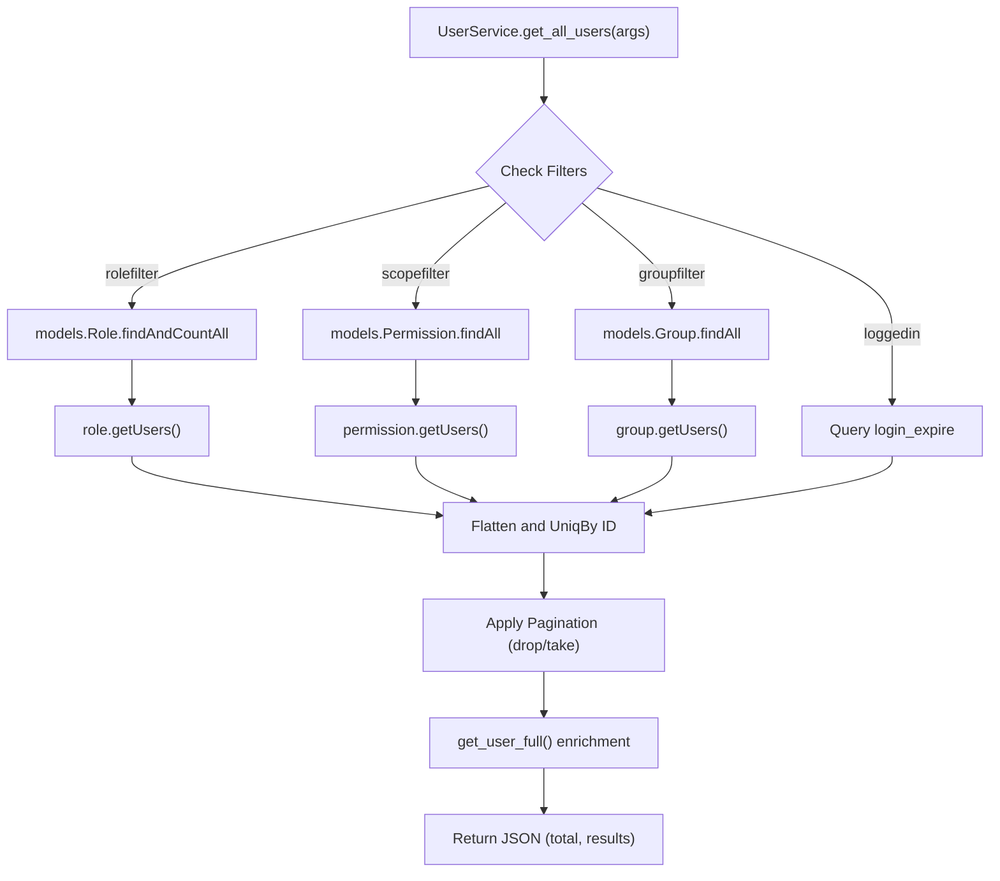
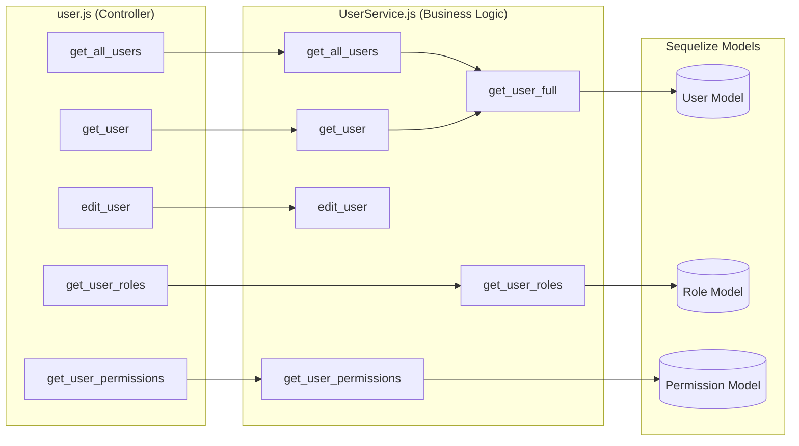

# User Service

Relevant source files

The following files were used as context for generating this wiki page:

- [auth_service/api/controllers/UserService.js](auth_service/api/controllers/UserService.js)
- [auth_service/api/controllers/user.js](auth_service/api/controllers/user.js)

The User Service provides the business logic and data access layer for managing user entities within the Ingenium Auth Service. It handles user retrieval, profile updates, and the complex resolution of roles and permissions associated with a user, whether assigned directly or inherited via group memberships.

## Overview and Data Model

The user entity is represented by the `User` Sequelize model. It tracks basic identity information and a specific `login_expire` timestamp used to determine session validity.

### User Model Attributes
| Attribute | Type | Description |
| :--- | :--- | :--- |
| `username` | STRING | Unique identifier for the user (required). |
| `display_name` | STRING | Friendly name for the user. |
| `login_expire` | DATE | Timestamp indicating when the user's current session/login state expires. Defaults to `NOW`. |

### Associations
The `User` model maintains many-to-many relationships with Roles, Groups, and Permissions through join tables:
*   **Roles**: Linked via `RoleUser` join table. [auth_service/server/models/user.js:10-13]()
*   **Groups**: Linked via `UserGroup` join table. [auth_service/server/models/user.js:14-17]()
*   **Permissions**: Linked via `UserPermission` join table. [auth_service/server/models/user.js:18-21]()

**Sources:**
* [auth_service/server/models/user.js:3-22]()
* [auth_service/api/controllers/UserService.js:3-5]()

---

## User Retrieval and Filtering

The `get_all_users` function in `UserService.js` implements a robust filtering and pagination system. Unlike standard resource listings, users can be filtered by their active login status or their association with specific RBAC entities.

### Filtering Parameters
*   **`loggedin`**: Filters users based on the `login_expire` timestamp. If "Yes", it queries for `login_expire >= Date.now()`. [auth_service/api/controllers/UserService.js:44-53]()
*   **`rolefilter`**: Returns users associated with roles matching the provided string prefix. This uses `role.getUsers()` to resolve the relationship. [auth_service/api/controllers/UserService.js:55-70]()
*   **`scopefilter`**: Returns users who possess a specific permission (scope). It fetches permissions matching the query, then uses `permission.getUsers()` to find associated users. [auth_service/api/controllers/UserService.js:102-123]()
*   **`groupfilter`**: Returns users belonging to groups matching the query. It resolves this by calling `group.getUsers()` for each matching group. [auth_service/api/controllers/UserService.js:166-186]()

### Pagination and Ordering
The service supports standard pagination via `limit` and `offset` parameters. Results are typically ordered by `username` in either `ASC` or `DESC` order. If filters like `rolefilter` are used, the service performs manual pagination using `_.drop` and `_.take` on the resulting collection. [auth_service/api/controllers/UserService.js:25-40]() [auth_service/api/controllers/UserService.js:84-92]()

### User Listing Logic Flow
The following diagram illustrates how `get_all_users` processes different filter types to return a unified user list.

**User Filtering Logic**

**Sources:**
* [auth_service/api/controllers/UserService.js:11-100]()
* [auth_service/api/controllers/UserService.js:102-164]()
* [auth_service/api/controllers/UserService.js:166-224]()

---

## RBAC Resolution

The service provides specific endpoints to resolve a user's security context.

### Get User Roles
The `get_user_roles` function retrieves all roles assigned to a user. This is exposed via the `GET /users/{id}/roles` endpoint. [auth_service/api/controllers/user.js:41-43]()

### Get User Permissions
The `get_user_permissions` function aggregates permissions for a user. This includes:
1.  Directly assigned permissions.
2.  Permissions inherited from assigned Roles.
3.  Permissions inherited from Groups the user belongs to.
[auth_service/api/controllers/user.js:37-39]()

### Internal Enrichment: `get_user_full`
This internal helper function is used by the list and get endpoints to provide a complete view of the user object, including their associated roles and group memberships. [auth_service/api/controllers/UserService.js:94-96]()

**Code Entity Mapping: User Controller to Service**

**Sources:**
* [auth_service/api/controllers/user.js:15-43]()
* [auth_service/api/controllers/UserService.js:11-12]()

---

## Management Operations

### Updating Users
The `edit_user` function allows updating a user's `display_name`. It uses the `id` provided in the swagger parameters to locate the record and perform the update. [auth_service/api/controllers/user.js:23-25]()

### Login Expiration Tracking
The `login_expire` field is a critical component of the user service. It is updated during the login process (managed by `AuthenticationService` and `jwt_helper`) and queried by `UserService` to determine the "Logged In" status of users for administrative reporting. [auth_service/api/controllers/UserService.js:44-53]()

**Sources:**
* [auth_service/api/controllers/user.js:23-25]()
* [auth_service/server/models/user.js:6-6]()
* [auth_service/api/controllers/UserService.js:23-23]()
