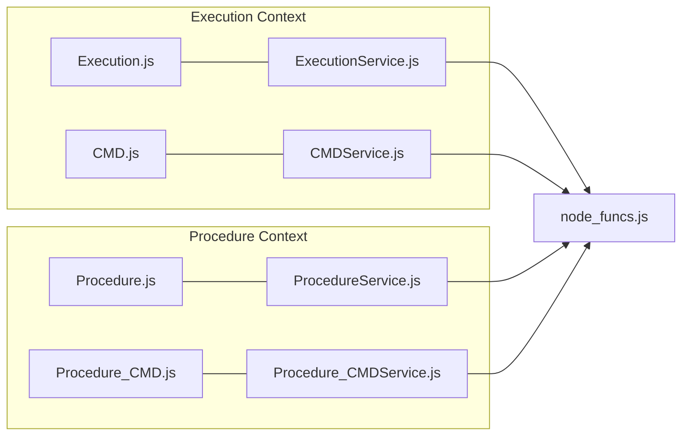

# Page: API Controllers — Architecture Pattern

# API Controllers — Architecture Pattern

<details>
<summary>Relevant source files</summary>

The following files were used as context for generating this wiki page:

- [api/.DS_Store](api/.DS_Store)
- [api/controllers/ANALYSIS.js](api/controllers/ANALYSIS.js)
- [api/controllers/ANALYSISService.js](api/controllers/ANALYSISService.js)

</details>


This page provides a high-level overview of the architectural pattern used for all API endpoints in the Ingenium Core Server. The codebase strictly follows a **Controller/Service split**, where routing and parameter extraction are decoupled from business logic and downstream service orchestration.

## The Controller/Service Split

The API is organized into two primary layers within the `api/controllers/` directory:

1.  **Routing Controllers (`*.js`)**: These are thin wrappers that serve as the entry point for Express routes. Their sole responsibility is to receive the request and delegate immediately to the corresponding service module.
2.  **Service Modules (`*Service.js`)**: These modules contain the actual implementation logic. They extract parameters from the Swagger object, manage authentication keys, and call the core business logic functions in `node_funcs.js`.

### Request Lifecycle Diagram

The following diagram illustrates how a request flows from the OpenAPI-driven router through the controller and service layers to the core logic.

**Request Flow: Controller to Service Pattern**
```mermaid
graph TD
    subgraph "Express / Swagger Middleware"
        REQ["HTTP Request"] --> SWAG["swagger-tools Middleware"]
        SWAG --> ROUTE["Router (swagger.yaml)"]
    end

    subgraph "Controller Layer (e.g., ANALYSIS.js)"
        ROUTE -->|calls| CTRL_FN["create_analysis_step(req, res, next)"]
    end

    subgraph "Service Layer (e.g., ANALYSISService.js)"
        CTRL_FN -->|delegates| SERV_FN["exports.create_analysis_step(args, res, next, headers)"]
        SERV_FN --> AUTH["node_funcs.get_auth_key(headers)"]
        SERV_FN --> PARAMS["Extract args['param']['value']"]
    end

    subgraph "Core Logic (node_funcs.js)"
        PARAMS --> NF["createArchiveElement()"]
        NF --> DB[("Archive / Execution DB")]
    end

    NF -.->|returns data| SERV_FN
    SERV_FN -->|res.status(200).json(data)| REQ
```
**Sources:** [api/controllers/ANALYSIS.js:7-9](), [api/controllers/ANALYSISService.js:4-26]()

---

## Standard Implementation Pattern

All controllers follow a standardized boilerplate for handling parameters, authentication, and error responses.

### 1. Parameter Extraction
The server uses `swagger-tools`, which attaches a `swagger` object to the request. Parameters defined in `swagger.yaml` are accessed via `req.swagger.params`. Inside the Service module, these are typically accessed as `args['param_name']['value']`.
*   **Source:** [api/controllers/ANALYSISService.js:14-17]()

### 2. Header-Based Authentication
The Service layer extracts the authentication token (API Key or JWT) from the request headers using a utility function. This key is then passed to downstream functions in `node_funcs.js` to authorize database or execution operations.
*   **Function:** `node_funcs.get_auth_key(headers)`
*   **Source:** [api/controllers/ANALYSISService.js:13]()

### 3. Error and Response Pattern
Responses are handled using a standard `try/catch` block within the Service functions. 
*   **Success**: Returns a `200 OK` with the JSON data.
*   **Failure**: Errors are caught, passed to `node_funcs.push_error` for logging/formatting, and returned as a `400 Bad Request`.
*   **Source:** [api/controllers/ANALYSISService.js:19-25]()

---

## Domain-Specific Controllers

The API is divided into several functional domains, each represented by a pair of Controller/Service files. For detailed documentation on the endpoints within these domains, refer to the child pages listed below.

### Execution and Procedure Management
These controllers handle the core lifecycle of test procedures and their live execution instances.
*   **Execution Domain**: Manages live execution state (pause, resume, halt) and the as-run tree. For details, see [Execution Domain Controllers](#3.1).
*   **Procedure Domain**: Manages the authoring and versioning of procedure templates. For details, see [Procedure Domain Controllers](#3.2).

### Venue and Environment
Handles the registration of physical or virtual test environments and their configurations.
*   **Venue/Environment**: Manages venue groups, configurations, and environment-specific steps. For details, see [Venue and Environment Controllers](#3.3).

### Step Type Specializations
Ingenium supports a wide variety of step types, each with its own input/result schema. These are grouped by their functional role:
*   **Commanding**: Steps that send data to a system under test (e.g., `CMD`, `BUS_1553`). For details, see [Step Type Controllers — Commanding](#3.4).
*   **Verification & Config**: Steps that query telemetry or update system settings (e.g., `VERIFY_EHA`, `UPDATE_CONFIG`). For details, see [Step Type Controllers — Verification and Configuration](#3.5).
*   **Data & Manual**: Timing, logging, and human-in-the-loop steps (e.g., `WAIT`, `Manual_Input`). For details, see [Step Type Controllers — Data, Timing, and Manual Steps](#3.6).

### Procedure-Scoped Steps
Every execution-scoped step type has a corresponding procedure-scoped version (prefixed with `Procedure_`). These allow authors to define step content within a procedure template before it is ever executed.
*   **Procedure-Scoped Steps**: For details, see [Procedure-Scoped Step Controllers](#3.7).

**Code Entity Association Map**

**Sources:** [api/controllers/ANALYSIS.js:1-22](), [api/controllers/ANALYSISService.js:1-137]()
