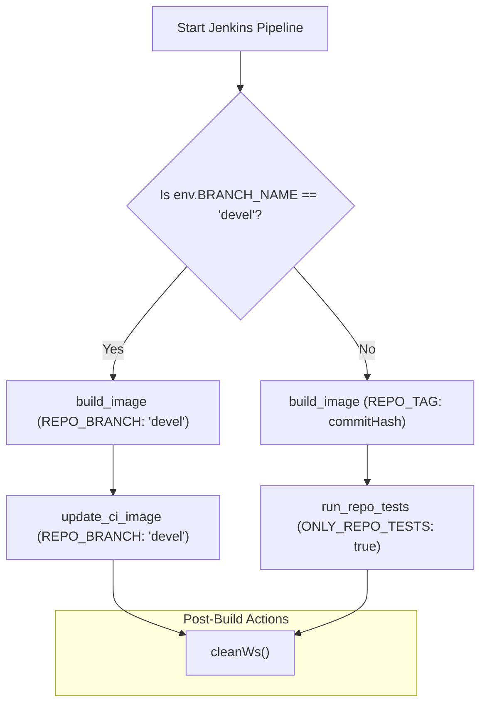
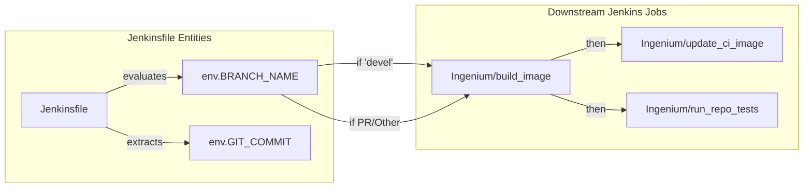

# Page: CI/CD Pipeline

# CI/CD Pipeline

Relevant source files

The following files were used as context for generating this wiki page:

- [Jenkinsfile](Jenkinsfile)

The `ingenium_core_server` utilizes a Jenkins-based CI/CD pipeline defined in a declarative `Jenkinsfile`. This pipeline manages the automated building of Docker images and the execution of integration tests, with logic that branches based on the source control branch being processed (e.g., development vs. pull requests).

### Pipeline Architecture and Branch Logic

The pipeline is structured around a single main stage, `Determine Branch and Execute Jobs`, which uses Groovy scripting to evaluate the `env.BRANCH_NAME` variable [Jenkinsfile:4-9](). The execution path diverges based on whether the code is on the primary development branch (`devel`) or a feature/pull request branch.

#### Devel Branch Workflow
When the pipeline detects the `devel` branch, it prioritizes updating the core infrastructure images used by other services:
1.  **Build Image**: Triggers the `Ingenium/build_image` job specifically for the `core_server` repository on the `devel` branch [Jenkinsfile:15-19]().
2.  **Update CI Image**: Triggers the `Ingenium/update_ci_image` job. This ensures that the continuous integration environment reflects the latest stable changes from the development branch [Jenkinsfile:24-28]().

#### Feature and PR Branch Workflow
For all other branches, the pipeline focuses on verification and ephemeral builds:
1.  **Build Image for PR**: Triggers `Ingenium/build_image` using the specific `GIT_COMMIT` hash as a tag [Jenkinsfile:37-41](). This prevents overwriting stable images.
2.  **Run Repo Tests**: Triggers `Ingenium/run_repo_tests`. This job executes the Python-based integration suite against the specific image tag, ensuring no regressions are introduced [Jenkinsfile:46-52]().

**Pipeline Flow Control**

Sources: [Jenkinsfile:1-95]()

### Downstream Job Orchestration

The pipeline functions as an orchestrator, delegating heavy lifting to specialized Jenkins jobs within the `Ingenium/` namespace. Data is passed to these jobs via `parameters`.

| Job Name | Parameters Sent | Purpose |
| :--- | :--- | :--- |
| `Ingenium/build_image` | `REPO`, `REPO_BRANCH` or `REPO_TAG` | Compiles the Docker image for the server. |
| `Ingenium/update_ci_image` | `REPO`, `REPO_BRANCH` | Updates the base image used by the CI runner. |
| `Ingenium/run_repo_tests` | `REPO`, `REPO_TAG`, `ONLY_REPO_TESTS`, `CLUSTER_BRANCH` | Executes the integration test suite (tests/test_ci_*.py) against the built image. |

**Code Entity Mapping: Orchestration**

Sources: [Jenkinsfile:7-53]()

### Post-Build Lifecycle and Cleanup

The pipeline implements standard lifecycle notifications and workspace management through the `post` block.

*   **Status Reporting**: The pipeline echoes specific success, failure, or abortion messages to the Jenkins console, tailored to the branch type [Jenkinsfile:60-86]().
*   **Workspace Cleanup**: Regardless of the build outcome (success or failure), the `cleanup` block invokes `cleanWs()` [Jenkinsfile:87-92](). This is critical for maintaining the health of Jenkins agents, as it removes the cloned repository and any temporary build artifacts, preventing disk space exhaustion.

Sources: [Jenkinsfile:59-93]()
