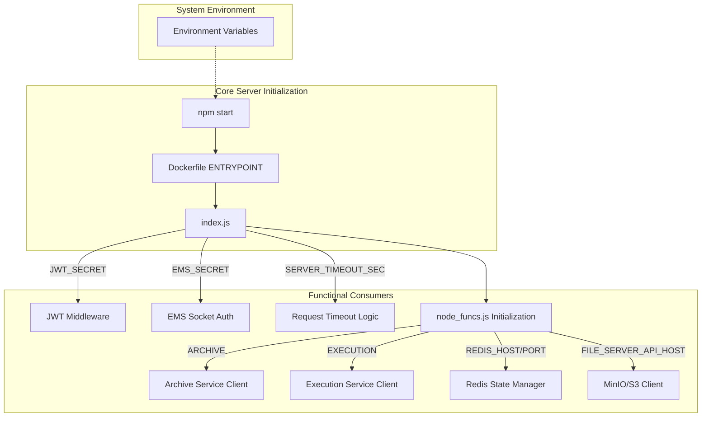
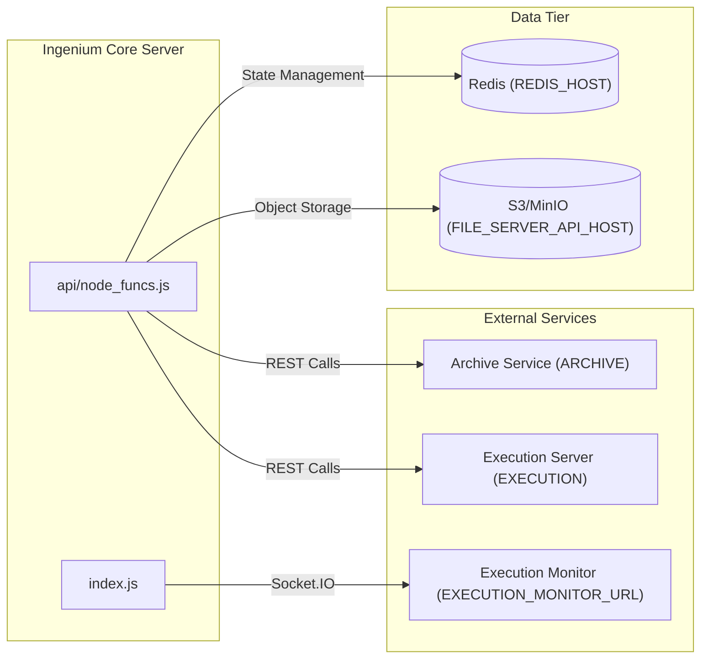

# Page: Configuration and Environment Variables

# Configuration and Environment Variables

Relevant source files

The following files were used as context for generating this wiki page:

- [Dockerfile](Dockerfile)
- [README.md](README.md)

The Ingenium Core Server relies on environment variables to manage connections to external services, security parameters, and runtime behavior. These variables are consumed by the server during initialization to configure the middleware stack and internal utility functions.

## Configuration Overview

The server is designed to be cloud-native and follows the 12-factor app methodology by using environment variables for configuration. While there is no dedicated `config.js` file in the repository root, the configuration is primarily ingested during the startup process and used across key modules like `index.js` and `api/node_funcs.js`.

### Configuration Flow Diagram

The following diagram illustrates how environment variables propagate from the system environment into the functional units of the Ingenium Core Server.

**Title: Configuration Data Flow**

Sources: [Dockerfile:7-7](), [index.js:1-20](), [api/node_funcs.js:1-50]()

---

## Environment Variable Reference

The table below details the variables used to configure the server's operational environment.

| Variable | Description | Default / Example |
| :--- | :--- | :--- |
| `ARCHIVE` | URL for the Archive service API (v5). Used for procedure and element CRUD. | `http://localhost:8010/api/v5` |
| `EXECUTION` | URL for the Execution Server API (v4). Used for running steps and commands. | `http://localhost:9999/api/v4` |
| `REDIS_HOST` | Hostname for the Redis instance used for execution state tracking. | `localhost` |
| `REDIS_PORT` | Port for the Redis instance. | `6379` |
| `FILE_SERVER_API_HOST` | Endpoint for the S3-compatible file server (MinIO). | `localhost:9000` |
| `MEDIA_BUCKET` | The S3 bucket name where images and data products are stored. | `ingenium-media` |
| `PUBLIC_PEM` | Public key used for verifying JWT signatures if using asymmetric keys. | `---BEGIN PUBLIC KEY---...` |
| `JWT_SECRET` | Secret key used for HMAC-based JWT verification. | `bigsecret` |
| `EMS_SECRET` | Secret used to authenticate with the Execution Monitor Service (EMS). | `ems_shared_secret` |
| `LOG_LEVEL` | Verbosity of the server logs (e.g., info, debug, error). | `info` |
| `SERVER_TIMEOUT_SEC` | Maximum time in seconds before a request is terminated. | `30` |
| `EXECUTION_MONITOR_URL` | URL for the Socket.IO-based Execution Monitor Service. | `http://localhost:3001` |

Sources: [README.md:21-29](), [index.js:1-50](), [api/node_funcs.js:1-100]()

---

## Service Integration Details

### External API Endpoints
The `ARCHIVE` and `EXECUTION` variables are critical for the server's role as an orchestrator.
*   **Archive (`ARCHIVE`)**: The `node_funcs.js` module uses this URL to perform operations on the underlying data store, such as `createArchiveElement` and `getStep`.
*   **Execution (`EXECUTION`)**: This endpoint is targeted when the server triggers live actions on hardware or simulators via `runStep`.

### State and Storage
*   **Redis**: Configured via `REDIS_HOST` and `REDIS_PORT`, Redis acts as the volatile memory for active executions. It stores the current status of steps and execution-level metadata that requires fast access.
*   **File Server**: The `FILE_SERVER_API_HOST` and `MEDIA_BUCKET` variables configure the `Minio` client. This is used for uploading and retrieving images, logs, and other binary data products associated with steps.

**Title: Service Connectivity Mapping**

Sources: [api/node_funcs.js:20-80](), [index.js:100-150]()

---

## Security Configuration

### Authentication (JWT)
The server implements JWT-based authentication. The `JWT_SECRET` (or `PUBLIC_PEM`) is used by the middleware in `index.js` to validate incoming requests.
*   If `JWT_SECRET` is provided, the server uses symmetric verification.
*   If `PUBLIC_PEM` is provided, the server uses asymmetric verification.

### Execution Monitor Secret
The `EMS_SECRET` is used specifically for the Socket.IO connection to the `EXECUTION_MONITOR_URL`. This ensures that only authorized Core Server instances can broadcast execution updates to the monitor.

Sources: [index.js:45-70](), [api/node_funcs.js:5-15]()
