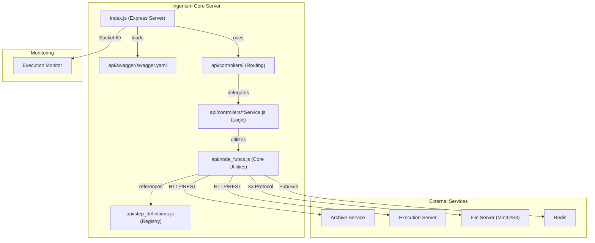
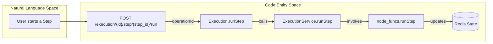

# Page: Core Architecture

# Core Architecture

Relevant source files

The following files were used as context for generating this wiki page:

- [README.md](README.md)
- [api/controllers/Health.js](api/controllers/Health.js)
- [api/controllers/HealthService.js](api/controllers/HealthService.js)

The Ingenium Core Server acts as the central orchestration layer of the OpenIngenium ecosystem. It provides a unified RESTful API that abstracts the complexities of downstream services—such as the Archive, Execution Server, and Redis state stores—into a cohesive domain model for procedures and executions.

The server is built on **Node.js** using the **Express** framework, utilizing a contract-first approach where the API structure and validation are governed by an OpenAPI (Swagger) specification.

### High-Level System Overview

The following diagram illustrates the relationship between the Core Server's internal components and the external services it orchestrates.

**System Component Map**

**Sources:** [README.md:19-29](), [index.js:1-50](), [api/node_funcs.js:1-100]()

---

### Request Lifecycle and Middleware

The server implements a standard middleware stack managed by `swagger-tools`. Every incoming request passes through several layers before reaching the business logic:

1.  **Initialization**: The Express app is initialized and configured with security headers and body parsers [index.js:23-45]().
2.  **Swagger Metadata**: The `swaggerMetadata()` middleware attaches OpenAPI definitions to the `req.swagger` object [index.js:75-80]().
3.  **Authentication**: A custom JWT-based middleware validates tokens against a public key or secret [index.js:115-150]().
4.  **Validation**: `swaggerValidator()` ensures that request parameters, headers, and body payloads conform to the `swagger.yaml` schema [index.js:82-85]().
5.  **Routing**: `swaggerRouter()` maps the `operationId` defined in the YAML to a specific function in the `api/controllers/` directory [index.js:87-92]().

For details on the bootstrap process and middleware configuration, see [Server Bootstrap and Middleware (index.js)](#2.1).

---

### Core Business Logic (`node_funcs`)

While controllers handle HTTP concerns, the `api/node_funcs.js` module serves as the primary engine for the server. It encapsulates the "heavy lifting" of the system, including:

*   **Service Integration**: Managing communication with the Archive and Execution Server APIs.
*   **Execution Lifecycle**: Functions like `runStep`, `createExecution`, and `haltExecution` manage the transition of procedures from static records to live runs [api/node_funcs.js:2330-2450]().
*   **Data Persistence**: Handling file uploads/downloads via S3-compatible storage and maintaining transient state in Redis.
*   **Error Propagation**: A centralized `push_error` utility ensures consistent error reporting across the stack [api/node_funcs.js:150-170]().

For a full reference of available utilities, see [node_funcs — Core Business Logic Module](#2.2).

**Code Entity Mapping: Request to Logic**

**Sources:** [api/controllers/Execution.js:35-40](), [api/node_funcs.js:2330-2350]()

---

### Configuration and Environment

The server is designed to be twelve-factor compliant, relying heavily on environment variables for configuration. Key parameters include service URLs (`ARCHIVE`, `EXECUTION`), security credentials (`JWT_SECRET`, `PUBLIC_PEM`), and operational limits (`SERVER_TIMEOUT_SEC`).

The `config.js` file acts as the central registry, providing defaults and parsing these variables for use throughout the application.

For a complete list of configuration options, see [Configuration and Environment Variables](#2.3).

---

### API Specification (OpenAPI)

The entire API surface is defined in `api/swagger/swagger.yaml`. This file is the "source of truth" for:
*   **Resource Paths**: Defining endpoints for Procedures, Executions, and Venues.
*   **Security Scopes**: Implementing Role-Based Access Control (RBAC) via OAuth2 scopes (e.g., `admin`, `execute:wsts`).
*   **Model Definitions**: Defining the structure of complex objects like `ArchiveElement` or `ExecutionStatus`.

For details on the specification and scope model, see [OpenAPI Specification (swagger.yaml)](#2.4).

---

### Health Monitoring

The server provides a basic health check endpoint used by orchestrators (like Kubernetes or Docker Compose) to verify availability.

| Endpoint | Controller | Function | Purpose |
| :--- | :--- | :--- | :--- |
| `GET /health` | `Health.js` | `health_get` | Returns `{"status": "OK"}` if the process is responsive. |

**Sources:** [api/controllers/Health.js:7-9](), [api/controllers/HealthService.js:11-19]()
