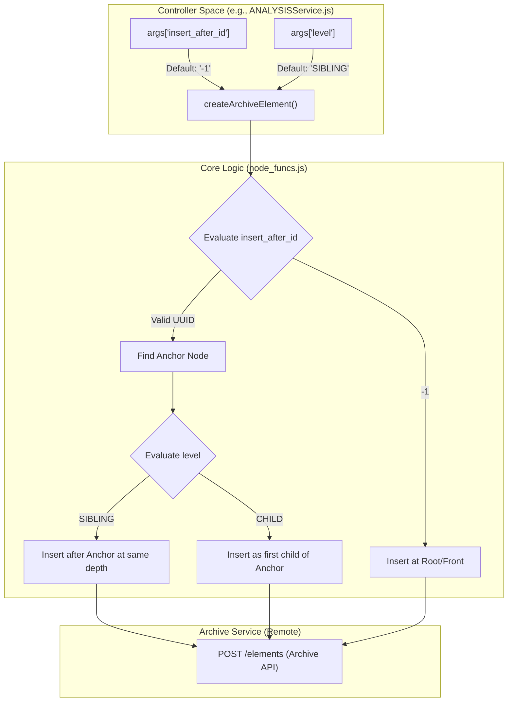
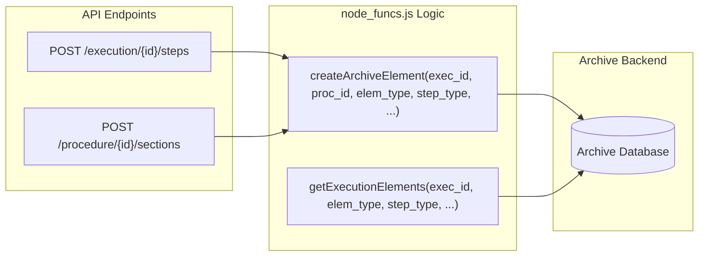

# Page: Element Hierarchy and Positioning

# Element Hierarchy and Positioning

Relevant source files

The following files were used as context for generating this wiki page:

- [api/controllers/ANALYSISService.js](api/controllers/ANALYSISService.js)
- [api/controllers/BUS_1553Service.js](api/controllers/BUS_1553Service.js)
- [api/controllers/ExecutionService.js](api/controllers/ExecutionService.js)
- [api/controllers/Procedure_ElementService.js](api/controllers/Procedure_ElementService.js)

This page documents the tree structure and positioning logic for archive elements within the Ingenium Core Server. Procedures and Executions are composed of a hierarchical tree of elements, including **SECTIONS**, **STEPS**, **PARAGRAPHS**, and **TOC** (Table of Contents) nodes. The server maintains this structure using a combination of parent-child relationships and ordered sequencing, managed primarily through the `node_funcs` utility module.

## 1. Tree Structure and Element Types

Every procedure or execution is represented as a directed tree of elements. The hierarchy allows for nesting (e.g., a SECTION containing multiple STEPS or nested SECTIONS).

| Element Type | Description |
| :--- | :--- |
| **SECTION** | A container element used to group other elements. It defines the structural branches of the tree. |
| **STEP** | An executable or verifiable unit (e.g., `CMD`, `ANALYSIS`, `WAIT`). |
| **PARAGRAPH** | A documentation element containing formatted text. |
| **TOC** | A Table of Contents element used for navigation. |

The positioning of these elements is determined by two primary factors during creation or movement: the `insert_after_id` and the `level`.

Sources: [api/controllers/ExecutionService.js:27-51](), [api/controllers/ANALYSISService.js:4-26]()

---

## 2. Positioning Logic: SIBLING vs CHILD

When adding or moving an element, the API requires specifying where the element should reside relative to an existing "anchor" element (`insert_after_id`).

### Insertion Levels
*   **SIBLING**: The new element is placed at the same hierarchical depth as the anchor element, immediately following it.
*   **CHILD**: The new element is placed one level deeper than the anchor element, becoming its first child.

### The Front Insertion Marker (`-1`)
To insert an element at the very beginning of a procedure or as the first element under a specific parent when no other siblings exist, the system uses a reserved ID: `-1`.
*   Providing `insert_after_id: "-1"` signifies that the element should be placed at the top of the natural order.

### Diagram: Insertion Data Flow
The following diagram illustrates how controller arguments are passed to the core logic in `node_funcs.js` to determine tree placement.

**Tree Positioning Data Flow**

Sources: [api/controllers/ANALYSISService.js:16-20](), [api/controllers/BUS_1553Service.js:15-19](), [api/controllers/ExecutionService.js:41-45]()

---

## 3. Natural Order Traversal

The "Natural Order" is the sequence in which elements appear when the tree is flattened for display or sequential execution. The server retrieves elements in this order to ensure that the UI and the execution engine process steps as intended by the author.

### Retrieval and Sorting
Elements are fetched via `getExecutionElements` or `getProcedureElements`. These functions support a `sort` parameter:
*   **ASC (Ascending)**: Returns elements in the order they appear from top to bottom in the tree (Depth-First Search order).
*   **DESC (Descending)**: Reverses the natural order.

### Implementation in node_funcs
The `node_funcs.js` module acts as the orchestrator for these operations, delegating the actual persistence to the Archive service while maintaining the business rules for hierarchy.

| Function | Role in Hierarchy |
| :--- | :--- |
| `createArchiveElement` | Handles the initial placement logic using `insert_after_id` and `level`. |
| `getExecutionElements` | Retrieves a flattened list of elements based on natural order. |
| `getStep` / `get_step_input` | Fetches specific node data without structural context. |
| `as_run` | Generates a complete tree representation of an execution for reporting. |

Sources: [api/controllers/ANALYSISService.js:82-110](), [api/controllers/ExecutionService.js:93-112](), [api/controllers/ExecutionService.js:131-156]()

---

## 4. Implementation Details

The hierarchy is managed through the `createArchiveElement` function, which is the central entry point for all element types (Steps, Sections, etc.).

**Code-to-System Mapping**

### Element Creation Parameters
When `createArchiveElement` is called, it translates the high-level tree concepts into the specific format required by the Archive service:
1.  **Context**: Determines if the element belongs to a live `execution_id` or a `procedure_id` working copy.
2.  **Type Mapping**: Maps the `elem_type` (e.g., "STEP") and `step_type` (e.g., "BUS_1553") to ensure the correct schema is applied.
3.  **Positioning**: Passes the `insert_after_id` and `level` to the backend, which maintains the linked-list or nested-set model.

Sources: [api/controllers/ANALYSISService.js:20-20](), [api/controllers/BUS_1553Service.js:19-19](), [api/controllers/ExecutionService.js:45-45]()
