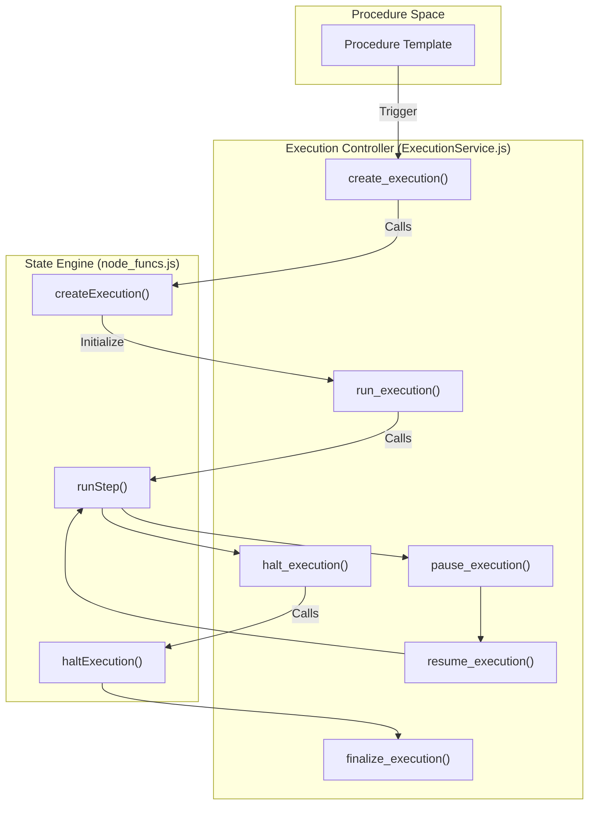
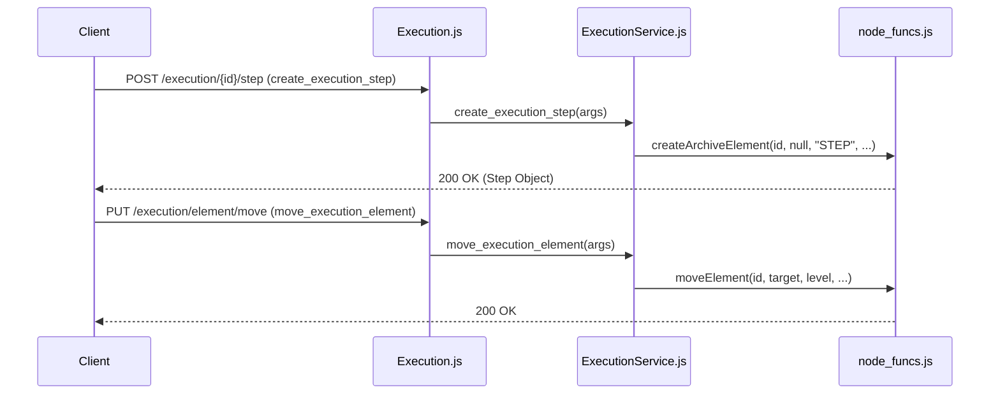

# Page: Execution Domain Controllers

# Execution Domain Controllers

Relevant source files

The following files were used as context for generating this wiki page:

- [api/controllers/Execution.js](api/controllers/Execution.js)
- [api/controllers/ExecutionService.js](api/controllers/ExecutionService.js)

The Execution Domain Controllers manage the lifecycle and operational state of procedure executions. This includes the creation of live execution instances from procedure templates, real-time control (start, stop, pause, resume), and the management of execution-specific elements such as steps and sections.

## Overview

The execution domain is implemented via two primary files:
*   `api/controllers/Execution.js`: The entry point for the OpenAPI router. It extracts parameters from the request and forwards them to the service layer [api/controllers/Execution.js:1-170]().
*   `api/controllers/ExecutionService.js`: The business logic layer that interacts with `node_funcs.js` to perform database operations, state transitions in Redis, and communication with the Execution Server [api/controllers/ExecutionService.js:1-930]().

### Execution Lifecycle Flow

The following diagram illustrates the transition from a Procedure template to a live Execution and its subsequent operational states.

**Execution State Transition Map**

**Sources:** [api/controllers/ExecutionService.js:7-25](), [api/controllers/ExecutionService.js:137-139](), [api/controllers/ExecutionService.js:61-63](), [api/controllers/ExecutionService.js:57-59]().

---

## Execution Management

### Lifecycle Operations
The controller provides endpoints to manage the high-level state of an execution.

| Function | Description | Implementation Detail |
| :--- | :--- | :--- |
| `create_execution` | Instantiates a new execution from a procedure. | Calls `node_funcs.createExecution` [api/controllers/ExecutionService.js:19-19](). |
| `get_execution` | Retrieves metadata (tags, status, conductor). | Calls `node_funcs.getExecution` [api/controllers/ExecutionService.js:84-84](). |
| `update_execution` | Updates metadata like title or description. | Calls `node_funcs.updateExecution` [api/controllers/ExecutionService.js:861-861](). |
| `delete_execution` | Removes an execution record. | Calls `node_funcs.removeExecution` [api/controllers/ExecutionService.js:64-64](). |
| `finalize_execution` | Marks an execution as complete/closed. | Calls `node_funcs.finalizeExecution` [api/controllers/ExecutionService.js:926-926](). |

### Runtime Control
These functions manage the active "running" state of the execution engine.

*   **Run/Halt**: `run_execution` triggers the execution of a specific step or the next available step in the sequence [api/controllers/ExecutionService.js:833-851](). `halt_execution` immediately stops the engine [api/controllers/ExecutionService.js:275-292]().
*   **Pause/Resume**: `pause_execution` sets the execution state to paused [api/controllers/ExecutionService.js:294-311](), while `resume_execution` restarts the flow [api/controllers/ExecutionService.js:891-908]().
*   **Step Re-runs**: `rerun_step` allows a conductor to re-execute a step that has already been run, maintaining a history of attempts [api/controllers/ExecutionService.js:806-823]().

**Sources:** [api/controllers/ExecutionService.js:7-91](), [api/controllers/ExecutionService.js:275-311](), [api/controllers/ExecutionService.js:806-930]().

---

## Execution Elements and Tree Structure

Executions are composed of an ordered tree of elements (Steps, Sections, Paragraphs, TOCs). The controller manages this hierarchy using a linked-list model with `insert_after_id` and `level` (SIBLING/CHILD) parameters.

### Data Flow: Element Management

The following diagram maps the API routes to the internal `node_funcs` logic for element manipulation.

**Element Manipulation Mapping**

**Sources:** [api/controllers/ExecutionService.js:27-51](), [api/controllers/ExecutionService.js:376-393](), [api/controllers/ExecutionService.js:45-45]().

### Reporting and Visualization
*   **As-Run Tree**: `get_execution_as_run` returns a hierarchical tree structure of the execution, including the status and results of every element as it was executed [api/controllers/ExecutionService.js:93-112]().
*   **History**: `get_execution_history` provides a flat list of step execution events, useful for audit trails [api/controllers/ExecutionService.js:184-203]().
*   **Outline**: `get_execution_outline` returns a lightweight version of the element tree for navigation sidebars [api/controllers/ExecutionService.js:395-412]().

**Sources:** [api/controllers/ExecutionService.js:93-112](), [api/controllers/ExecutionService.js:184-203](), [api/controllers/ExecutionService.js:395-412]().

---

## Step Execution Logic

Running a step involves complex interactions between the server and the execution engine.

1.  **Request**: The client calls `run_execution` with an `execution_id` and an optional `step_id` [api/controllers/ExecutionService.js:833-833]().
2.  **Validation**: The service validates the user's authority via `node_funcs.get_auth_key` [api/controllers/ExecutionService.js:842-842]().
3.  **Dispatch**: The system calls `node_funcs.runStep`, which updates the Redis state and notifies the Execution Monitor [api/controllers/ExecutionService.js:845-845]().
4.  **Wait States**: If a step requires manual input or a timed wait, the controller manages these via `set_switch_wait` and `get_switch_wait`, which interact with the execution's control flags [api/controllers/ExecutionService.js:329-374]().

### Bulk Operations
The controller supports bulk actions for post-execution review:
*   **Bulk Justify**: `execution_bulk_justify` allows adding justifications to multiple failed or skipped steps at once [api/controllers/ExecutionService.js:560-577]().
*   **Bulk Approve**: `execution_bulk_approve` allows a reviewer to approve multiple steps in the execution record [api/controllers/ExecutionService.js:614-631]().

**Sources:** [api/controllers/ExecutionService.js:833-851](), [api/controllers/ExecutionService.js:329-374](), [api/controllers/ExecutionService.js:560-631]().
