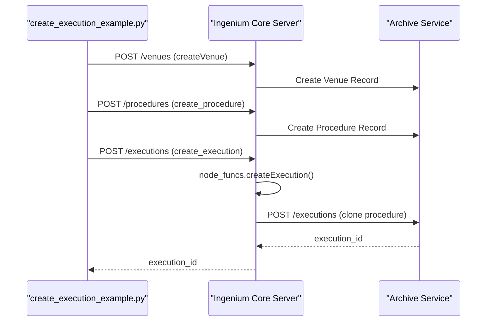
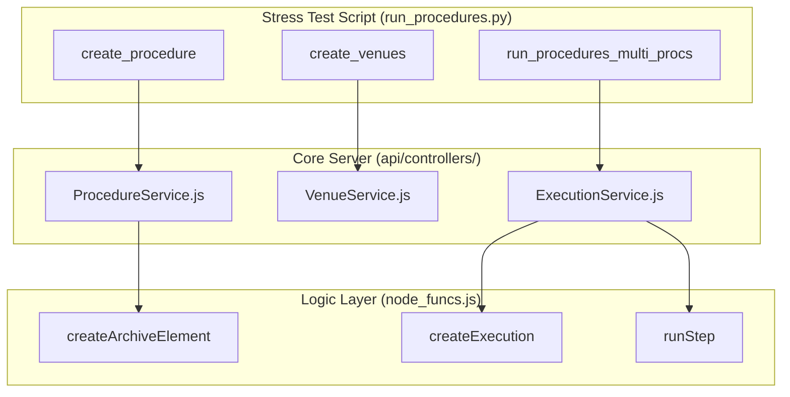

# Page: Execution Examples and Stress Tests

# Execution Examples and Stress Tests

Relevant source files

The following files were used as context for generating this wiki page:

- [README.md](README.md)
- [api/controllers/ExecutionService.js](api/controllers/ExecutionService.js)

This page documents the auxiliary Python scripts used for demonstrating system capabilities, performing asynchronous execution flows, and conducting high-load stress testing against the Ingenium Core Server. These scripts are located in `tests/execution_examples/` and `tests/stress_tests/`.

## 1. Execution Examples

The execution examples provide reference implementations for common API interactions, such as creating procedures, managing execution lifecycles, and handling complex step types like External Interface Procedures (EIP).

### 1.1 Basic and Async Execution
The system supports both synchronous and asynchronous execution patterns.
*   **`create_execution_example.py`**: Demonstrates the standard flow of creating a venue, creating a procedure, and then instantiating an execution from that procedure.
*   **`async_execution_example.py`**: Illustrates how to trigger execution steps and monitor their status asynchronously, which is critical for long-running operations like `WAIT` or `QUERY_EVR` steps.

### 1.2 EIP and Conductor Management
*   **`create_eip_procedure.py`**: Specifically focuses on the `Manual_EIP` (External Interface Procedure) step type. It demonstrates how to author a procedure that requires external signals or manual confirmation to proceed.
*   **`change_test_conductor.py`**: Shows how to update the metadata of an active execution, specifically changing the assigned test conductor during runtime.

### 1.3 Data Portability
The scripts `import_procedure.py` and `export_procedure.py` utilize the Core Server's import/export endpoints to move procedure definitions between environments or back up definitions to local JSON files.

**Data Flow: Execution Creation Example**
The following diagram describes the sequence of events in a typical execution example script.

"Execution Creation Flow"

Sources: [api/controllers/ExecutionService.js:7-25](), [README.md:31-43]()

---

## 2. Stress Testing (run_procedures.py)

The `tests/stress_tests/run_procedures.py` script is a comprehensive load-testing tool designed to simulate high-concurrency environments. It uses a command-line interface to perform batch operations.

### 2.1 Key Commands
The script supports several sub-commands to simulate different stages of the system lifecycle:

| Command | Functionality |
| :--- | :--- |
| `create_venues` | Generates a specified number of venues to simulate a large-scale testbed. |
| `create_procedure` | Authors a procedure with a defined number of steps to test Archive's ingestion performance. |
| `run_procedure` | Executes a single procedure from start to finish. |
| `run_procedures_multi_procs` | Uses Python's `multiprocessing` to launch multiple execution instances simultaneously, stressing the Redis state management and the Execution Server. |

### 2.2 Implementation Details
The stress test leverages the `ingenium_client` to interact with the Core Server. It focuses on stressing `node_funcs.createExecution` [api/controllers/ExecutionService.js:19]() and the step-running logic in `node_funcs.runStep`.

**System Stress Points**
The diagram below maps the stress test commands to the internal code entities they exercise.

"Stress Test Entity Mapping"

Sources: [api/controllers/ExecutionService.js:27-51](), [api/controllers/ExecutionService.js:7-25]()

### 2.3 Data Flow in Multi-Process Execution
When `run_procedures_multi_procs` is invoked:
1.  The script initializes a pool of worker processes.
2.  Each worker authenticates and obtains a JWT via `get_auth_key` [api/controllers/ExecutionService.js:15]().
3.  Each worker calls `create_execution` [api/controllers/ExecutionService.js:7]().
4.  Workers iterate through the steps of their respective executions, calling `run_execution_step`.
5.  The Core Server manages the concurrent requests, offloading state to Redis and persistence to the Archive service.

Sources: [api/controllers/ExecutionService.js:7-25](), [api/controllers/ExecutionService.js:27-51](), [README.md:31-43]()
