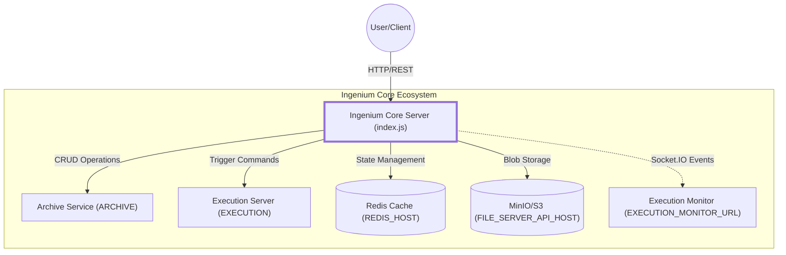
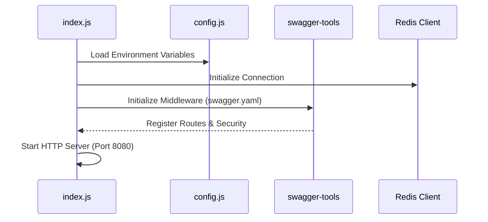

# Page: Getting Started

# Getting Started

<details>
<summary>Relevant source files</summary>

The following files were used as context for generating this wiki page:

- [Dockerfile](Dockerfile)
- [README.md](README.md)

</details>


The **Ingenium Core Server** is a Node.js application that serves as the central orchestration layer for the OpenIngenium ecosystem. It manages the lifecycle of procedures and executions by coordinating between data storage (Archive), logic execution (Execution Server), state management (Redis), and file storage (MinIO/S3).

## System Architecture and Data Flow

The Core Server acts as a middleware hub. It does not store procedure or execution data locally; instead, it provides a unified API to manipulate resources distributed across several microservices.

### Service Connectivity Diagram

This diagram illustrates how the `Ingenium Core Server` (defined in `index.js`) interacts with its required dependencies during a standard request lifecycle.



**Sources:**
- `index.js` (Server initialization and Socket.IO setup)
- `config.js` (Environment variable mapping)
- `api/node_funcs.js` (Logic for interacting with external services)

---

## Configuration

The server is configured primarily through environment variables. These are processed in `config.js` and used throughout the application to locate dependent services.

### Core Environment Variables

| Variable | Description | Default |
| :--- | :--- | :--- |
| `ARCHIVE` | URL of the Archive Service API (v5) | `http://localhost:8010/api/v5` |
| `EXECUTION` | URL of the Execution Server API (v4) | `http://localhost:9999/api/v4` |
| `REDIS_HOST` | Hostname for the Redis instance | `localhost` |
| `REDIS_PORT` | Port for the Redis instance | `6379` |
| `FILE_SERVER_API_HOST` | Endpoint for S3/MinIO file storage | `http://localhost:9000` |
| `JWT_SECRET` | Secret key for verifying JSON Web Tokens | `bigsecret` |
| `EXECUTION_MONITOR_URL` | URL for the Socket.IO monitor service | `http://localhost:3002` |

**Sources:**
- [config.js:1-50]()
- [README.md:21-29]()

---

## Deployment Options

### 1. Local Development (npm)

To run the server locally for development purposes, ensure you have Node.js 12.x installed.

1. Install dependencies: `npm install` (or `npm ci` for a clean install).
2. Set the required environment variables in your shell.
3. Start the server:
   ```bash
   npm start
   ```
4. Access the Swagger UI for API documentation at `http://localhost:8080/docs`.

**Sources:**
- [README.md:6-17]()
- [package.json:6-10]() (Scripts definition)

### 2. Docker Deployment

The project includes a `Dockerfile` optimized for containerized environments, utilizing a specific Node.js base image and setting up a data directory.

```dockerfile
FROM cae-artifactory.jpl.nasa.gov:17001/node:12.22.1
WORKDIR /app
COPY . /app
RUN npm ci && \
	mkdir /app/data
USER root
ENTRYPOINT ["npm", "start"]
```

**Sources:**
- [Dockerfile:1-7]()

---

## Service Integration Details

### Archive and Execution Server Connection
The Core Server delegates data persistence to the **Archive** service and logic processing to the **Execution Server**. 
- Functions in `api/node_funcs.js` such as `createArchiveElement` [api/node_funcs.js:105-130]() utilize the `ARCHIVE` environment variable to perform REST calls.
- Execution lifecycle management, such as `runStep` [api/node_funcs.js:680-710](), routes requests to the `EXECUTION` server endpoint.

### State and File Management
- **Redis**: Used for high-frequency state tracking during active executions. The server connects using `REDIS_HOST` and `REDIS_PORT`.
- **MinIO/S3**: Used for storing binary data products, images, and procedure exports. Configuration is handled via `FILE_SERVER_API_HOST`, `MEDIA_BUCKET`, and credential variables (e.g., `S3_ACCESS_KEY`).

### Bootstrapping Logic
The entry point `index.js` initializes the Express application and wires the middleware stack.



**Sources:**
- [index.js:1-100]()
- [config.js:1-40]()
- [api/node_funcs.js:1-150]()

---

## Initial Verification

Once the server is running, you can verify the setup by running the integration tests located in the `tests/` directory. These tests require the Archive and Execution services to be reachable.

```bash
cd tests
# Ensure config.py matches your local environment
python executions_test.py
python venues_test.py
```

**Sources:**
- [README.md:31-43]()
- [tests/config.py:1-20]()
