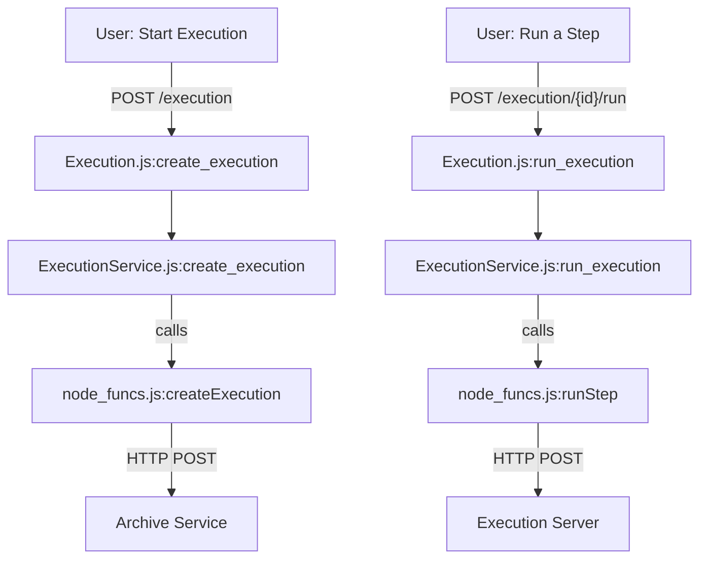
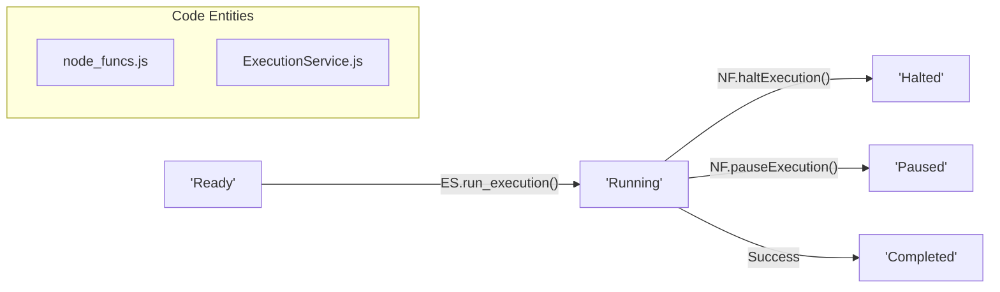

# Page: Glossary

# Glossary

Relevant source files

The following files were used as context for generating this wiki page:

- [Dockerfile](Dockerfile)
- [Jenkinsfile](Jenkinsfile)
- [README.md](README.md)
- [api/controllers/ANALYSISService.js](api/controllers/ANALYSISService.js)
- [api/controllers/BUS_1553Service.js](api/controllers/BUS_1553Service.js)
- [api/controllers/Execution.js](api/controllers/Execution.js)
- [api/controllers/ExecutionService.js](api/controllers/ExecutionService.js)
- [api/controllers/Procedure.js](api/controllers/Procedure.js)
- [api/controllers/ProcedureService.js](api/controllers/ProcedureService.js)

This page provides definitions for codebase-specific terms, abbreviations, and domain concepts used within the Ingenium Core Server. It serves as a technical reference for onboarding engineers to understand how natural language concepts map to specific code entities and implementation logic.

## Core Concepts

### Archive Element
The fundamental building block of procedures and executions. Elements are stored in the **Archive** service and can be of several types: `SECTION`, `STEP`, `PARAGRAPH`, or `TOC` [api/node_funcs.js:15-20](). Elements are organized in a tree structure maintained via `insert_after_id` and `level` (`SIBLING` or `CHILD`) parameters [api/controllers/ExecutionService.js:33-35]().

### Execution
A "live" instance of a procedure being run against a specific venue. Executions track state, history, and results. They are managed via the `ExecutionService` [api/controllers/ExecutionService.js:7-25]() and stored in the Archive.

### Procedure
The template or "source code" for an execution. Procedures consist of a hierarchy of elements. The server supports a "Working Copy" concept where edits are made before being finalized or versioned [api/controllers/ProcedureService.js:6-25]().

### Venue
A physical or virtual testbed where an execution takes place. Venues have configurations and status states that are managed through the `VenueService` [api/controllers/VenueService.js]().

---

## Technical Terms & Abbreviations

| Term | Definition | Implementation Reference |
| :--- | :--- | :--- |
| **As-Run** | A report or tree structure representing the final state and results of a completed execution. | `node_funcs.as_run` [api/node_funcs.js:105-112]() |
| **EMS** | Execution Monitor Service. A component that tracks live execution status via Socket.IO. | `index.js:200-210]()` |
| **JWT** | JSON Web Token. Used for stateless authentication between the client and Core Server. | `index.js:50-65]()` |
| **node_funcs** | The central utility module containing core business logic and external service integrations. | `api/node_funcs.js` |
| **Step Type** | A specific functional definition for a `STEP` element (e.g., `CMD`, `WAIT`, `ANALYSIS`). | `api/step_definitions.js` |
| **Working Copy** | An editable version of a procedure that has not yet been committed as a fixed version. | `ProcedureService.load_working_copy` [api/controllers/ProcedureService.js:6-15]() |

---

## Data Flow: Natural Language to Code Entity

The following diagram bridges high-level user actions to the specific code functions and services that handle them.

### Execution Lifecycle Mapping
"I want to start a test" $\rightarrow$ `createExecution` $\rightarrow$ `runStep`

**Sources:** [api/controllers/Execution.js:5-7](), [api/controllers/ExecutionService.js:7-25](), [api/node_funcs.js:19-25]()

---

## Domain Logic Details

### Element Positioning Logic
The Ingenium Core Server uses a relative positioning system for its tree structure. Instead of absolute indices, elements are placed relative to an existing `elem_id`.

*   **insert_after_id**: The UUID of the reference element.
*   **-1**: A special constant used to indicate "insert at the very beginning" of the list/parent [api/controllers/ANALYSISService.js:16]().
*   **Level**: 
    *   `SIBLING`: Places the new element at the same depth as the reference.
    *   `CHILD`: Places the new element inside the reference (e.g., a Step inside a Section) [api/controllers/ExecutionService.js:34-35]().

### Step Execution State
Steps transition through states managed by the Execution Server but reflected in the Core Server's `node_funcs`.

**Sources:** [api/controllers/ExecutionService.js:137-139](), [api/node_funcs.js:150-165]()

---

## Glossary Table of Step Types

| Step Type | Description | Controller |
| :--- | :--- | :--- |
| **ANALYSIS** | Post-processing or data analysis steps. | `ANALYSISService.js` [api/controllers/ANALYSISService.js:4]() |
| **BUS_1553** | Commands or monitoring for MIL-STD-1553 data buses. | `BUS_1553Service.js` [api/controllers/BUS_1553Service.js:3]() |
| **CMD** | A generic command sent to the system under test. | `CMDService.js` |
| **WAIT** | A temporal pause in execution (duration or absolute time). | `WAITService.js` |
| **TOC** | Table of Contents element used for procedure organization. | `TOCService.js` |

**Sources:** [api/controllers/ANALYSISService.js:1-26](), [api/controllers/BUS_1553Service.js:1-25]()