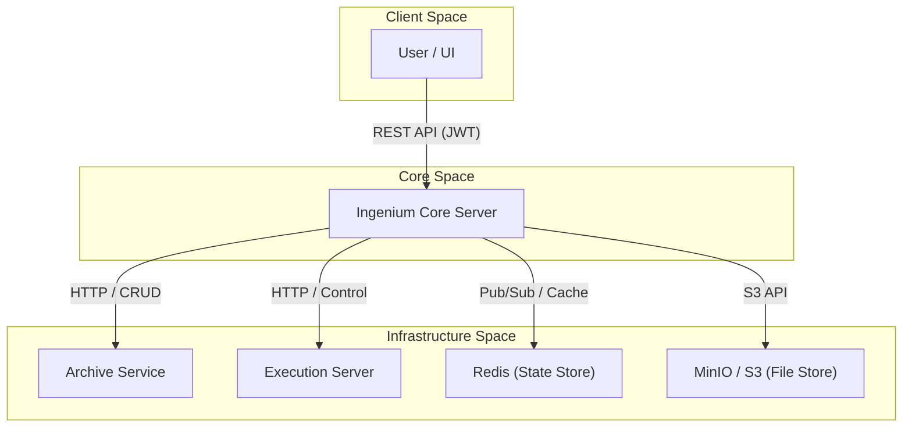
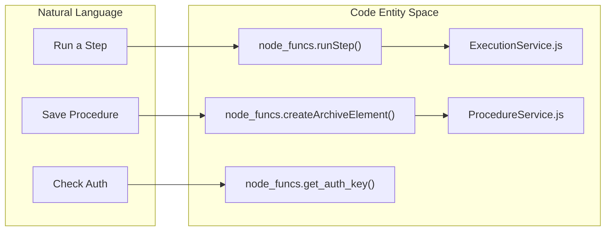

# Page: Ingenium Core Server — Overview

# Ingenium Core Server — Overview

Relevant source files

The following files were used as context for generating this wiki page:

- [Dockerfile](Dockerfile)
- [LICENSE](LICENSE)
- [README.md](README.md)

The **Ingenium Core Server** is the central orchestration component of the OpenIngenium ecosystem. It acts as the primary API gateway and business logic layer, mediating communication between users (via the UI or CLI), the data persistence layer (Archive), and the real-time execution engine (Execution Server).

The server is built on [Node.js](https://nodejs.org/) using the [Express](https://expressjs.com/) framework and heavily leverages `swagger-tools` to provide a contract-first API based on the OpenAPI (Swagger) specification [README.md:1-20]().

### Role in OpenIngenium
The Core Server serves as the "brain" of the system. While the **Archive** handles raw database storage and the **Execution Server** handles low-level hardware commanding, the Core Server manages:
*   **Procedure Lifecycle:** Authoring, versioning, and importing/exporting procedure templates.
*   **Execution Management:** Creating live execution instances from procedures and tracking their state.
*   **Step Orchestration:** Translating high-level step definitions (e.g., Commands, Verifications, Manual Inputs) into actionable requests for downstream services.
*   **Authentication & Authorization:** Validating JWT tokens and enforcing scope-based access control.

### System Context Diagram
The following diagram illustrates how the `ingenium_core_server` interacts with other components in the ecosystem.

**Diagram: High-Level System Context**

Sources: [README.md:21-30](), [Dockerfile:1-7]()

---

### Key Architectural Concepts

#### 1. Contract-First API
The server's behavior is defined by a `swagger.yaml` file. This specification dictates the available endpoints, expected parameters, and security requirements. The `swagger-tools` middleware automatically routes incoming requests to the appropriate controller based on the `operationId` defined in the spec.

#### 2. Controller-Service Pattern
The codebase follows a strict separation of concerns:
*   **Controllers:** Located in `api/controllers/`, these handle request parsing and response formatting.
*   **Services:** Located in `api/controllers/` (as `*Service.js` files), these contain the business logic and interact with external dependencies.

#### 3. Execution State Mapping
The server bridges the gap between static procedure definitions and dynamic execution states. It maps internal "Archive Elements" to "Execution Steps" using a centralized utility module.

**Diagram: Logic to Code Entity Mapping**

Sources: [README.md:3-5](), [Dockerfile:1-7]()

---

### Wiki Navigation

This wiki is organized to guide you through the setup, internal architecture, and specific API domains of the Core Server.

#### [Getting Started](#1.1)
Covers the prerequisites and steps to get the server running locally or via Docker. Includes details on mandatory environment variables like `ARCHIVE`, `EXECUTION`, and `JWT_SECRET`.
*   **Key Files:** `Dockerfile` [1-7](), `package.json`.

#### [CI/CD Pipeline](#1.2)
Explains the automated build and test process managed via Jenkins. It details how the codebase is validated before deployment.
*   **Key Files:** `Jenkinsfile`.

#### [Core Architecture](#2)
A deep dive into the server's internal workings, including the `index.js` bootstrap process, the `node_funcs.js` utility library, and the OpenAPI specification.

#### [API Controllers — Architecture Pattern](#3)
Detailed documentation of the various functional domains:
*   **Execution:** Managing live runs.
*   **Procedures:** Authoring and versioning.
*   **Step Types:** Specific logic for Commands, Verifications, and Telemetry checks.

#### [Step Definitions and Search Definitions](#4)
Technical reference for how different step types (e.g., `CMD`, `WAIT`, `VERIFY_EHA`) are defined and processed by the system.

#### [Testing](#5)
Overview of the Python-based integration test suite used to verify end-to-end functionality across the Core, Archive, and Execution services.
*   **Key Files:** `tests/executions_test.py` [31-43](), `tests/venues_test.py` [31-43]().

---
**Sources:**
*   [README.md:1-43]()
*   [Dockerfile:1-7]()
*   [LICENSE:1-131]()
