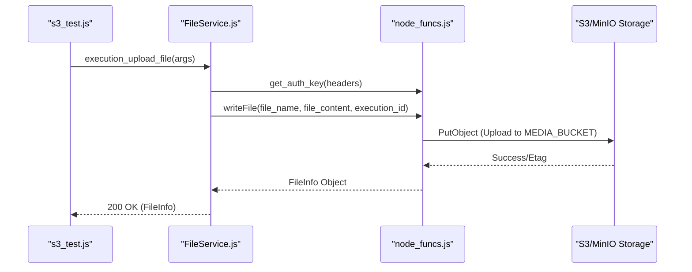
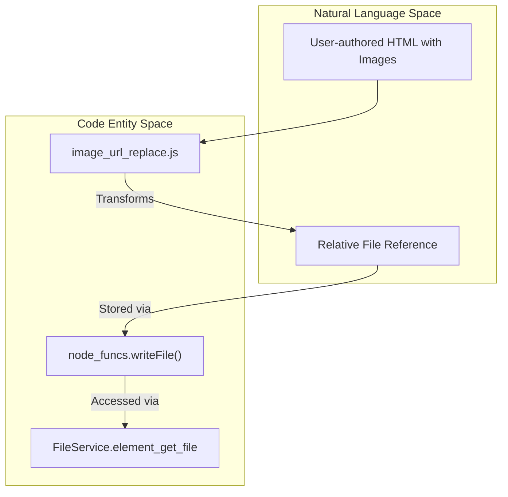

# Page: JavaScript Test Utilities

# JavaScript Test Utilities

Relevant source files

The following files were used as context for generating this wiki page:

- [README.md](README.md)
- [api/controllers/FileService.js](api/controllers/FileService.js)

This section documents the JavaScript-based test utilities and example scripts located in `tests/js_examples/` and `tests/node/regex/`. These utilities serve as ad-hoc tools for validating HTTP client behavior, S3/MinIO connectivity, and complex regex patterns used for content transformation within the Ingenium Core Server.

## HTTP Client and S3 Examples

The `tests/js_examples/` directory contains scripts used to verify the behavior of various Node.js HTTP libraries and storage integrations. These are primarily used for debugging the communication between the Core Server and its dependent services like the Archive and Execution Server.

### Implementation and Data Flow

The scripts demonstrate different patterns for interacting with the Core Server's underlying infrastructure:

*   **HTTP Client Comparison**: `axios_example.js` and `request_example.js` provide templates for making authenticated requests to the API.
*   **Performance Testing**: `fast_calls.js` is utilized to measure the latency and overhead of rapid sequential API calls.
*   **Storage Integration**: `s3_test.js` validates the ability of the server's logic to communicate with S3-compatible storage (MinIO) for file attachments.
*   **Data Transformation**: `reduce_test.js` tests the logic for aggregating or filtering large JSON payloads, often used when processing execution history.

### Logic Flow: File Upload Simulation

The following diagram illustrates how `s3_test.js` and related file utilities interact with the system logic defined in `api/controllers/FileService.js` and `api/node_funcs.js`.

**File Storage Test Flow**

Sources: [api/controllers/FileService.js:98-120](), [api/controllers/FileService.js:1-5]()

## Content Transformation Regex Utilities

The `tests/node/regex/` directory contains specialized scripts for testing the transformation of HTML content. This is critical for maintaining the integrity of procedure elements when they are rendered or exported.

### HTML and Image URL Replacement

The server frequently needs to rewrite URLs or sanitize HTML tags when moving data between the working copy and the execution state.

*   **`html_replace.js`**: Tests regex patterns used to identify and replace specific HTML tags or attributes without corrupting the document structure.
*   **`image_url_replace.js`**: Specifically targets `` tags to ensure that relative paths are correctly converted to absolute URLs pointing to the file server, especially when elements are viewed in different contexts (e.g., PDF export vs. Web UI).

### Regex Transformation Logic

The transformation logic generally follows a pattern of identifying resource IDs and appending the necessary authentication or host prefixes.

**Regex Transformation Mapping**

Sources: [api/controllers/FileService.js:54-74](), [api/controllers/FileService.js:188-195]()

## Summary of Utility Scripts

| File | Purpose | Key Functionality |
| :--- | :--- | :--- |
| `axios_example.js` | HTTP Testing | Demonstrates Promise-based HTTP requests using the Axios library. |
| `request_example.js` | Legacy HTTP Testing | Demonstrates requests using the (now deprecated) `request` library. |
| `s3_test.js` | Storage Validation | Directly tests connectivity to the configured `MEDIA_BUCKET`. |
| `reduce_test.js` | Payload Processing | Validates JavaScript `reduce` logic for summarizing API responses. |
| `html_replace.js` | Sanitization | Tests regex for stripping or modifying HTML tags in procedure descriptions. |
| `image_url_replace.js` | Resource Mapping | Ensures image `src` attributes point to the correct file server endpoints. |

Sources: [api/controllers/FileService.js:5-26](), [api/controllers/FileService.js:131-144]()
