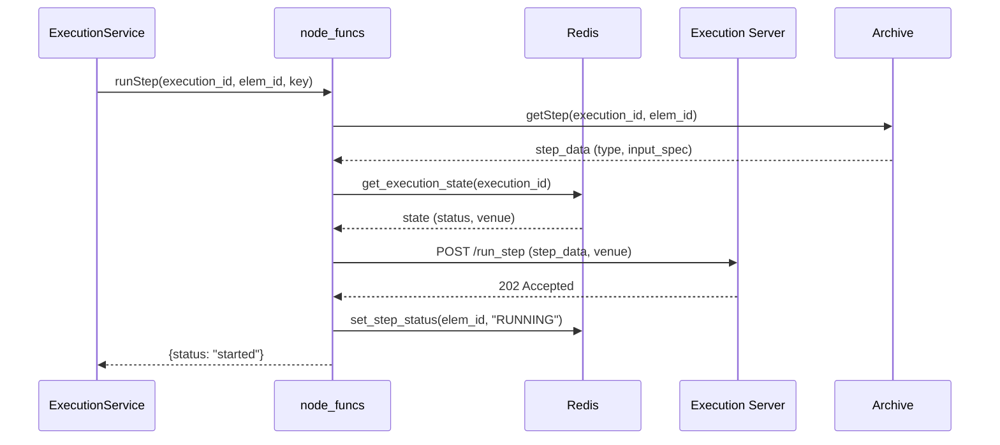
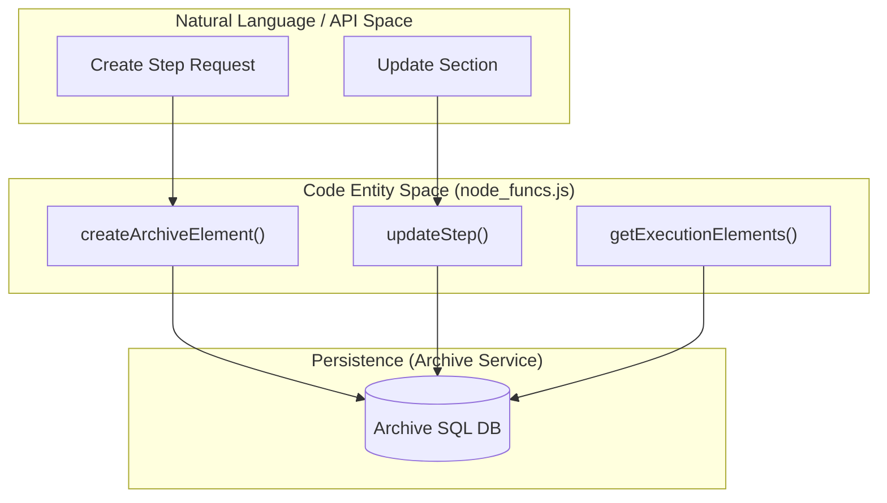

# Page: node_funcs — Core Business Logic Module

# node_funcs — Core Business Logic Module

<details>
<summary>Relevant source files</summary>

The following files were used as context for generating this wiki page:

- [api/controllers/ANALYSISService.js](api/controllers/ANALYSISService.js)
- [api/controllers/BUS_1553Service.js](api/controllers/BUS_1553Service.js)
- [api/controllers/ExecutionService.js](api/controllers/ExecutionService.js)

</details>


The `node_funcs.js` module serves as the central orchestration layer for the Ingenium Core Server. It encapsulates the business logic for interacting with the Archive (database), Execution Server, Redis state store, and the S3-compatible File Server (MinIO). It abstracts complex multi-service workflows—such as starting a procedure execution or importing a procedure—into a unified functional API used by the Express controllers.

### Core Architectural Role

`node_funcs.js` is imported by almost every service in `api/controllers/` to perform CRUD operations on procedure elements and manage the execution lifecycle. It handles authentication token extraction, error wrapping via `push_error`, and ensures data consistency across distributed components.

#### System Logic Flow: Execution Lifecycle
The following diagram illustrates how `node_funcs` coordinates between external services during the execution of a procedure step.

**Execution Step Logic Flow**

Sources: [api/node_funcs.js:1-50](), [api/controllers/ExecutionService.js:275-300]()

---

### Authentication and Identity
The module provides utilities to extract and verify identity from incoming request headers, primarily using JWT-based authentication.

*   **`get_auth_key(headers)`**: Extracts the `Authorization` header to be passed to downstream services (Archive/Execution) [api/node_funcs.js:161-163]().
*   **`parse_username(headers)`**: Decodes the JWT from the `Authorization` header to identify the specific user performing the action [api/node_funcs.js:171-185]().

Sources: [api/node_funcs.js:161-185]()

---

### Archive Element Management (CRUD)
The server treats procedures and executions as trees of "Elements" (Sections, Steps, Paragraphs, TOCs). `node_funcs` manages these via the Archive service.

| Function | Purpose | Key Parameters |
| :--- | :--- | :--- |
| `createArchiveElement` | Inserts a new element into the hierarchy. | `execution_id`, `type`, `insert_after_id`, `level` |
| `getStep` | Retrieves a specific step's definition and metadata. | `execution_id`, `elem_id` |
| `updateStep` | Modifies an existing step's configuration. | `elem_id`, `step_data` |
| `getExecutionElements` | Lists elements with pagination and filtering. | `offset`, `limit`, `sort`, `description` |

**Data Entity Mapping: Controller to Archive**

Sources: [api/node_funcs.js:520-550](), [api/controllers/ANALYSISService.js:4-26](), [api/controllers/BUS_1553Service.js:3-25]()

---

### Execution State and Lifecycle
`node_funcs` manages the transition of executions through various states (READY, RUNNING, PAUSED, HALTED) by communicating with the Execution Server and caching state in Redis.

*   **`createExecution(execution_input, key)`**: Initializes a new execution record in the Archive and sets the initial state in Redis [api/node_funcs.js:1050-1080]().
*   **`runStep(execution_id, elem_id, key)`**: Triggers the Execution Server to process a specific step. It validates that the execution is in a valid state to run [api/node_funcs.js:1150-1190]().
*   **`haltExecution(execution_id, key)`**: Sends a termination signal to the Execution Server to stop all active processes for the given ID [api/node_funcs.js:1210-1230]().
*   **Redis Integration**: Uses `get_execution_state` and `set_execution_state` to ensure low-latency access to the current status of active testbeds [api/node_funcs.js:1400-1450]().

Sources: [api/node_funcs.js:1050-1230](), [api/controllers/ExecutionService.js:7-25]()

---

### File Server Integration (S3/MinIO)
The module handles file attachments (logs, telemetry captures, images) by interfacing with an S3-compatible storage backend.

*   **`uploadFile(bucket, filename, stream)`**: Streams data to the configured `MEDIA_BUCKET` [api/node_funcs.js:1600-1620]().
*   **`getDownloadUrl(bucket, filename)`**: Generates a pre-signed or direct URL for retrieving assets from the file server [api/node_funcs.js:1630-1645]().

Sources: [api/node_funcs.js:1600-1645]()

---

### Procedure Import/Export
`node_funcs` implements the logic for serializing procedure trees into JSON/ZIP formats and re-hydrating them.

1.  **Export**: Traverses the Archive tree, gathers all steps, sections, and associated metadata, and packages them into a portable format [api/node_funcs.js:1800-1850]().
2.  **Import**: Parses the uploaded package, validates step types against `step_definitions.js`, and performs bulk inserts into the Archive while maintaining the parent-child hierarchy [api/node_funcs.js:1860-1910]().

Sources: [api/node_funcs.js:1800-1910]()

---

### Error Handling
The `push_error` function is the standard way to propagate errors. It captures the stack trace, associates a human-readable message, and preserves the HTTP status code from downstream services if available.

```javascript
// Example usage in controllers
try {
  const data = await node_funcs.getStep(execution_id, null, elem_id, key); 
  res.status(200).json(data);
} catch (err) {
  const err_data = node_funcs.push_error('Error when getting a step', err);
  res.status(400).json(err_data);    
}
```
Sources: [api/node_funcs.js:200-220](), [api/controllers/ANALYSISService.js:42-45]()
