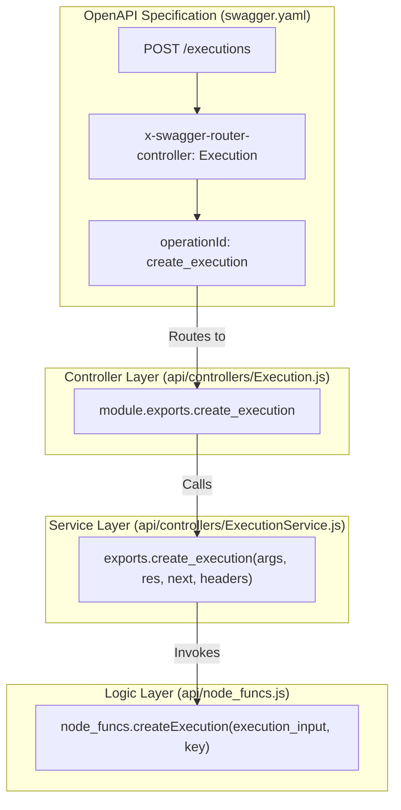

# Page: OpenAPI Specification (swagger.yaml)

# OpenAPI Specification (swagger.yaml)

<details>
<summary>Relevant source files</summary>

The following files were used as context for generating this wiki page:

- [README.md](README.md)
- [api/controllers/Execution.js](api/controllers/Execution.js)
- [api/controllers/ExecutionService.js](api/controllers/ExecutionService.js)

</details>


The `api/swagger/swagger.yaml` file is the central contract for the Ingenium Core Server. It defines the API structure, versioning, security requirements, and the mapping between HTTP endpoints and the JavaScript controller functions. The project utilizes `swagger-tools` middleware to automate request validation and routing based on this specification [README.md:19-19]().

## API Overview and Versioning

The Ingenium Core Server implements **version 5** of the Ingenium API. 

| Attribute | Value | Source |
| :--- | :--- | :--- |
| **OpenAPI Version** | 2.0 (Swagger) | `api/swagger/swagger.yaml` |
| **API Version** | 5.0.0 | `api/swagger/swagger.yaml` |
| **Base Path** | `/api/v5` | `api/swagger/swagger.yaml` |
| **Schemes** | http, https | `api/swagger/swagger.yaml` |

The server is designed as a middle-tier orchestrator, often proxying or aggregating data from the **Archive** (v5) and **Execution Server** (v4) [README.md:26-27]().

## Security Definitions and Scopes

The API uses OAuth2 with JWT for authentication. Security is enforced via scopes that define granular permissions for different operational domains.

### Scope Model
The following scopes are defined within the `securityDefinitions` of the specification:

*   **`admin`**: Full administrative access to the system.
*   **`execute:wsts`**: Permission to run executions specifically for WSTS (Weapon System Test Suite) environments.
*   **`execute:testbed`**: Permission to run executions on hardware testbeds.
*   **`read:procedures`**: Read-only access to procedure definitions and versions.
*   **`write:procedures`**: Permission to create, update, and import procedures.

### Authentication Flow
When a request is received, the `swagger-tools` middleware validates the JWT in the `Authorization` header. Controllers then extract the identity and authorization context using `node_funcs.get_auth_key(headers)` [api/controllers/ExecutionService.js:15-15]().

## Operation Mapping (Controller Logic)

The specification uses the `x-swagger-router-controller` and `operationId` vendor extensions to map REST endpoints to specific JavaScript files and functions.

### Request Data Flow
1.  **Middleware**: `swagger-tools` parses the incoming request against the YAML definition.
2.  **Parameter Extraction**: Parameters (path, query, body) are attached to `req.swagger.params` [api/controllers/Execution.js:6-6]().
3.  **Controller Routing**: The middleware identifies the controller file (e.g., `Execution.js`) and calls the function matching the `operationId`.
4.  **Service Delegation**: The controller extracts parameters and passes them to a corresponding Service module (e.g., `ExecutionService.js`) [api/controllers/Execution.js:5-7]().

### Mapping Example: Execution Domain
The following diagram illustrates how the YAML definition maps to the codebase for the `create_execution` operation.

**Operation Mapping Architecture**

**Sources:** [api/controllers/Execution.js:5-7](), [api/controllers/ExecutionService.js:7-25](), [api/node_funcs.js:1-1]()

## Key Operation Groups

The specification organizes the API into several functional domains:

| Tag | Responsibility | Key OperationIds |
| :--- | :--- | :--- |
| **Execution** | Live execution lifecycle and state. | `create_execution`, `run_execution`, `halt_execution` |
| **Procedure** | Procedure authoring and versioning. | `get_procedures`, `create_procedure_version` |
| **Step Types** | Specific logic for different command types. | `create_execution_step`, `update_step_result` |
| **Venue** | Environment and hardware configuration. | `get_venues`, `update_venue_status` |

### Parameter Handling
All controllers follow a standard pattern for accessing validated parameters from the OpenAPI spec:
*   **Body Parameters**: Accessed via `args['body_name']['value']` [api/controllers/ExecutionService.js:16-16]().
*   **Path/Query Parameters**: Accessed via `args['param_name']['value']` [api/controllers/ExecutionService.js:38-42]().

## Data Model to Code Mapping

The `definitions` section of `swagger.yaml` defines the complex objects used across the API. These definitions are mirrored in the `node_funcs.js` logic and the `step_definitions.js` registry.

**Data Entity Association**
```mermaid
graph LR
    subgraph "Swagger Definitions"
        S1["ExecutionInfo"]
        S2["Step"]
        S3["Procedure"]
    end

    subgraph "node_funcs.js Entities"
        N1["createExecution()"]
        N2["createArchiveElement()"]
        N3["getProcedure()"]
    end

    subgraph "Archive Service (Remote)"
        R1["/elements"]
        R2["/procedures"]
    end

    S1 <..> N1
    S2 <..> N2
    S3 <..> N3
    N2 -- "POST" --> R1
    N3 -- "GET" --> R2
```
**Sources:** [api/controllers/ExecutionService.js:19-19](), [api/controllers/ExecutionService.js:45-45](), [api/node_funcs.js:1-1]()

## Documentation Access
The server provides a built-in Swagger UI for interactive documentation. When the server is running, the UI is accessible at:
`http://localhost:8080/docs` [README.md:16-16]().

**Sources:**
* `README.md`
* `api/controllers/Execution.js`
* `api/controllers/ExecutionService.js`
* `api/swagger/swagger.yaml` (Implicit as the subject of the page)
