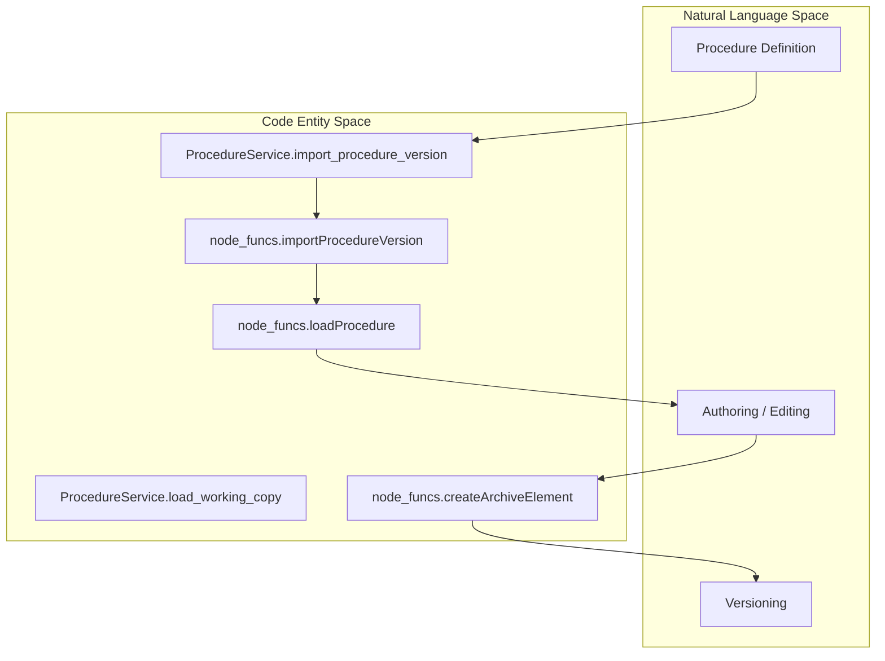
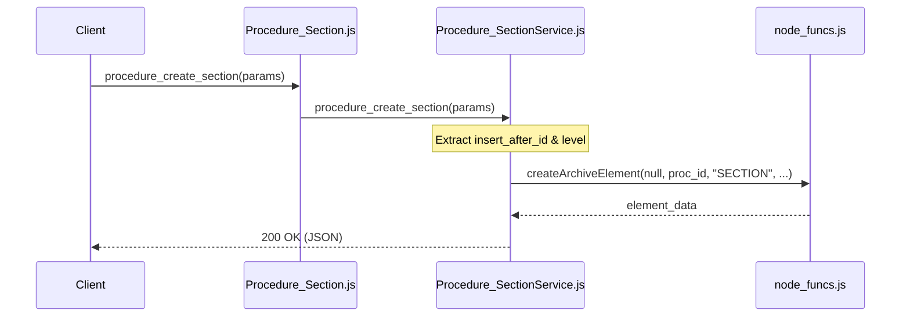

# Page: Procedure Domain Controllers

# Procedure Domain Controllers

Relevant source files

The following files were used as context for generating this wiki page:

- [api/controllers/ProcSection.js](api/controllers/ProcSection.js)
- [api/controllers/Procedure.js](api/controllers/Procedure.js)
- [api/controllers/ProcedureService.js](api/controllers/ProcedureService.js)
- [api/controllers/Procedure_Section.js](api/controllers/Procedure_Section.js)
- [api/controllers/Procedure_SectionService.js](api/controllers/Procedure_SectionService.js)
- [api/controllers/Procedure_Step.js](api/controllers/Procedure_Step.js)

The Procedure Domain Controllers manage the lifecycle, versioning, and structural organization of procedures within the Ingenium Core Server. This domain handles the transition between static procedure definitions and their "working copies" used for authoring, as well as the hierarchical management of procedure elements including sections, steps, and paragraphs.

## Overview and Core Responsibility

The procedure domain is split into two primary controller sets:
1.  **Procedures/Procedure**: Manages high-level procedure metadata, versioning, and the "working copy" lifecycle [api/controllers/Procedure.js:1-69]().
2.  **Procedure_Element (Section/Step/etc.)**: Manages the granular content within a procedure, such as creating steps, reordering elements, and updating content [api/controllers/Procedure_Section.js:1-22]().

### Procedure Lifecycle Data Flow

The following diagram illustrates the transition from a stored Procedure Version to a Working Copy and back.

**Procedure Lifecycle and Code Entities**

**Sources:** [api/controllers/ProcedureService.js:6-25](), [api/controllers/ProcedureService.js:27-46](), [api/controllers/ProcedureService.js:48-71]()

---

## Procedure Management

The `ProcedureService` provides endpoints to manage the state of a procedure's working copy. A "working copy" is the mutable state of a procedure currently being edited by an author.

### Key Functions

| Function | File | Description |
| :--- | :--- | :--- |
| `load_working_copy` | [api/controllers/ProcedureService.js:6-25]() | Reloads a specific version of a procedure into the working copy for editing. |
| `import_procedure_version` | [api/controllers/ProcedureService.js:27-46]() | Replaces the current working copy with a procedure definition from an external file/object. |
| `procedure_get_elements` | [api/controllers/ProcedureService.js:73-104]() | Retrieves a flat or filtered list of elements (steps, sections) from the procedure. |
| `procedure_get_structure` | [api/controllers/ProcedureService.js:142-160]() | Returns the full hierarchical tree (TOC) of the procedure. |

**Sources:** [api/controllers/ProcedureService.js:6-160]()

---

## Procedure Element Tree Management

Procedures are structured as a tree of elements. Elements can be `SECTION`, `STEP`, `PARAGRAPH`, or `TOC`. The controllers handle insertion using a relative positioning system (`insert_after_id` and `level`).

### Element Insertion Logic
When creating or moving elements, the API uses:
*   **`insert_after_id`**: The UUID of the reference element. Using `"-1"` targets the beginning of the list [api/controllers/Procedure_SectionService.js:9-16]().
*   **`level`**: Determines if the new element is a `SIBLING` (same depth) or a `CHILD` (nested under the reference) [api/controllers/Procedure_SectionService.js:10-17]().

**Procedure Element Hierarchy Flow**

**Sources:** [api/controllers/ProcSection.js:7-9](), [api/controllers/Procedure_SectionService.js:3-26]()

### Section and Step Controllers

The system distinguishes between "Execution-scoped" elements and "Procedure-scoped" elements. The controllers in this domain focus on the `Procedure_*` variants which modify the template/working copy.

*   **Procedure_Section**: Manages section headers and nesting.
    *   `procedure_create_section`: [api/controllers/Procedure_SectionService.js:3-26]()
    *   `procedure_get_sections`: [api/controllers/Procedure_SectionService.js:49-75]()
*   **Procedure_Step**: Manages individual executable or informational steps.
    *   `procedure_get_step`: [api/controllers/Procedure_Step.js:7-9]()
    *   `procedure_update_step_input`: Updates the authoring-time configuration (input spec) of a step [api/controllers/Procedure_Step.js:19-21]().

**Sources:** [api/controllers/Procedure_SectionService.js:1-98](), [api/controllers/Procedure_Step.js:1-22]()

---

## Search and Manipulation

The `ProcedureService` includes advanced manipulation functions for refactoring procedures:

1.  **Moving Elements**: `procedure_move_element` allows changing the position of an element within the tree by updating its parent and sibling pointers in the database [api/controllers/Procedure.js:31-33]().
2.  **Copying Elements**: `procedure_copy_element` duplicates an existing element or subtree [api/controllers/Procedure.js:35-37]().
3.  **Tagging**: Elements can be tagged for metadata filtering using `procedure_element_apply_tag` and `procedure_element_remove_tag` [api/controllers/Procedure.js:63-68]().
4.  **Replacement**: `procedure_replace_element` allows swapping one element type for another while maintaining position [api/controllers/Procedure.js:47-49]().

### Implementation Detail: node_funcs Integration
The controllers are "thin" wrappers. Most business logic, such as the actual SQL/Archive interaction for `getProcedureElements` or `createArchiveElement`, is delegated to `node_funcs.js` [api/controllers/ProcedureService.js:96](), [api/controllers/Procedure_SectionService.js:20]().

**Sources:** [api/controllers/Procedure.js:1-69](), [api/controllers/ProcedureService.js:96-104](), [api/controllers/Procedure_SectionService.js:20-25]()
