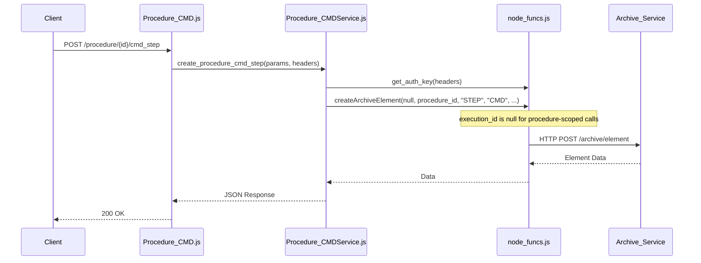
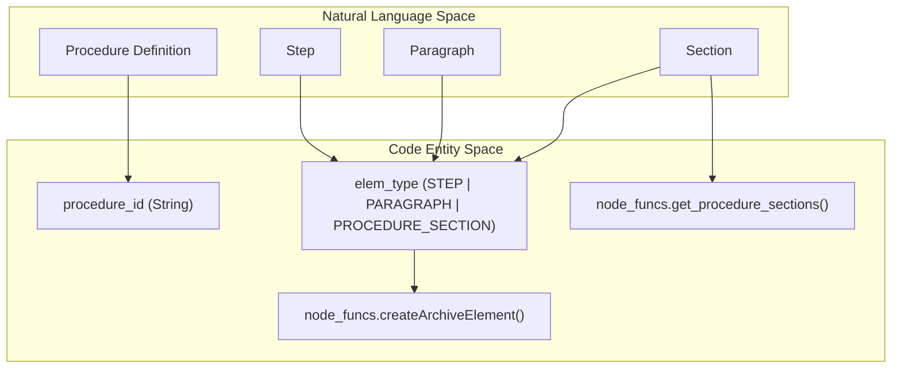

# Page: Procedure-Scoped Step Controllers

# Procedure-Scoped Step Controllers

Relevant source files

The following files were used as context for generating this wiki page:

- [api/controllers/Procedure_ANALYSIS.js](api/controllers/Procedure_ANALYSIS.js)
- [api/controllers/Procedure_ANALYSISService.js](api/controllers/Procedure_ANALYSISService.js)
- [api/controllers/Procedure_BUS_1553.js](api/controllers/Procedure_BUS_1553.js)
- [api/controllers/Procedure_BUS_1553Service.js](api/controllers/Procedure_BUS_1553Service.js)
- [api/controllers/Procedure_CMD.js](api/controllers/Procedure_CMD.js)
- [api/controllers/Procedure_CMDService.js](api/controllers/Procedure_CMDService.js)
- [api/controllers/Procedure_Element.js](api/controllers/Procedure_Element.js)
- [api/controllers/Procedure_ElementService.js](api/controllers/Procedure_ElementService.js)
- [api/controllers/Procedure_Paragraph.js](api/controllers/Procedure_Paragraph.js)
- [api/controllers/Procedure_ParagraphService.js](api/controllers/Procedure_ParagraphService.js)
- [api/controllers/Procedure_ProcedureSectionService.js](api/controllers/Procedure_ProcedureSectionService.js)
- [api/controllers/Procedure_Procedure_Section.js](api/controllers/Procedure_Procedure_Section.js)
- [api/controllers/Procedure_QUERY_EVR.js](api/controllers/Procedure_QUERY_EVR.js)
- [api/controllers/Procedure_QUERY_EVRService.js](api/controllers/Procedure_QUERY_EVRService.js)

Procedure-scoped step controllers provide the API interface for managing the elements of a procedure's "working copy." While execution-scoped controllers operate on live, running instances of procedures (Executions), these controllers mirror that functionality for authoring and editing the static procedure definitions.

## Overview and Architectural Pattern

The `Procedure_*` namespace in `api/controllers/` follows a strict Controller/Service delegation pattern. Each controller handles the extraction of parameters from the OpenAPI-validated request (`req.swagger.params`) and delegates the business logic to a corresponding Service module.

### Core Logic Delegation
Most operations in these controllers are thin wrappers around `api/node_funcs.js`. Because these controllers operate on procedures rather than executions, the `execution_id` parameter passed to `node_funcs` is typically `null`, while the `procedure_id` is provided to target the specific procedure working copy [api/controllers/Procedure_ANALYSISService.js:19-19](), [api/controllers/Procedure_CMDService.js:19-19]().

### Common Operations
Every step-specific controller (e.g., `Procedure_CMD`, `Procedure_ANALYSIS`) implements a standard set of CRUD operations:
*   **Create**: Uses `node_funcs.createArchiveElement` to insert a new step into the procedure tree [api/controllers/Procedure_ANALYSISService.js:19-19]().
*   **Get**: Uses `node_funcs.getStep` to retrieve the definition of a specific element [api/controllers/Procedure_ANALYSISService.js:40-40]().
*   **Update**: Uses `node_funcs.updateStep` to modify the authoring-time configuration [api/controllers/Procedure_ANALYSISService.js:93-93]().
*   **List**: Uses `node_funcs.getProcedureElements` to return all steps of a specific type within the procedure, supporting pagination and sorting [api/controllers/Procedure_ANALYSISService.js:68-69]().

### Data Flow: Procedure Element Creation
The following diagram illustrates how a request to create a procedure step flows through the system.

**Procedure Step Creation Flow**

Sources: [api/controllers/Procedure_CMD.js:7-9](), [api/controllers/Procedure_CMDService.js:12-20](), [api/node_funcs.js:1-10]() (implied)

---

## Command Step Controllers

Command-related controllers manage steps that involve sending instructions to a vehicle or system. These controllers often handle both the step definition and the "User Input" (the specific parameters for the command).

| Controller | Step Type | Key Service Functions |
| :--- | :--- | :--- |
| `Procedure_CMD` | `CMD` | `create_procedure_cmd_step`, `update_procedure_cmd_step_input` |
| `Procedure_CMD_FILE` | `CMD_FILE` | Mirrors `Procedure_CMD` for file-based commands |
| `Procedure_CMD_SCMF` | `CMD_SCMF` | Handles SCMF-specific command formatting |
| `Procedure_CMD_SSE` | `CMD_SSE` | Handles SSE-specific command formatting |
| `Procedure_BUS_1553` | `BUS_1553` | Manages MIL-STD-1553 bus command steps |

For these types, the `update_step_input` function in `node_funcs` is used to store the specific command arguments that will be used when the procedure is eventually executed [api/controllers/Procedure_CMDService.js:137-137](), [api/controllers/Procedure_BUS_1553Service.js:137-137]().

Sources: [api/controllers/Procedure_CMDService.js:1-144](), [api/controllers/Procedure_BUS_1553Service.js:1-144]()

---

## Structural and Content Controllers

These controllers manage the non-executable elements of a procedure, such as sections, paragraphs, and structural validation.

### Procedure Sections and Hierarchy
`Procedure_Procedure_Section` manages the organizational structure of the procedure. It supports retrieving the "structure" (the nested tree of elements) and the "elements" (the flat list of items within a section) [api/controllers/Procedure_Procedure_Section.js:31-37]().

*   **Structure**: `node_funcs.get_procedure_section_structure` [api/controllers/Procedure_ProcedureSectionService.js:156-156]().
*   **Elements**: `node_funcs.get_procedure_section_elements` [api/controllers/Procedure_ProcedureSectionService.js:174-174]().

### Paragraphs
`Procedure_Paragraph` handles text-based descriptive elements. Unlike steps, paragraphs do not have "User Input" or "Results" fields; they primarily consist of a description or markdown content [api/controllers/Procedure_ParagraphService.js:21-21]().

### Element Validation
`Procedure_Element` provides a unique `validate_procedure_element` endpoint. This is used to refresh or re-calculate computed fields within a procedure element before it is finalized [api/controllers/Procedure_ElementService.js:18-18]().

**Entity Mapping: Procedure Structure**

Sources: [api/controllers/Procedure_ProcedureSectionService.js:20-20](), [api/controllers/Procedure_ParagraphService.js:21-21](), [api/controllers/Procedure_ANALYSISService.js:19-19]()

---

## Verification and Timing Controllers

These controllers manage steps that wait for telemetry or verify system states.

| Controller | Purpose | Primary node_funcs call |
| :--- | :--- | :--- |
| `Procedure_ANALYSIS` | Post-test data analysis steps | `getProcedureElements(..., 'ANALYSIS', ...)` |
| `Procedure_QUERY_EVR` | Querying Event Records | `getStep(null, procedure_id, elem_id, ...)` |
| `Procedure_WAIT` | Simple duration or absolute time waits | `createArchiveElement(..., 'WAIT', ...)` |
| `Procedure_WAIT_EHA` | Waiting for EHA telemetry conditions | `updateStep(...)` |
| `Procedure_WAIT_EVR` | Waiting for specific Event Records | `get_step_input(...)` |

In all cases, the service implementation follows the pattern of checking for optional parameters like `insert_after_id` (defaulting to `-1` for front-insertion) and `level` (defaulting to `SIBLING`) to determine the element's position in the procedure tree [api/controllers/Procedure_ANALYSISService.js:15-16](), [api/controllers/Procedure_CMDService.js:15-16]().

Sources: [api/controllers/Procedure_ANALYSISService.js:1-99](), [api/controllers/Procedure_QUERY_EVRService.js:1-50]() (implied), [api/controllers/Procedure_ProcedureSectionService.js:1-180]()
