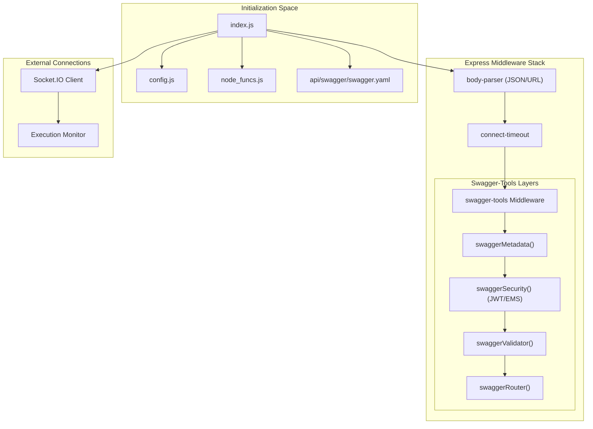
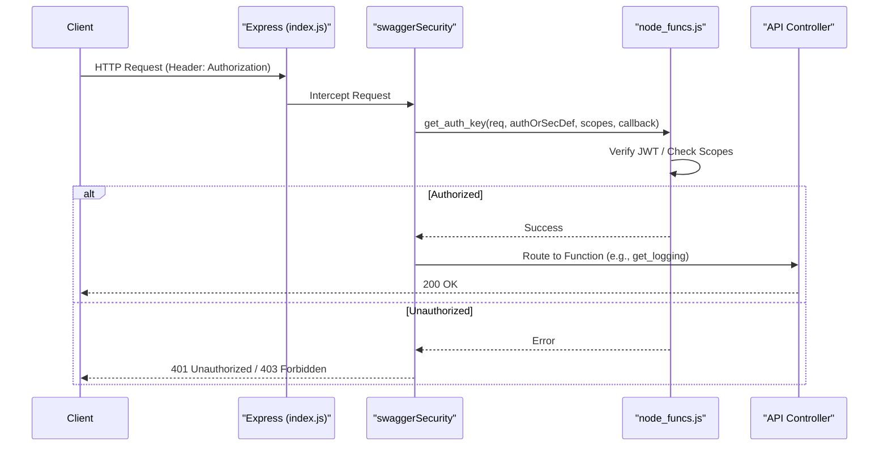

# Page: Server Bootstrap and Middleware (index.js)

# Server Bootstrap and Middleware (index.js)

Relevant source files

The following files were used as context for generating this wiki page:

- [README.md](README.md)
- [api/controllers/Logging.js](api/controllers/Logging.js)
- [api/controllers/LoggingService.js](api/controllers/LoggingService.js)

The `index.js` file serves as the entry point for the Ingenium Core Server. It initializes the Express application, configures the middleware stack, integrates OpenAPI (Swagger) tools, and establishes connections to external monitors. The server is designed to act as a central orchestrator, leveraging `swagger-tools` to handle routing, validation, and documentation based on a predefined specification.

### Server Initialization Flow

The bootstrap process follows a strict sequence to ensure that configuration is loaded and security measures are in place before the HTTP server begins listening for requests.

1.  **Dependency Loading**: Imports `express`, `swagger-tools`, and local modules like `config.js` and `node_funcs`.
2.  **Express App Setup**: Initializes the `express` instance and applies basic middleware like `cors` and `body-parser`.
3.  **Swagger Metadata**: Loads the `api/swagger/swagger.yaml` file.
4.  **Middleware Wiring**: Initializes `swagger-tools` which provides metadata, security, validation, and routing middleware.
5.  **Execution Monitor Connection**: Establishes a Socket.IO connection to the external Execution Monitor.
6.  **Server Start**: Begins listening on the port defined in `config.js`.

#### Component Relationship Diagram
This diagram illustrates how the `index.js` bootstrap script links the Express framework to the Swagger specification and core utility functions.

**Bootstrap Architecture**

**Sources:** `index.js`, `README.md:19-19`(), `api/node_funcs.js`()

---

### Core Middleware Configuration

The server implements several critical middleware layers to handle data limits, timeouts, and security.

#### Body Parser and Limits
To handle large procedure imports and complex execution data, the `body-parser` is configured with a high limit.
*   **JSON Limit**: 100mb [index.js:28-28]().
*   **URL Encoded Limit**: 100mb [index.js:29-29]().

#### Request Timeout
To prevent hanging connections during long-running operations (such as large archive queries), the `connect-timeout` middleware is used. The timeout value is sourced from `config.SERVER_TIMEOUT_SEC` [index.js:31-31]().

#### Response Interceptor (Audit Logging)
The server utilizes a custom response interceptor to capture API activity for logging purposes. This interceptor wraps the standard `res.send` and `res.json` methods to log the status code and response body before they are sent to the client [index.js:35-50]().

**Sources:** `index.js:28-50`(), `config.js`()

---

### Authentication and Security Middleware

Security is enforced via `swaggerSecurity` middleware, which maps security definitions in `swagger.yaml` to JavaScript handlers.

| Security Scheme | Implementation | Description |
| :--- | :--- | :--- |
| **JWT** | `node_funcs.get_auth_key` | Validates JSON Web Tokens for user requests. |
| **EMS** | `node_funcs.get_ems_key` | Validates internal Execution Management System keys. |

The middleware extracts the `Authorization` header and verifies the scopes required by the specific endpoint defined in the OpenAPI spec.

**Security Data Flow**

**Sources:** `index.js:72-76`(), `api/node_funcs.js`()

---

### Socket.IO and Execution Monitor

The server acts as a client to the **Execution Monitor**, establishing a persistent connection via `socket.io-client`. This allows the Core Server to receive real-time updates regarding execution status and relay them as needed.

*   **Connection**: Initialized using `EXECUTION_MONITOR_URL` from the configuration [index.js:101-101]().
*   **Events**: Listens for `connect` and `disconnect` events to log the status of the monitor link [index.js:103-109]().

**Sources:** `index.js:101-110`(), `config.js`()

---

### Swagger UI and Routing

The server provides built-in documentation and a testing interface:
1.  **Swagger UI**: Accessible at `/docs` [index.js:84-84]().
2.  **Router**: The `swaggerRouter` middleware maps `operationId` fields from the `swagger.yaml` to specific controller files in `api/controllers/` [index.js:78-81]().

For example, a request to `GET /logging` is mapped via the specification to `Logging.get_logging`:
*   **Controller**: `api/controllers/Logging.js` [api/controllers/Logging.js:7-9]()
*   **Service**: `api/controllers/LoggingService.js` [api/controllers/LoggingService.js:7-15]()

**Sources:** `index.js:78-84`(), `api/controllers/Logging.js`(), `api/controllers/LoggingService.js`()
