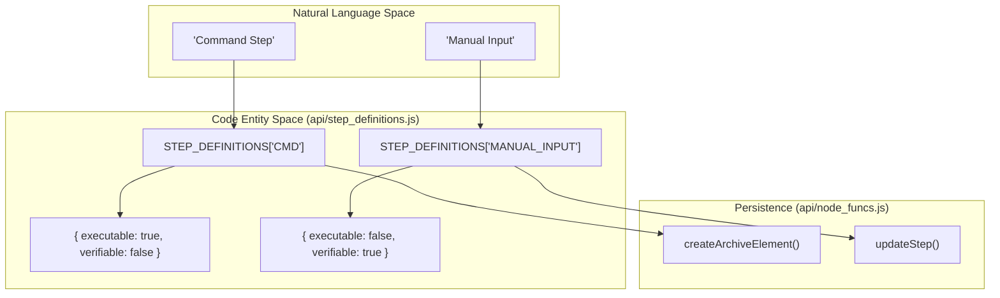
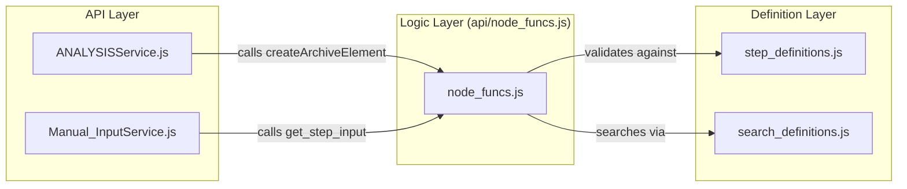

# Page: Step Definitions and Search Definitions

# Step Definitions and Search Definitions

Relevant source files

The following files were used as context for generating this wiki page:

- [api/controllers/ANALYSISService.js](api/controllers/ANALYSISService.js)
- [api/controllers/BUS_1553Service.js](api/controllers/BUS_1553Service.js)
- [api/controllers/Manual_InputService.js](api/controllers/Manual_InputService.js)

This page provides a high-level overview of the canonical registries for step types and search operations within the Ingenium Core Server. These definitions govern how procedure and execution elements are structured, validated, and manipulated across the system.

The core of this logic resides in two primary files:
1.  `api/step_definitions.js`: Defines the schema, metadata, and execution capabilities for every step type (e.g., `CMD`, `WAIT`, `ANALYSIS`).
2.  `api/search_definitions.js`: Defines the field mappings used to perform search-and-replace operations across different element types.

## Step Definitions Registry

The `step_definitions.js` file acts as the single source of truth for the properties of all step types. It categorizes steps based on whether they are executable or verifiable and defines the schemas for user inputs and results.

### Step Metadata and Schemas
Each entry in the registry typically includes:
*   **Execution Flags**: Boolean values indicating if a step can be "run" or if it requires verification.
*   **Authoring Input**: The schema for data provided during procedure creation.
*   **Execution Input**: The schema for data provided by a user during live execution (e.g., `MANUAL_INPUT`).
*   **Result Templates**: The structure of the data generated after a step completes.

### Technical Mapping
The following diagram illustrates how the `step_definitions` registry bridges the gap between the high-level Step Type and the internal data structures used by `node_funcs.js`.

**Diagram: Step Definition Mapping**

**Sources:** `api/node_funcs.js:19-20` (), `api/controllers/Manual_InputService.js:19-20` (), `api/controllers/BUS_1553Service.js:19-20` ().

For a complete list of all supported step types and their specific configurations, see **[Step Type Reference](#4.1)**.

## Search and Replace Definitions

The `search_definitions.js` file defines how the system traverses the complex JSON structures of procedure elements to perform search and replace operations. This is critical for bulk-updating parameters, renaming commands, or finding specific telemetry references across a large procedure.

### Field Mapping
Because different step types (like `CMD` vs `ANALYSIS`) store their data in different nested fields, the search registry provides a map of searchable paths for each `elem_type`.

*   **Procedures**: Searches typically target descriptions, names, and step-specific input fields.
*   **Executions**: Searches may also include result fields and status metadata.

For details on how these definitions are applied during element traversal and how the hierarchy is managed, see **[Element Hierarchy and Positioning](#4.2)**.

## Integration with Controllers

API Controllers utilize these definitions to validate requests and structure responses. For instance, when a client calls `create_analysis_step`, the controller delegates to `node_funcs.js`, which references the step definitions to ensure the element is initialized with the correct defaults.

**Diagram: Controller to Definition Flow**

**Sources:** `api/controllers/ANALYSISService.js:4-26` (), `api/controllers/Manual_InputService.js:77-95` (), `api/controllers/BUS_1553Service.js:139-160` ().

## Child Pages

*   **[Step Type Reference](#4.1)**: A detailed catalog of every step type, including their flags (executable/verifiable) and the specific schemas for `MANUAL_INPUT`, `CMD`, `WAIT`, and more.
*   **[Element Hierarchy and Positioning](#4.2)**: Technical details on the tree structure (SIBLING vs CHILD), insertion logic (using `insert_after_id`), and how `node_funcs.js` maintains the integrity of the procedure tree.
