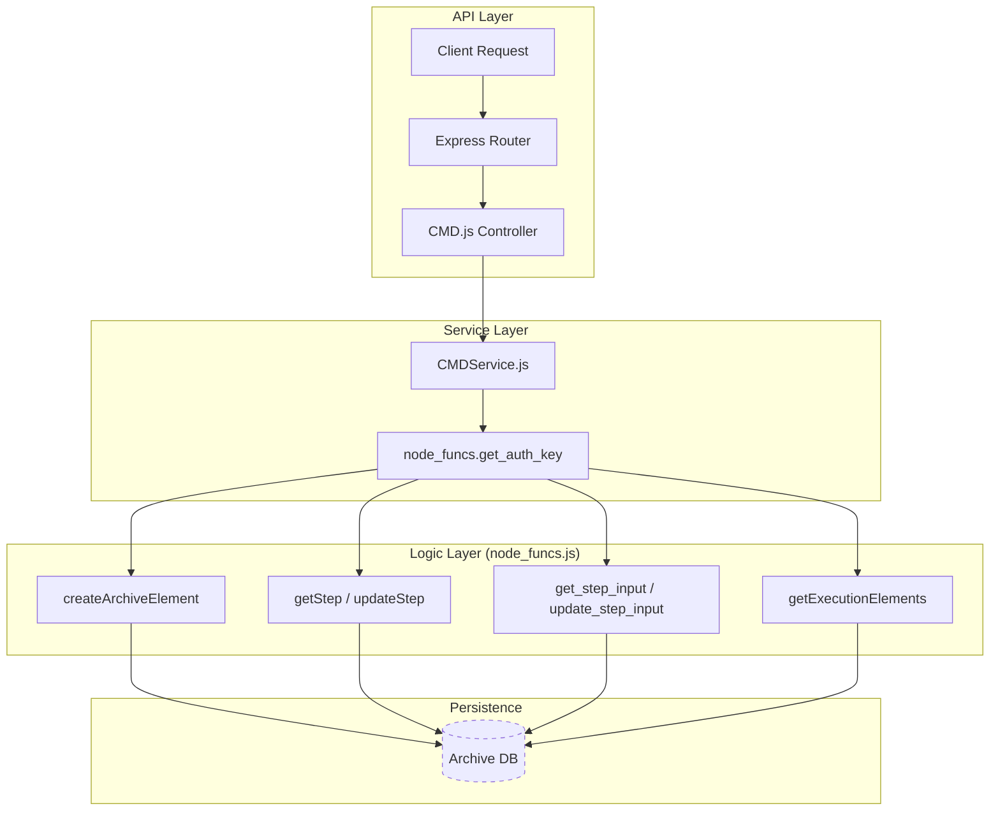

# Page: Step Type Controllers — Commanding

# Step Type Controllers — Commanding

<details>
<summary>Relevant source files</summary>

The following files were used as context for generating this wiki page:

- [api/controllers/BUS_1553.js](api/controllers/BUS_1553.js)
- [api/controllers/BUS_1553Service.js](api/controllers/BUS_1553Service.js)
- [api/controllers/CMD.js](api/controllers/CMD.js)
- [api/controllers/CMDService.js](api/controllers/CMDService.js)
- [api/controllers/CMD_FILE.js](api/controllers/CMD_FILE.js)
- [api/controllers/CMD_FILEService.js](api/controllers/CMD_FILEService.js)
- [api/controllers/CMD_SCMF.js](api/controllers/CMD_SCMF.js)
- [api/controllers/CMD_SCMFService.js](api/controllers/CMD_SCMFService.js)
- [api/controllers/CMD_SSE.js](api/controllers/CMD_SSE.js)
- [api/controllers/CMD_SSEService.js](api/controllers/CMD_SSEService.js)

</details>


This section documents the set of API controllers responsible for managing "Commanding" step types. These steps represent actions that send instructions to external systems, such as generic spacecraft commands, file-based commands, specialized SCMF/SSE commands, or MIL-STD-1553 bus operations.

## Overview

Commanding steps follow a standardized architectural pattern within the Ingenium Core Server. Each step type is managed by a controller-service pair that interacts with the `node_funcs.js` utility module to perform CRUD operations on the archive.

### Supported Command Types
*   **CMD**: Generic system commands.
*   **CMD_FILE**: Commands sourced from external files.
*   **CMD_SCMF**: Spacecraft Command Message Format steps.
*   **CMD_SSE**: Specific Spacecraft Support Equipment commands.
*   **BUS_1553**: Operations specifically targeting the MIL-STD-1553 communication bus.

### Controller Pattern
Every commanding controller (e.g., `CMD.js`) acts as a thin routing layer that extracts parameters from `req.swagger.params` and delegates to a corresponding service (e.g., `CMDService.js`) [api/controllers/CMD.js:7-9](). The services then call `node_funcs` for database and execution logic [api/controllers/CMDService.js:19-20]().

---

## Data Flow and Logic

The following diagram illustrates the flow from an API request to the underlying archive storage for a commanding step.

### Request Lifecycle: Commanding Steps

**Sources:** [api/controllers/CMD.js:7-37](), [api/controllers/CMDService.js:3-159](), [api/node_funcs.js:1-200]() (implied by service calls).

---

## Common Endpoint Structures

All commanding step services implement a uniform set of asynchronous functions. Below is the technical detail for the `CMD` type, which is mirrored by `CMD_FILE`, `CMD_SCMF`, `CMD_SSE`, and `BUS_1553`.

### 1. Step Creation
Creates a new step instance within an execution.
*   **Function**: `create_cmd_step(args, res, next, headers)` [api/controllers/CMDService.js:3]()
*   **Key Logic**: Calls `node_funcs.createArchiveElement` with `elem_type="STEP"` and `step_type="CMD"` [api/controllers/CMDService.js:19]().
*   **Parameters**:
    *   `execution_id`: Target execution.
    *   `insert_after_id`: Position in the procedure tree (defaults to `-1` for front) [api/controllers/CMDService.js:15]().
    *   `level`: `SIBLING` or `CHILD` [api/controllers/CMDService.js:16]().

### 2. Retrieval and Listing
*   **Get Single Step**: `get_cmd_step` calls `node_funcs.getStep` to retrieve the full step definition [api/controllers/CMDService.js:39]().
*   **List Steps**: `get_execution_cmd_steps` filters the execution tree specifically for the `CMD` type using `node_funcs.getExecutionElements` [api/controllers/CMDService.js:107-108]().

### 3. Input and Result Specifications
Commanding steps distinguish between the **Input Spec** (parameters defined for the command) and the **Result Spec** (the outcome of the command execution).
*   **Input**: Managed via `get_step_input` and `update_step_input` [api/controllers/CMDService.js:59, 153]().
*   **Result**: Retrieved via `get_step_result` [api/controllers/CMDService.js:79]().

**Sources:** [api/controllers/CMDService.js:1-163](), [api/controllers/CMD_FILEService.js:1-161]().

---

## Step Type Implementation Details

### BUS_1553 (MIL-STD-1553)
The `BUS_1553` controller handles specialized bus communication steps. While the API structure is identical to generic commands, it targets specific hardware interfaces.
*   **Controller**: `api/controllers/BUS_1553.js` [api/controllers/BUS_1553.js:1-37]()
*   **Service**: `api/controllers/BUS_1553Service.js` [api/controllers/BUS_1553Service.js:1-161]()

### SCMF and SSE
These controllers manage high-fidelity spacecraft commanding formats.
*   **CMD_SCMF**: Uses `step_type="CMD_SCMF"` in `node_funcs` calls [api/controllers/CMD_SCMFService.js:20, 102]().
*   **CMD_SSE**: Uses `step_type="CMD_SSE"` in `node_funcs` calls [api/controllers/CMD_SSEService.js:19, 101]().

---

## Code Entity Mapping

The following diagram maps the Natural Language concepts of "Commanding" to the specific Code Entities and functions within the server.

### Concept to Code Mapping
```mermaid
classDiagram
    class "Commanding Concept" {
        +Generic Command
        +File Command
        +1553 Bus Op
    }

    class "CMDService.js" {
        +create_cmd_step()
        +get_execution_cmd_steps()
        +update_cmd_step_input()
    }

    class "BUS_1553Service.js" {
        +create_bus_1553_step()
        +get_bus_1553_step_result()
    }

    class "node_funcs.js" {
        +createArchiveElement()
        +getExecutionElements()
        +updateStep()
    }

    "Commanding Concept" -- "CMDService.js" : Maps to
    "Commanding Concept" -- "BUS_1553Service.js" : Maps to
    "CMDService.js" ..> "node_funcs.js" : Invokes
    "BUS_1553Service.js" ..> "node_funcs.js" : Invokes
```
**Sources:** [api/controllers/CMDService.js:19, 108, 131, 153](), [api/controllers/BUS_1553Service.js:19, 109, 131]().

---

## Summary Table: Controller Endpoints

| Step Type | Controller | Service | Primary `node_funcs` Call |
| :--- | :--- | :--- | :--- |
| **CMD** | `CMD.js` | `CMDService.js` | `createArchiveElement(..., "CMD", ...)` |
| **CMD_FILE** | `CMD_FILE.js` | `CMD_FILEService.js` | `createArchiveElement(..., "CMD_FILE", ...)` |
| **CMD_SCMF** | `CMD_SCMF.js` | `CMD_SCMFService.js` | `createArchiveElement(..., "CMD_SCMF", ...)` |
| **CMD_SSE** | `CMD_SSE.js` | `CMD_SSEService.js` | `createArchiveElement(..., "CMD_SSE", ...)` |
| **BUS_1553** | `BUS_1553.js` | `BUS_1553Service.js` | `createArchiveElement(..., "BUS_1553", ...)` |

**Sources:** [api/controllers/CMD.js:5](), [api/controllers/CMD_FILE.js:5](), [api/controllers/CMD_SCMF.js:5](), [api/controllers/CMD_SSE.js:5](), [api/controllers/BUS_1553.js:5]().
