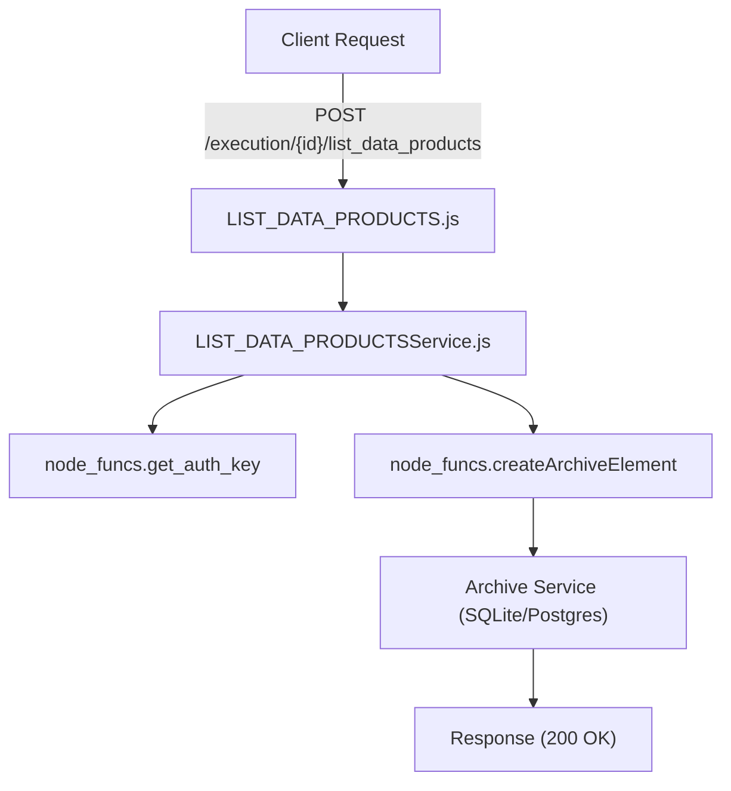
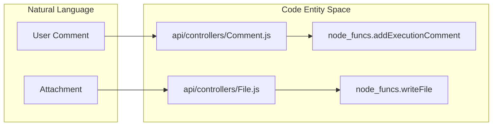

# Page: Step Type Controllers — Data, Timing, and Manual Steps

# Step Type Controllers — Data, Timing, and Manual Steps

Relevant source files

The following files were used as context for generating this wiki page:

- [api/controllers/CUSTOM_SCRIPT.js](api/controllers/CUSTOM_SCRIPT.js)
- [api/controllers/CUSTOM_SCRIPTService.js](api/controllers/CUSTOM_SCRIPTService.js)
- [api/controllers/Comment.js](api/controllers/Comment.js)
- [api/controllers/CommentService.js](api/controllers/CommentService.js)
- [api/controllers/File.js](api/controllers/File.js)
- [api/controllers/FileService.js](api/controllers/FileService.js)
- [api/controllers/GDS.js](api/controllers/GDS.js)
- [api/controllers/GDSService.js](api/controllers/GDSService.js)
- [api/controllers/LIST_DATA_PRODUCTS.js](api/controllers/LIST_DATA_PRODUCTS.js)
- [api/controllers/LIST_DATA_PRODUCTSService.js](api/controllers/LIST_DATA_PRODUCTSService.js)
- [api/controllers/Manual_EIP.js](api/controllers/Manual_EIP.js)
- [api/controllers/Manual_EIPService.js](api/controllers/Manual_EIPService.js)
- [api/controllers/Manual_Input.js](api/controllers/Manual_Input.js)
- [api/controllers/Manual_InputService.js](api/controllers/Manual_InputService.js)
- [api/controllers/Paragraph.js](api/controllers/Paragraph.js)
- [api/controllers/ParagraphService.js](api/controllers/ParagraphService.js)

This page documents the remaining set of step type controllers in the Ingenium Core Server. These controllers handle data product management, timing and synchronization, manual ground operations, user input prompts, and structural procedure elements like paragraphs and comments.

## Overview of Step Controllers

Each step type follows a standardized architectural pattern where a controller (e.g., `GDS.js`) handles the Express request routing and a corresponding service (e.g., `GDSService.js`) implements the business logic by calling `node_funcs.js` utilities.

### Standard Data Flow
1.  **Request Entry**: The controller receives `req.swagger.params` from the `swagger-tools` middleware.
2.  **Auth Extraction**: The service calls `node_funcs.get_auth_key(headers)` to retrieve the JWT-based session key [api/controllers/GDSService.js:12-12]().
3.  **Core Logic**: The service invokes `node_funcs.createArchiveElement`, `node_funcs.getStep`, or `node_funcs.updateStep` [api/controllers/GDSService.js:19-19](), [api/controllers/GDSService.js:69-69]().
4.  **Error Handling**: Errors are caught and formatted via `node_funcs.push_error` before returning a 400 status [api/controllers/GDSService.js:22-23]().

---

## Data Product Steps
These steps are used to interface with external data archives to list or wait for specific telemetry or science products.

### LIST_DATA_PRODUCTS
Used to query available data products within an execution context.
*   **Implementation**: Maps to step type `LIST_DATA_PRODUCTS` [api/controllers/LIST_DATA_PRODUCTSService.js:20-20]().
*   **Key Functions**:
    *   `create_list_data_products_step`: Initializes a new data listing step [api/controllers/LIST_DATA_PRODUCTSService.js:4-26]().
    *   `get_list_data_products_step_input`: Retrieves the query parameters (e.g., time ranges, product types) [api/controllers/LIST_DATA_PRODUCTSService.js:78-96]().

### WAIT_DATA_PRODUCTS
Synchronizes execution by waiting for specific data products to appear in the archive.

**Data Flow: Creating a Data Step**

*Sources: [api/controllers/LIST_DATA_PRODUCTS.js:7-9](), [api/controllers/LIST_DATA_PRODUCTSService.js:4-26]()*

---

## Timing and Reference Steps
These steps manage the temporal flow of a procedure.

*   **WAIT**: Pauses execution for a specific duration or until a wall-clock time is reached.
*   **TIME_REFERENCE**: Establishes a synchronization point (e.g., T-0) for subsequent relative timing calculations.

---

## Manual and Ground System Steps
These steps require human intervention or interaction with the Ground Data System (GDS).

### GDS (Ground Data System Manual)
Represents a manual action that must be performed within the GDS interface.
*   **Step Type**: `GDS_MANUAL` [api/controllers/GDSService.js:19-19]().
*   **Sub-resources**: Supports `input` (instructions for the operator) and `result` (confirmation of action) [api/controllers/GDSService.js:77-115]().

### Manual Input and Manual EIP
*   **MANUAL_INPUT**: Prompts the operator for a value (string, number, boolean).
*   **MANUAL_EIP**: Specific prompt for "Event in Progress" or external integration points [api/controllers/Manual_EIPService.js:19-19]().

---

## Scripting and Status Steps

### CUSTOM_SCRIPT
Allows execution of arbitrary logic defined within the step specification.
*   **Implementation**: Uses `createArchiveElement` with type `CUSTOM_SCRIPT` [api/controllers/CUSTOM_SCRIPTService.js:19-19]().
*   **Execution**: Logic is typically handled by the downstream Execution Server, while this server manages the persistence of the script body via `update_custom_script_step_input` [api/controllers/CUSTOM_SCRIPTService.js:139-159]().

### VI and VI_STATUS
Used for Virtual Instrument (VI) integration, allowing procedures to monitor or set states in external software components.

---

## Structural and Documentation Elements
Not all elements in a procedure are "steps" that execute logic. Some provide structure or metadata.

### Paragraph and TOC
*   **Paragraph**: Persists formatted text or instructions. It uses the `node_funcs.getStep` logic but is flagged as a `PARAGRAPH` element type.
*   **TOC**: Represents a Table of Contents marker in the procedure tree.

### Comment and Conversation
The `Comment` controller manages a threaded conversation system attached to any procedure element.
*   **Conversations**: High-level threads created via `addExecutionConversation` [api/controllers/CommentService.js:19-19]().
*   **Comments**: Individual messages within a thread added via `addExecutionComment` [api/controllers/CommentService.js:142-142]().

### File Management
The `File` controller manages binary attachments for both executions and specific steps.
*   **Storage**: Files are persisted via `node_funcs.writeFile`, which interacts with the configured S3/MinIO bucket [api/controllers/FileService.js:20-20]().
*   **Retrieval**: `readFile` and `readFileExec` handle streaming data back to the client [api/controllers/FileService.js:68-68](), [api/controllers/FileService.js:159-159]().

**Entity Mapping: Files and Comments**

*Sources: [api/controllers/CommentService.js:142-142](), [api/controllers/FileService.js:20-20]()*

---

## Controller Reference Table

| Controller | Element Type | Step Type | Primary Purpose |
| :--- | :--- | :--- | :--- |
| `LIST_DATA_PRODUCTS` | `STEP` | `LIST_DATA_PRODUCTS` | Query archive for products [api/controllers/LIST_DATA_PRODUCTSService.js:42-42]() |
| `GDS` | `STEP` | `GDS_MANUAL` | Manual GDS operator actions [api/controllers/GDSService.js:41-41]() |
| `CUSTOM_SCRIPT` | `STEP` | `CUSTOM_SCRIPT` | User-defined logic [api/controllers/CUSTOM_SCRIPTService.js:41-41]() |
| `Manual_EIP` | `STEP` | `MANUAL_EIP` | Event integration prompts [api/controllers/Manual_EIPService.js:41-41]() |
| `Comment` | `N/A` | `N/A` | Threaded discussion on elements [api/controllers/CommentService.js:4-25]() |
| `File` | `N/A` | `N/A` | S3/MinIO attachment management [api/controllers/FileService.js:5-26]() |

*Sources: [api/controllers/LIST_DATA_PRODUCTSService.js:42](), [api/controllers/GDSService.js:41](), [api/controllers/CUSTOM_SCRIPTService.js:41](), [api/controllers/Manual_EIPService.js:41]()*
