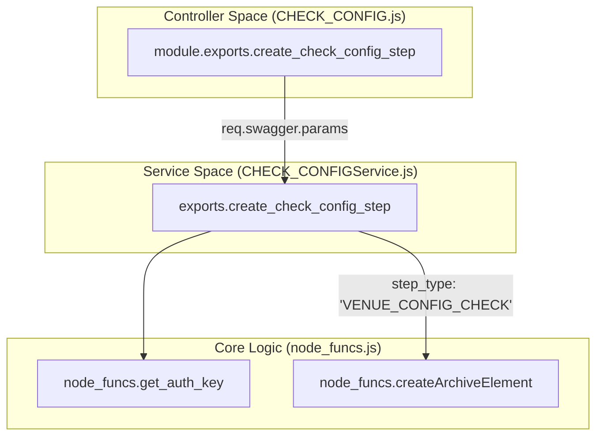
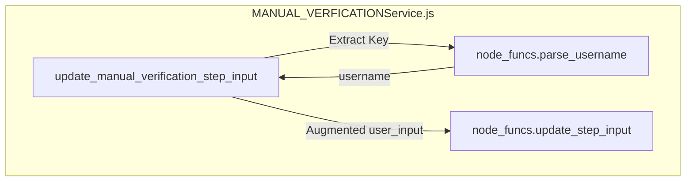

# Page: Step Type Controllers — Verification and Configuration

# Step Type Controllers — Verification and Configuration

Relevant source files

The following files were used as context for generating this wiki page:

- [api/controllers/ANALYSIS.js](api/controllers/ANALYSIS.js)
- [api/controllers/ANALYSISService.js](api/controllers/ANALYSISService.js)
- [api/controllers/CHECK_CONFIG.js](api/controllers/CHECK_CONFIG.js)
- [api/controllers/CHECK_CONFIGService.js](api/controllers/CHECK_CONFIGService.js)
- [api/controllers/GET_CONFIG.js](api/controllers/GET_CONFIG.js)
- [api/controllers/GET_CONFIGService.js](api/controllers/GET_CONFIGService.js)
- [api/controllers/GRAPH_EHA.js](api/controllers/GRAPH_EHA.js)
- [api/controllers/GRAPH_EHAService.js](api/controllers/GRAPH_EHAService.js)
- [api/controllers/MANUAL_VERFICATION.js](api/controllers/MANUAL_VERFICATION.js)
- [api/controllers/MANUAL_VERFICATIONService.js](api/controllers/MANUAL_VERFICATIONService.js)

This page documents the controller and service pairs responsible for step types focused on system verification, telemetry analysis, and configuration management within an execution. These controllers handle the lifecycle of steps that verify Engineering Health Assessment (EHA) data, query Event Records (EVR), and manage venue configurations.

## Overview

Verification and Configuration controllers follow a standardized pattern for managing execution-scoped elements. Each controller provides endpoints to create, retrieve, update, and list steps of a specific type. Additionally, they provide sub-resource access for `input` (authoring/user parameters) and `result` (execution output/telemetry findings).

### Common Architecture Pattern

The system uses a delegation model where the Express controller extracts parameters from `req.swagger.params` and passes them to a Service module. The Service module then invokes core logic in `api/node_funcs.js`.

**Standard Data Flow:**
1. **Controller**: Receives request, extracts `execution_id`, `elem_id`, and `headers`.
2. **Service**: Retrieves the authentication key via `node_funcs.get_auth_key(headers)` [api/controllers/ANALYSISService.js:13]().
3. **node_funcs**: Interacts with the Archive and Execution services to perform CRUD operations or fetch results.

---

## Configuration Management Steps

These steps interact with the Venue Configuration service to ensure the test environment matches the expected state.

### CHECK_CONFIG, GET_CONFIG, and UPDATE_CONFIG
These controllers manage steps that interface with venue settings. While they appear as distinct step types in the API, they map to specific `step_type` strings in the archive:
*   **CHECK_CONFIG**: Maps to `VENUE_CONFIG_CHECK` [api/controllers/CHECK_CONFIGService.js:19]().
*   **GET_CONFIG**: Maps to `VENUE_CONFIG_GET` [api/controllers/GET_CONFIGService.js:19]().
*   **UPDATE_CONFIG**: (Functionally similar to GET/CHECK, managing `VENUE_CONFIG_UPDATE` types).

#### Configuration Logic Mapping
| Controller | Archive Step Type | Service Function Call |
| :--- | :--- | :--- |
| `CHECK_CONFIG` | `VENUE_CONFIG_CHECK` | `node_funcs.createArchiveElement` [api/controllers/CHECK_CONFIGService.js:19]() |
| `GET_CONFIG` | `VENUE_CONFIG_GET` | `node_funcs.createArchiveElement` [api/controllers/GET_CONFIGService.js:19]() |

**Sources:** [api/controllers/CHECK_CONFIGService.js:1-160](), [api/controllers/GET_CONFIGService.js:1-160]()

---

## Verification and EHA Steps

These steps are used for real-time and post-test verification of spacecraft or system health.

### VERIFY_EHA, GRAPH_EHA, and WAIT_EHA
These controllers manage Engineering Health Assessment steps. `GRAPH_EHA` is specifically used for visual telemetry analysis.

*   **GRAPH_EHA**: Uses `node_funcs.getExecutionElements` with `step_type: 'GRAPH_EHA'` to list all telemetry graph steps in an execution [api/controllers/GRAPH_EHAService.js:48]().

### MANUAL_VERIFICATION
Used for "human-in-the-loop" verification where a conductor must manually sign off on a condition.
*   **Automatic Metadata**: When updating input for a manual verification, the service automatically populates `verified_by` (parsed from the JWT) and `time_verified` if they are not provided [api/controllers/MANUAL_VERFICATIONService.js:154-159]().

**Sources:** [api/controllers/GRAPH_EHAService.js:1-160](), [api/controllers/MANUAL_VERFICATIONService.js:1-169]()

---

## Event and Analysis Steps

### QUERY_EVR and WAIT_EVR
These controllers manage steps that search for or block execution until specific Event Records (EVRs) are received from the system under test.

### ANALYSIS
The `ANALYSIS` controller handles generic post-processing or data analysis steps.
*   **Listing**: The `get_execution_analysis_steps` function filters by `elem_type: 'STEP'` and `step_type: 'ANALYSIS'` [api/controllers/ANALYSISService.js:95-96]().

**Sources:** [api/controllers/ANALYSISService.js:1-132]()

---

## Code Entity Space Mapping

The following diagrams bridge the Natural Language concepts to the specific code entities used in the implementation.

### Configuration Step Lifecycle
This diagram shows how a `CHECK_CONFIG` request moves through the system entities.

**Sources:** [api/controllers/CHECK_CONFIG.js:7-9](), [api/controllers/CHECK_CONFIGService.js:3-25]()

### Verification Input Handling
This diagram illustrates the specialized logic for `MANUAL_VERIFICATION` where user identity is injected.

**Sources:** [api/controllers/MANUAL_VERFICATIONService.js:140-166]()

---

## API Sub-Resources Reference

Every step type in this category implements a standard set of sub-resource endpoints for granular data access.

| Endpoint Suffix | Service Function | Description |
| :--- | :--- | :--- |
| `/input` | `get_step_input` | Returns the `authoring_user_input` or `execution_user_input` [api/controllers/ANALYSISService.js:54]() |
| `/result` | `get_step_result` | Returns the telemetry or verification outcome [api/controllers/ANALYSISService.js:74]() |
| `(root)` | `getStep` | Returns the full element metadata including status and timestamps [api/controllers/ANALYSISService.js:40]() |

### Execution-Level Listing
To retrieve all steps of a specific type across an entire execution, the controllers use the `getExecutionElements` function. This supports pagination (`offset`, `limit`) and sorting [api/controllers/ANALYSISService.js:102-103]().

**Sources:** [api/controllers/ANALYSISService.js:48-110](), [api/controllers/CHECK_CONFIGService.js:47-115]()
