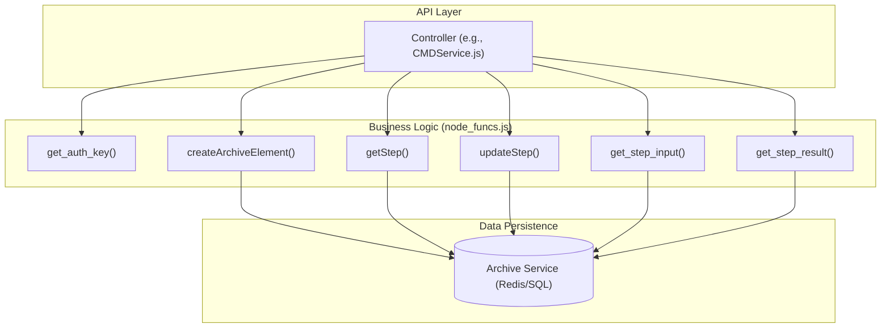
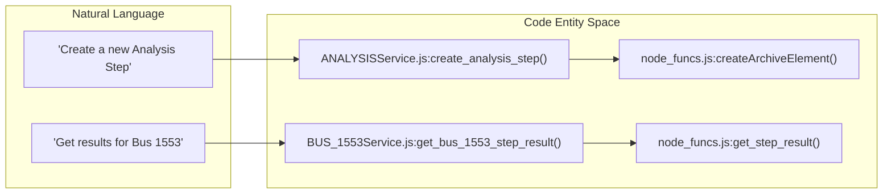

# Page: Step Type Reference

# Step Type Reference

Relevant source files

The following files were used as context for generating this wiki page:

- [api/controllers/ANALYSISService.js](api/controllers/ANALYSISService.js)
- [api/controllers/BUS_1553Service.js](api/controllers/BUS_1553Service.js)
- [api/controllers/CHECK_CONFIGService.js](api/controllers/CHECK_CONFIGService.js)
- [api/controllers/CMDService.js](api/controllers/CMDService.js)
- [api/controllers/CUSTOM_SCRIPTService.js](api/controllers/CUSTOM_SCRIPTService.js)
- [api/controllers/Manual_InputService.js](api/controllers/Manual_InputService.js)

This page provides a comprehensive technical reference for the step types supported by the Ingenium Core Server. Every step in a procedure or execution is defined by a specific type that determines its data schema, execution behavior, and how it is processed by the backend.

## Step Definition Registry

The canonical registry for all step types is located in `api/step_definitions.js`. This file defines the structural requirements for each step, including authoring inputs, execution-time user inputs, and result schemas.

### Core Architecture of a Step Type
Steps are treated as "Archive Elements" of type `STEP` `[api/node_funcs.js:216-220]()`. When a step is created or updated, the system validates its `step_type` against the definitions to ensure data integrity.

### Data Flow for Step Operations
The following diagram illustrates how a step request (e.g., `CMD` or `ANALYSIS`) moves from the API controller through the business logic layer to the underlying archive.

**Step Execution and Data Flow**

**Sources:** `[api/controllers/CMDService.js:3-163]()`, `[api/node_funcs.js:10-50]()`

---

## Technical Reference Table

The following table summarizes the primary step types defined in the system. Each type corresponds to a specific controller in `api/controllers/`.

| Step Type | Description | Verifiable | Executable | Controller Service |
|:---|:---|:---:|:---:|:---|
| `MANUAL_INPUT` | Prompts user for data during execution. | Yes | No | `Manual_InputService.js` |
| `MANUAL_EIP` | Manual Entry Interface Procedure step. | Yes | No | `Manual_EIPService.js` |
| `VENUE_CONFIG_MANUAL` | Manual configuration of a venue. | No | No | `Venue_ConfigService.js` |
| `CMD` | Generic command sent to a target system. | Yes | Yes | `CMDService.js` |
| `CMD_FILE` | Command sequence loaded from a file. | Yes | Yes | `CMD_FILEService.js` |
| `CMD_SCMF` | SCMF-formatted command. | Yes | Yes | `CMD_SCMFService.js` |
| `CMD_SSE` | SSE-formatted command. | Yes | Yes | `CMD_SSEService.js` |
| `BUS_1553` | MIL-STD-1553 bus transaction. | Yes | Yes | `BUS_1553Service.js` |
| `VENUE_CONFIG_CHECK` | Verification of current venue config. | Yes | No | `CHECK_CONFIGService.js` |
| `VENUE_CONFIG_GET` | Retrieves current configuration values. | No | Yes | `GET_CONFIGService.js` |
| `VENUE_CONFIG_UPDATE` | Updates venue configuration. | No | Yes | `UPDATE_CONFIGService.js` |
| `VERIFY_EHA` | Verifies Engineering Health Analysis data. | Yes | No | `VERIFY_EHAService.js` |
| `GRAPH_EHA` | Generates a graph of EHA data. | No | No | `GRAPH_EHAService.js` |
| `WAIT_EHA` | Pauses execution until EHA criteria met. | No | Yes | `WAIT_EHAService.js` |
| `QUERY_EVR` | Queries Event Records. | No | Yes | `QUERY_EVRService.js` |
| `WAIT_EVR` | Pauses execution until specific EVR seen. | No | Yes | `WAIT_EVRService.js` |
| `WAIT` | Pauses for a duration or until a specific time. | No | Yes | `WAITService.js` |
| `CUSTOM_SCRIPT` | Executes a user-defined script. | Yes | Yes | `CUSTOM_SCRIPTService.js` |
| `ANALYSIS` | Post-execution data analysis step. | Yes | No | `ANALYSISService.js` |
| `PARAGRAPH` | Non-executable descriptive text. | No | No | `ParagraphService.js` |
| `COMMENT` | User or system generated comment. | No | No | `CommentService.js` |

**Sources:** `[api/controllers/CMDService.js:19]()`, `[api/controllers/ANALYSISService.js:20]()`, `[api/controllers/BUS_1553Service.js:19]()`, `[api/controllers/CHECK_CONFIGService.js:19]()`, `[api/controllers/Manual_InputService.js:19]()`

---

## Implementation Details

### Command Steps (CMD, BUS_1553, etc.)
Command steps represent executable actions. They typically involve:
1.  **Input Spec**: Defined during authoring (e.g., command mnemonics, arguments) `[api/controllers/CMDService.js:47-65]()`.
2.  **User Input**: Provided at runtime if the step is parameterized `[api/controllers/CMDService.js:139-159]()`.
3.  **Result Spec**: Captured after execution, including status and return values `[api/controllers/CMDService.js:67-85]()`.

### Manual and Input Steps
`MANUAL_INPUT` steps require a human-in-the-loop. The backend manages the state of these steps by storing `ManualInputValueSpec` objects which are updated via `update_step_input` `[api/controllers/Manual_InputService.js:139-159]()`.

### Analysis and Verification Steps
`ANALYSIS` and `VERIFY_EHA` steps are used to validate system state. Unlike commands, their primary purpose is to generate a `PASS/FAIL` result based on data retrieved from the Archive or telemetry streams `[api/controllers/ANALYSISService.js:62-80]()`.

**Code Entity Association: Step Management**

**Sources:** `[api/controllers/ANALYSISService.js:4-26]()`, `[api/controllers/BUS_1553Service.js:97-115]()`, `[api/node_funcs.js:216-240]()`

---

## Step Hierarchy and Leveling
Steps are organized within a procedure using a parent-child relationship model. When creating a step, the `level` parameter (`SIBLING` or `CHILD`) and the `insert_after_id` determine its position in the execution tree `[api/controllers/ANALYSISService.js:9-17]()`.

-   **SIBLING**: Places the new step at the same hierarchical level as the reference ID.
-   **CHILD**: Places the new step inside the reference element (typically used when the reference is a `SECTION`).
-   **Front Insertion**: Using `insert_after_id = "-1"` forces the step to the beginning of the list `[api/controllers/ANALYSISService.js:16]()`.

**Sources:** `[api/controllers/ANALYSISService.js:4-26]()`, `[api/controllers/CMDService.js:3-25]()`, `[api/controllers/CUSTOM_SCRIPTService.js:3-25]()`
