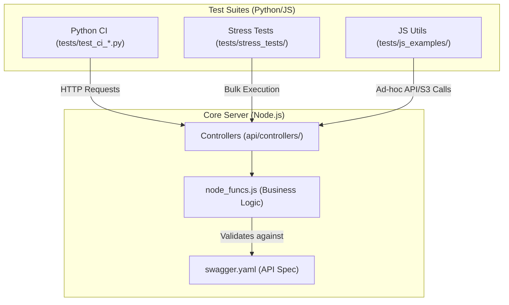
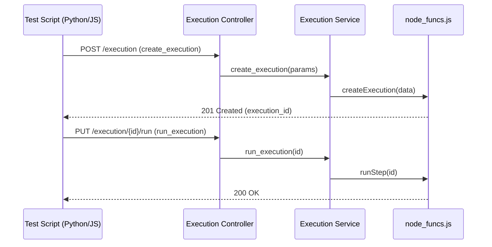

# Page: Testing

# Testing

Relevant source files

The following files were used as context for generating this wiki page:

- [README.md](README.md)
- [api/controllers/Execution.js](api/controllers/Execution.js)

The Ingenium Core Server test suite is designed to ensure API reliability, execution engine stability, and performance under load. Testing is divided into three primary categories: automated Python-based CI tests, execution/stress examples, and JavaScript utility scripts for ad-hoc validation.

The test suite requires connectivity to several dependent services, including the Ingenium Archive and the Execution Server, as defined in the test configuration [README.md:33-34]().

### Testing Architecture

The following diagram illustrates the relationship between the test suites and the Core Server components:

**Test Suite to Code Mapping**

Sources: [README.md:31-43](), [api/controllers/Execution.js:5-165]()

### Python CI Test Suite
The primary integration testing framework is built using Python's `unittest` and `xmlrunner`. These tests interact with the server via the `ingenium_client` to validate end-to-end workflows, including authentication, procedure creation, and execution management.

*   **Framework**: Utilizes `unittest` and `config.py` to manage service URLs like `CORE_SERVER_URL` and `ARCHIVE_ING_URL`.
*   **Coverage**: Includes dedicated files for health checks, logging, API keys, and comprehensive step-type validation (e.g., `test_ci_executions.py`, `test_ci_procedures.py`).
*   **Authentication**: Supports JWT-based authentication via `with_jwt.py` and `auth_example.py`.

For details, see [Python CI Test Suite](#5.1).

### Execution Examples and Stress Tests
Beyond standard CI, the repository contains scripts for complex execution scenarios and performance benchmarking.

*   **Execution Examples**: Located in `tests/execution_examples/`, these scripts demonstrate asynchronous execution, EIP procedure creation, and conductor role changes.
*   **Stress Testing**: Located in `tests/stress_tests/`, the `run_procedures.py` tool allows for load testing by simulating multiple concurrent procedure runs across various venues.

For details, see [Execution Examples and Stress Tests](#5.2).

### JavaScript Test Utilities
A collection of Node.js and browser-compatible scripts are maintained for testing specific integrations and utility functions.

*   **HTTP & Storage**: Examples using `axios` and `request` for API calls, and `s3_test.js` for verifying MinIO/S3 connectivity.
*   **Regex Validation**: Specialized tests in `tests/node/regex/` ensure that HTML content and image URLs are correctly transformed during procedure rendering or export.

For details, see [JavaScript Test Utilities](#5.3).

### Execution Flow in Tests
When a test triggers an execution, it follows the standard API lifecycle within the Core Server.

**Execution Lifecycle Mapping**

Sources: [api/controllers/Execution.js:5-7](), [api/controllers/Execution.js:137-139](), [README.md:39-42]()

### Summary Table of Test Locations

| Category | Location | Purpose |
| :--- | :--- | :--- |
| **CI Integration** | `tests/test_ci_*.py` | Automated validation of all API endpoints and step types. |
| **Scenarios** | `tests/execution_examples/` | Demonstrations of specific execution workflows (Async, EIP). |
| **Load Testing** | `tests/stress_tests/` | High-concurrency execution and venue creation. |
| **Regex/Utilities** | `tests/node/` & `tests/js_examples/` | Ad-hoc testing for S3, regex, and JS HTTP clients. |

Sources: [README.md:31-43]()
