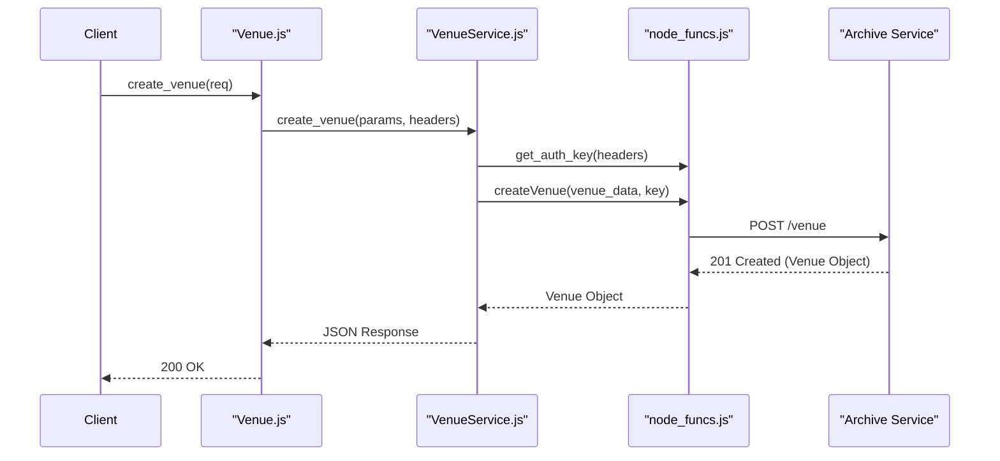
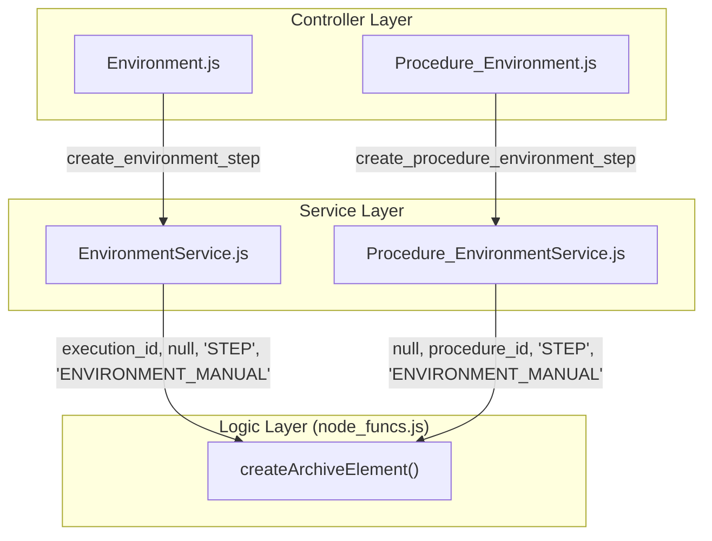

# Page: Venue and Environment Controllers

# Venue and Environment Controllers

Relevant source files

The following files were used as context for generating this wiki page:

- [api/controllers/Environment.js](api/controllers/Environment.js)
- [api/controllers/EnvironmentService.js](api/controllers/EnvironmentService.js)
- [api/controllers/Procedure_Environment.js](api/controllers/Procedure_Environment.js)
- [api/controllers/Procedure_EnvironmentService.js](api/controllers/Procedure_EnvironmentService.js)

This page documents the controllers and services responsible for managing the physical and logical contexts in which procedures are executed. This includes **Venues** (testbeds or facilities), **Venue Groups**, **Venue Configurations**, and **Environment Steps** (manual environmental setup tasks).

## Overview of Entities

The system distinguishes between the physical location/status of a testbed and the configuration data required to operate it:

| Entity | Description | Controller / Service |
| :--- | :--- | :--- |
| **Venue** | Represents a physical testbed or simulation environment. Tracks registration and status. | `Venue.js` / `VenueService.js` |
| **Venue Group** | Logical collections of venues for organizational purposes. | `VenueGroup.js` / `VenueGroupService.js` |
| **Venue Config** | Versioned configuration data (JSON) associated with a specific venue. | `Venue_Config.js` / `Venue_ConfigService.js` |
| **Environment Step** | A procedure element (type `ENVIRONMENT_MANUAL`) used to prompt users for environmental setup during execution. | `Environment.js` / `EnvironmentService.js` |

---

## Venue and Configuration Management

The Venue controllers handle the registration and lifecycle of test environments. Venues are typically managed via the `node_funcs` utility which interfaces with the backend Archive.

### Data Flow: Venue Registration
The following diagram illustrates how a Venue is registered through the controller stack into the persistent store.

**Venue Registration Sequence**

**Sources:** [api/controllers/Venue.js:7-9](), [api/controllers/VenueService.js:15-32](), [api/node_funcs.js:1-50]() (implied by service calls).

### Venue Configurations
Venue configurations allow users to store and retrieve specific settings for a venue. These are versioned and can be searched by venue ID.

*   **Create Config:** `Venue_ConfigService.create_venue_config` delegates to `node_funcs.createVenueConfig` [api/controllers/Venue_ConfigService.js:14-31]().
*   **Get Latest:** `Venue_ConfigService.get_latest_venue_config` retrieves the most recent configuration for a specific venue [api/controllers/Venue_ConfigService.js:63-78]().

---

## Environment Steps

Environment steps are a specialized type of procedure element identified by the `step_type`: `ENVIRONMENT_MANUAL`. These steps are used to document or verify environmental conditions (e.g., "Set room temperature to 22C").

### Execution vs. Procedure Context
The system provides two sets of controllers for environment steps:
1.  **Environment Controller:** Operates on steps within a live **Execution** [api/controllers/Environment.js:1-37]().
2.  **Procedure_Environment Controller:** Operates on steps within a **Procedure Working Copy** [api/controllers/Procedure_Environment.js:1-29]().

### Implementation Detail: Step Creation
Both services utilize `node_funcs.createArchiveElement` but pass different identifiers depending on the context.

**Code Mapping: Environment Step Creation**

**Sources:** [api/controllers/EnvironmentService.js:3-25](), [api/controllers/Procedure_EnvironmentService.js:4-26]()

### Key Functions

| Function | Description | Implementation |
| :--- | :--- | :--- |
| `get_execution_environment_steps` | Returns a paginated list of all environment steps in an execution. | Calls `node_funcs.getExecutionElements` with `step_type='ENVIRONMENT_MANUAL'` [api/controllers/EnvironmentService.js:87-115](). |
| `update_environment_step_input` | Updates the `user_input` (specification) of the step. | Calls `node_funcs.update_step_input` [api/controllers/EnvironmentService.js:139-159](). |
| `get_environment_step_result` | Retrieves the results recorded for an environment step during execution. | Calls `node_funcs.get_step_result` [api/controllers/EnvironmentService.js:67-85](). |

---

## Venue Groups

Venue Groups provide a way to categorize venues. The `VenueGroupService` provides standard CRUD operations.

*   **List Groups:** `get_venue_groups` retrieves all defined groups [api/controllers/VenueGroupService.js:83-97]().
*   **Membership:** Venues are associated with groups via the `venue_group_id` attribute in the Venue object.
*   **Implementation:** All operations (create, get, update, delete) are routed through `node_funcs` to the Archive backend [api/controllers/VenueGroupService.js:14-135]().

**Sources:**
*   **Venue Logic:** [api/controllers/Venue.js](), [api/controllers/VenueService.js]()
*   **Venue Group Logic:** [api/controllers/VenueGroup.js](), [api/controllers/VenueGroupService.js]()
*   **Venue Config Logic:** [api/controllers/Venue_Config.js](), [api/controllers/Venue_ConfigService.js]()
*   **Environment Logic:** [api/controllers/Environment.js](), [api/controllers/EnvironmentService.js](), [api/controllers/Procedure_Environment.js](), [api/controllers/Procedure_EnvironmentService.js]()
