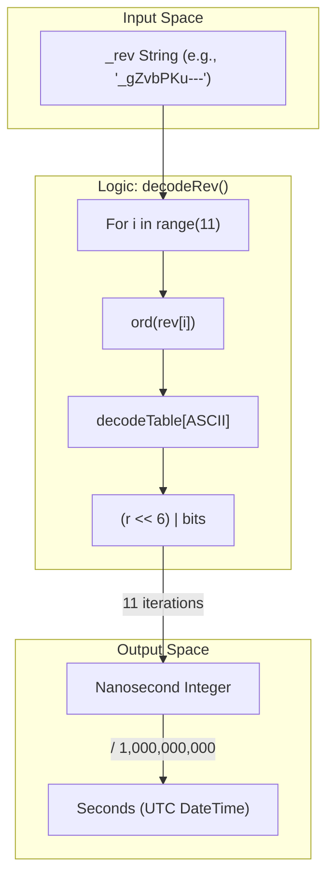
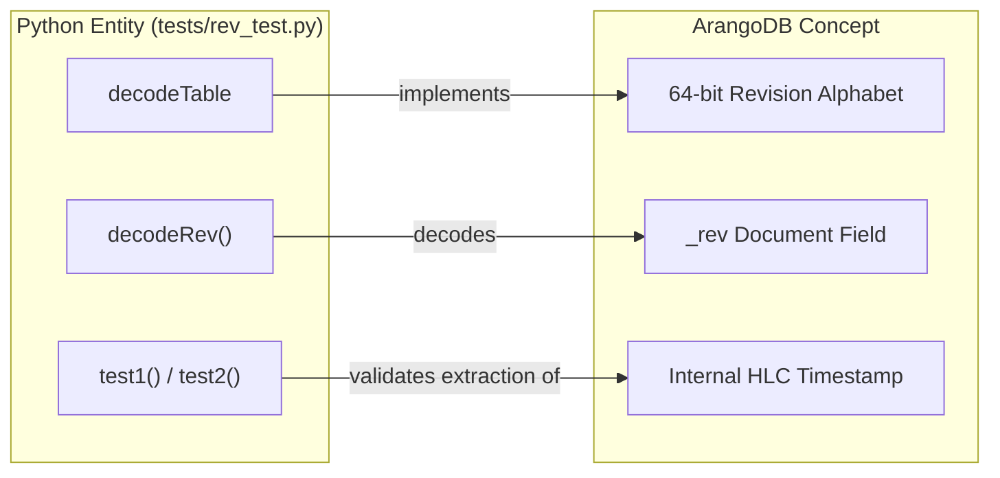

# ArangoDB Revision Decoding Utility

Relevant source files

The following files were used as context for generating this wiki page:

- [document/document.js](document/document.js)
- [tests/rev_test.py](tests/rev_test.py)

The ArangoDB Revision Decoding Utility is a standalone Python script designed to reverse-engineer the internal timestamp encoded within ArangoDB `_rev` (revision) strings. While the main synchronization service is written in Node.js, this utility provides a reference implementation for extracting high-precision nanosecond timestamps from the Base64-like encoded strings ArangoDB uses to track document versions.

### Encoding Scheme and Alphabet

ArangoDB revisions are encoded using a custom 64-character alphabet. This alphabet is similar to Base64 but uses a specific character ordering and set of symbols.

*   **Alphabet String**: `-_ABCDEFGHIJKLMNOPQRSTUVWXYZabcdefghijklmnopqrstuvwxyz0123456789` [tests/rev_test.py:4-4]()
*   **Structure**: The encoding maps 6-bit values to specific characters.
*   **Lookup Table**: The `decodeTable` is a 256-entry array that maps ASCII character codes back to their 6-bit integer values. Values of `-1` represent characters not present in the ArangoDB encoding set [tests/rev_test.py:6-39]().

### Decoding Implementation

The core logic resides in the `decodeRev()` function. It processes the first 11 characters of a revision string to reconstruct a 64-bit integer representing the timestamp in nanoseconds since the Unix epoch.

#### Bitwise Accumulation Logic
The function iterates through the revision string and performs a 6-bit left shift for each character, OR-ing the result with the character's mapped value from the `decodeTable`.

| Step | Operation | Description |
| :--- | :--- | :--- |
| 1 | `r = 0` | Initialize accumulator [tests/rev_test.py:42]() |
| 2 | `ord(rev[i])` | Get ASCII code of the character [tests/rev_test.py:44]() |
| 3 | `decodeTable[...]` | Look up 6-bit value [tests/rev_test.py:44]() |
| 4 | `(r << 6) \| c` | Shift accumulator 6 bits left and add new bits [tests/rev_test.py:46]() |
| 5 | Repeat | Continue for exactly 11 characters [tests/rev_test.py:43]() |

#### Timestamp Conversion
The resulting integer is a nanosecond-precision timestamp. To convert this to a standard Unix timestamp (seconds), the value is divided by $1,000,000,000$ [tests/rev_test.py:57]().

**Revision Decoding Flow**
Title: ArangoDB Revision String to Timestamp Flow

Sources: [tests/rev_test.py:41-48](), [tests/rev_test.py:57]()

### Validation and Test Cases

The utility includes two test functions, `test1()` and `test2()`, which validate the decoding logic against known revision strings. These tests demonstrate that the extracted timestamps correspond to valid UTC dates and times.

#### Example Mappings
The following table illustrates the relationship between ArangoDB revision strings and their decoded human-readable timestamps as processed by the utility:

| Revision String (`_rev`) | Decoded Timestamp (Seconds) | Human Readable (UTC) |
| :--- | :--- | :--- |
| `_gZvbPKu---` | `1675...` | Extracted UTC Date [tests/rev_test.py:57]() |
| `_gNnUjje---` | `1675...` | Extracted UTC Date [tests/rev_test.py:73]() |
| `-1erpMlX---` | `...` | Extracted UTC Date [tests/rev_test.py:79]() |

**Entity Mapping: Python Logic to ArangoDB Concepts**
Title: Mapping Utility Entities to Database Concepts

Sources: [tests/rev_test.py:4-48](), [tests/rev_test.py:50-85]()

### Technical Significance
In the context of the `ingenium_data_sync_service`, understanding the `_rev` structure is critical for debugging incremental synchronization. While the Node.js service typically uses high-level queries to fetch documents updated after a certain time, this utility allows developers to manually verify the exact age of a document version by inspecting its `_rev` string directly without querying the database for its metadata.

Sources:
* [tests/rev_test.py:1-88]()
* [document/document.js:58-97]() (Context on document metadata)
