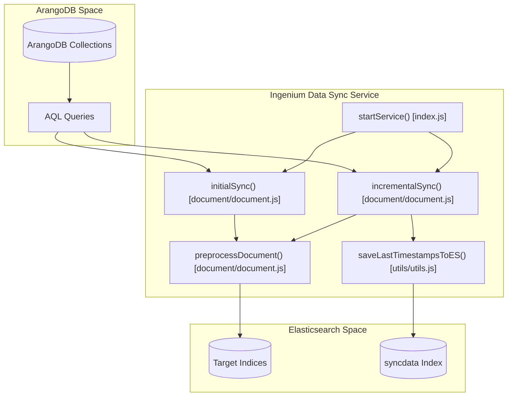

# Architecture

<details>
<summary>Relevant source files</summary>

The following files were used as context for generating this wiki page:

- [README.md](README.md)
- [index.js](index.js)

</details>


The Ingenium Data Sync Service is a robust synchronization engine designed to bridge the gap between **ArangoDB** (the primary transactional store) and **Elasticsearch** (the search and analytics engine). It ensures that complex Ingenium data structures are denormalized, preprocessed, and indexed for high-performance querying.

The service follows a two-phase lifecycle: an initial bulk load for historical data followed by a continuous, polling-based incremental sync to capture real-time updates.

### System Data Flow

The following diagram illustrates the high-level data flow and the code entities responsible for each stage of the pipeline.

**Diagram: Data Synchronization Pipeline**

**Sources:** [index.js:12-91](), [document/document.js:132-212](), [utils/utils.js:4-53]()

---

### Sync Lifecycle Phases

The service operates in three distinct logical phases to ensure data integrity and resilience:

1.  **Connection & Initialization**: The service attempts to connect to both databases with a 5-minute retry loop [index.js:16-58](). It then waits for a configurable grace period (`INIT_SYNC_DELAY_SECS`) to allow search index mappings to stabilize [index.js:68-69]().
2.  **Initial Sync**: A one-shot execution of `initialSync` [index.js:78](). If the document count exceeds `INIT_SYNC_TRIGGER_ELEM_COUNT`, the service switches to a chunked bulk load strategy using `INIT_SYNC_CHUNK_SIZE` to prevent memory exhaustion [document/document.js:132-167]().
3.  **Incremental Sync**: An infinite loop that calls `incrementalSync` every `SYNC_INTERVAL_SECS` [index.js:80-88](). It uses ArangoDB `_rev` values as watermarks to fetch only documents modified since the last successful sync [document/document.js:174-212]().

### Module Boundaries

The codebase is organized into functional layers to separate concerns:

| Layer | Responsibilities | Key Entities |
| :--- | :--- | :--- |
| **Orchestration** | Lifecycle management, retry logic, and polling loop. | `startService()` [index.js:12]() |
| **Pipeline** | Data extraction (AQL), denormalization, and transformation. | `initialSync()`, `preprocessDocument()` [document/document.js:1]() |
| **Data Access** | Client instantiation for ArangoDB and Elasticsearch. | `getArangoDb()`, `getEsClient()` [db/db.js:1]() |
| **State Management** | Persistence of sync watermarks (timestamps) in ES. | `readLastTimestampsFromES()`, `saveLastTimestampsToES()` [utils/utils.js:1]() |
| **Configuration** | Environment variable parsing and default settings. | `config.js` [config/config.js:1]() |

**Sources:** [index.js:1-7](), [document/document.js:1-10](), [db/db.js:1-20](), [utils/utils.js:1-10]()

---

### Architectural Layers (Child Pages)

For a deeper dive into specific components of the architecture, refer to the following detailed pages:

#### [2.1 Service Entrypoint and Sync Lifecycle](#)
Detailed breakdown of the `startService()` function in `index.js`. Covers the connection retry logic, the transition from initial to incremental sync, and the global error handling strategy.
*See [Service Entrypoint and Sync Lifecycle](#2.1) for details.*

#### [2.2 Document Synchronization Pipeline](#)
Deep dive into the `document/document.js` logic. Explains how AQL is used to join collections (e.g., `element` and `procedureElement`), how `preprocessDocument` cleanses data, and the mechanics of chunked processing.
*See [Document Synchronization Pipeline](#2.2) for details.*

#### [2.3 Configuration Reference](#)
Comprehensive guide to the environment variables and constants defined in `config/config.js`. Explains how to tune sync intervals, chunk sizes, and collection targets.
*See [Configuration Reference](#2.3) for details.*

---

### Code Entity Mapping

The following diagram maps high-level architectural concepts to the specific files and functions that implement them.

**Diagram: Architectural Component Mapping**
```mermaid
classDiagram
    class "Lifecycle Manager" {
        index.js: startService()
        index.js: sleepMilisecs()
    }
    class "Sync Engine" {
        document.js: initialSync()
        document.js: incrementalSync()
        document.js: getElementData()
    }
    class "Data Transformer" {
        document.js: preprocessDocument()
    }
    class "State Store" {
        utils.js: readLastTimestampsFromES()
        utils.js: saveLastTimestampsToES()
    }
    class "Database Clients" {
        db.js: getArangoDb()
        db.js: getEsClient()
    }

    "Lifecycle Manager" --> "Sync Engine" : invokes
    "Sync Engine" --> "Data Transformer" : uses
    "Sync Engine" --> "State Store" : updates/reads
    "Sync Engine" --> "Database Clients" : uses
```
**Sources:** [index.js:78-82](), [document/document.js:132-212](), [utils/utils.js:4-53](), [db/db.js:4-18]()
