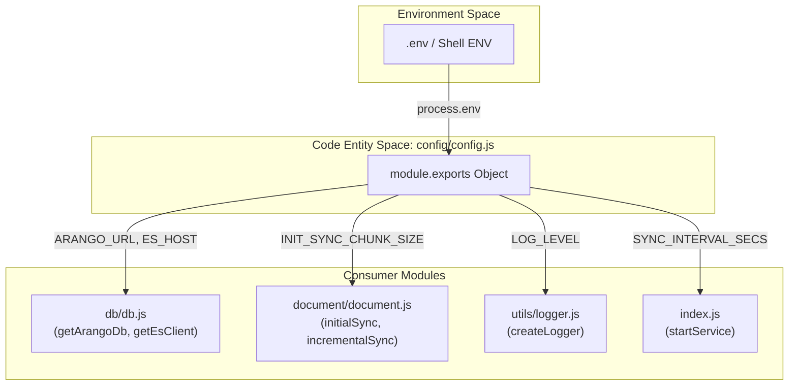
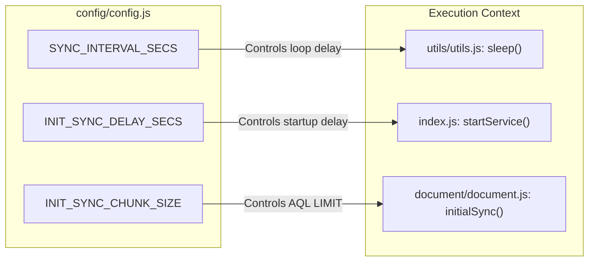

# Configuration Reference

<details>
<summary>Relevant source files</summary>

The following files were used as context for generating this wiki page:

- [README.md](README.md)
- [config/config.js](config/config.js)

</details>


The Ingenium Data Sync Service utilizes a centralized configuration pattern managed via `config/config.js`. This module aggregates environment variables, provides sane defaults for local development, and performs basic type validation to ensure the sync pipeline operates with predictable timing and memory constraints.

### Configuration Architecture

The configuration layer acts as the source of truth for all service components, including the database client factories, the document processing pipeline, and the logging utility. It primarily consumes environment variables, which allows the service to be deployed across different environments (Dev, QA, Prod) using the same Docker image by simply varying the container's environment manifest.

#### Configuration Data Flow
The following diagram illustrates how configuration values propagate from the environment through `config/config.js` to the functional modules of the service.

**Configuration Propagation Diagram**

Sources: [config/config.js:1-15](), [db/db.js:1-20](), [index.js:1-50]()

---

### Environment Variables and Defaults

The service defines several categories of configuration: connection parameters for ArangoDB and Elasticsearch, sync lifecycle timing, and data throughput (chunking) limits.

#### Database Connection Settings
These variables define how the service authenticates and connects to the source and destination databases.

| Variable | Config Key | Default Value | Description |
|:---|:---|:---|:---|
| `ARANGO_URL` | `ARANGO_URL` | `http://127.0.0.1:18529` | Full URL for ArangoDB endpoint. |
| `ARANGO_USER` | `ARANGO_USER` | `root` | Username for ArangoDB authentication. |
| `ARANGO_ROOT_PASSWORD`| `ARANGO_PASSWORD` | `password` | Password for ArangoDB authentication. |
| `ARANGO_DB_NAME` | `ARANGO_DB_NAME` | `ingenium` | Target ArangoDB database name. |
| `ES_HOST` | `ES_HOST` | `127.0.0.1` | Hostname for Elasticsearch. |
| `ES_PORT` | `ES_PORT` | `19200` | Port for Elasticsearch. |

Sources: [config/config.js:2-8](), [README.md:119-124]()

#### Sync Lifecycle and Timing
These parameters control the "heartbeat" of the service and the initial grace period allowed for external dependencies to become healthy.

| Variable | Config Key | Default Value | Description |
|:---|:---|:---|:---|
| `INIT_SYNC_DELAY_SECS` | `INIT_SYNC_DELAY_SECS` | `60` | Delay in seconds before the first sync attempt starts. |
| `SYNC_INTERVAL_SECS` | `SYNC_INTERVAL_SECS` | `30` | The polling interval for `incrementalSync` after initial sync completes. |

Sources: [config/config.js:9-12](), [index.js:23-23](), [index.js:46-46]()

#### Chunking and Throughput
To prevent memory exhaustion when handling millions of documents, the service uses a chunked approach for bulk indexing.

| Variable | Config Key | Default Value | Description |
|:---|:---|:---|:---|
| `INIT_SYNC_TRIGGER_ELEM_COUNT`| `INIT_SYNC_TRIGGER_ELEM_COUNT`| `500000` | Threshold of total documents. If exceeded, the service uses chunked processing. |
| `INIT_SYNC_CHUNK_SIZE` | `INIT_SYNC_CHUNK_SIZE` | `100000` | Number of documents processed per batch during initial sync. |
| `N/A` | `SYNC_CHUNK_SIZE` | `100000` | Internal alias for chunk size during incremental phases. |

Sources: [config/config.js:10-13](), [document/document.js:14-18]()

---

### Implementation Details

#### Type Validation Logic
The `config/config.js` file implements inline validation for numeric environment variables using `isNaN(parseInt())` checks. This ensures that if a user provides an invalid string (e.g., `ES_PORT=abc`), the service falls back to the hardcoded default rather than crashing with a `NaN` error during network calls.

Example implementation for `ES_PORT`:
`ES_PORT: isNaN(parseInt(process.env.ES_PORT)) ? 19200 : parseInt(process.env.ES_PORT)` [config/config.js:8-8]()

#### Collection Hardcoding
Unlike connection strings, the `ARANGO_COLLECTION_NAMES` array is currently defined as a static array within the config file. This array dictates which collections the `startService` loop iterates over.

*   **Collections**: `['element', 'procedureElement']` [config/config.js:6-6]()

#### Logging Level
The `LOG_LEVEL` is currently hardcoded to `'info'` in `config/config.js:14-14](). This value is passed to the Winston logger in `utils/logger.js` to filter log output.

---

### Overriding Defaults for Deployment

To override these values in a production environment, you should use a `.env` file or container environment variables.

**System Entity Mapping: Config to Implementation**

Sources: [config/config.js:9-13](), [index.js:23-46](), [document/document.js:14-30](), [utils/utils.js:45-47]()

#### Example `.env` for Production
```bash
ARANGO_URL=http://prod-arango:8529
ARANGO_ROOT_PASSWORD=secure_password_here
ES_HOST=elasticsearch-cluster.internal
SYNC_INTERVAL_SECS=60
INIT_SYNC_CHUNK_SIZE=50000
```
Sources: [README.md:58-77]()
