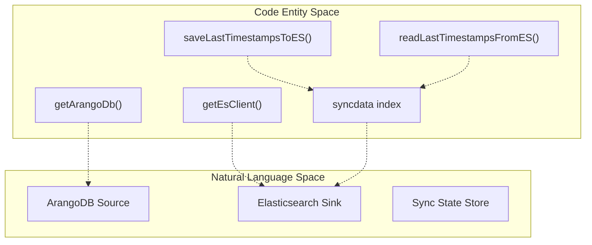
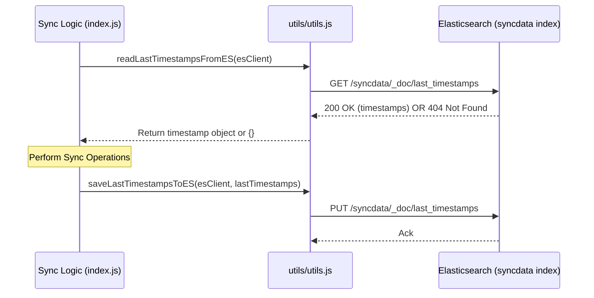

# Data Layer

Relevant source files

The following files were used as context for generating this wiki page:

- [db/db.js](db/db.js)
- [utils/utils.js](utils/utils.js)

The Data Layer is responsible for establishing connections to the system's primary data stores: **ArangoDB** (the source of truth) and **Elasticsearch** (the sync destination and state store). This layer provides factory functions for client instantiation and utility functions for managing the persistent synchronization state.

The service treats both databases as external dependencies managed via environment-based configuration. It does not implement internal retry logic within the factory functions; instead, it relies on the orchestration logic in the service entrypoint to handle connection failures.

### System Connectivity Overview

The following diagram illustrates how the `db/db.js` factory and `utils/utils.js` state management functions bridge the application logic to the physical database instances.

**Data Layer Connection Mapping**

Sources: [db/db.js:12-24](), [utils/utils.js:8-35]()

---

### Database Client Factory

The service centralizes client creation in `db/db.js`. It uses the `arangojs` driver for ArangoDB interactions and the official `@elastic/elasticsearch` client for Elasticsearch operations.

*   **ArangoDB Connection**: The `getArangoDb` function instantiates a `Database` object using `ARANGO_URL`, `ARANGO_DB_NAME`, and credentials [db/db.js:12-20]().
*   **Elasticsearch Connection**: The `getEsClient` function constructs a node URL from `ES_HOST` and `ES_PORT` to initialize the client [db/db.js:22-24]().

For details on client configuration and dependency on environment variables, see [Database Client Factory](#3.1).

### Sync State Management

To ensure data consistency across service restarts and prevent redundant processing, the service maintains a "high-water mark" for each synchronized collection. This state is stored externally in Elasticsearch rather than locally.

**State Persistence Flow**

Sources: [utils/utils.js:8-35]()

*   **Distributed State**: The service uses a dedicated Elasticsearch index named `syncdata` and a document ID `last_timestamps` to store the last processed revision for every collection [utils/utils.js:11-12]().
*   **Graceful Initialization**: On the first run, the system handles `404 Not Found` errors from Elasticsearch gracefully, returning an empty state to trigger a full initial sync [utils/utils.js:27-31]().
*   **Utility Helpers**: The layer also provides common logic such as `camelToSnakeCase` for field normalization and a `sleep` promise for polling delays [utils/utils.js:2-6]().

For details on the state schema and persistence logic, see [Sync State Management](#3.2).

---

### Sources
* [db/db.js:1-29]()
* [utils/utils.js:1-42]()
