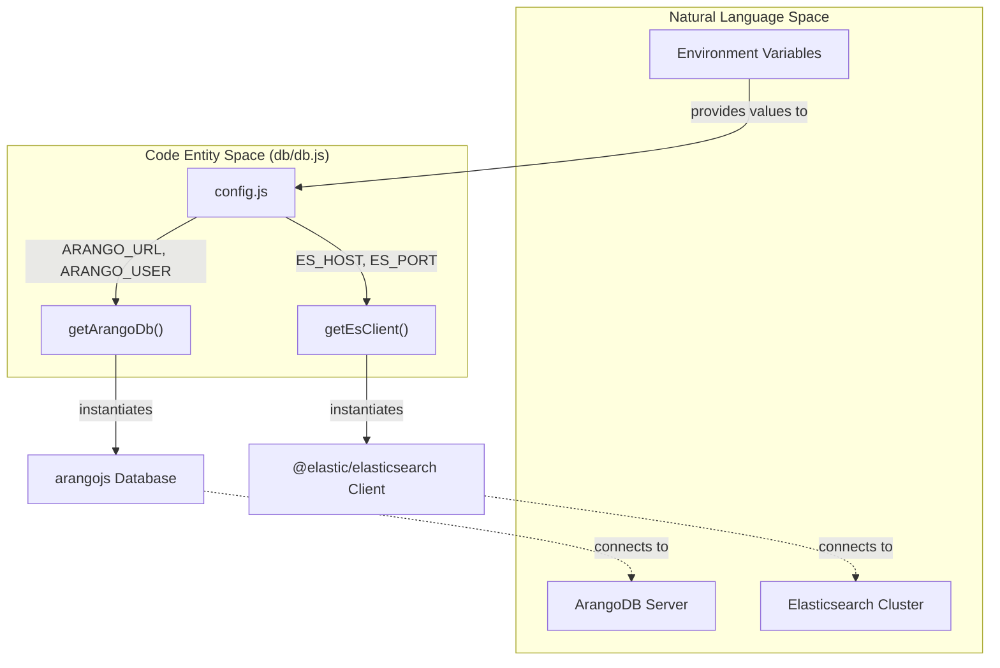
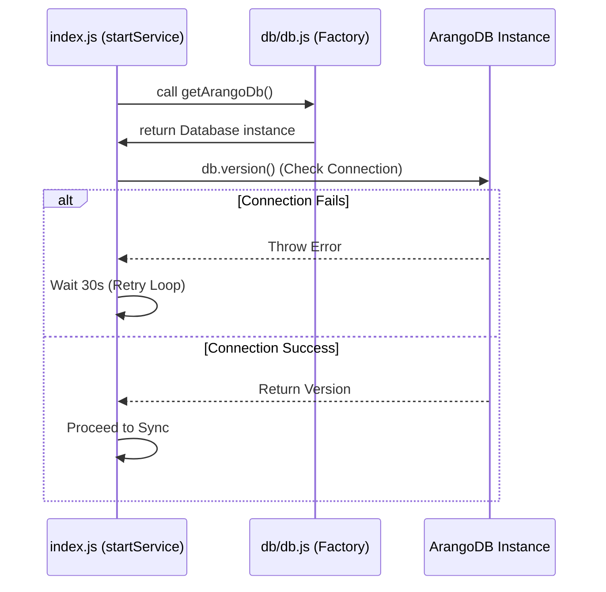

# Database Client Factory

Relevant source files

The following files were used as context for generating this wiki page:

- [config/config.js](config/config.js)
- [db/db.js](db/db.js)

The **Database Client Factory** module provides a centralized mechanism for instantiating connections to the two primary data stores used by the Ingenium Data Sync Service: **ArangoDB** and **Elasticsearch**. 

This module acts as a thin abstraction layer that consumes environment-driven configuration to produce pre-authenticated client instances. It is intentionally designed without internal retry logic or connection pooling management, delegating lifecycle concerns (such as reconnection loops) to the service entrypoint.

### Client Instantiation Logic

The factory utilizes the `arangojs` and `@elastic/elasticsearch` libraries to create connection objects. These objects are used throughout the synchronization pipeline to perform AQL queries and bulk index operations.

#### ArangoDB Connection (`getArangoDb`)
The `getArangoDb()` function initializes a new `Database` instance. It configures the connection using the `ARANGO_URL` and targets a specific logical database defined by `ARANGO_DB_NAME` [db/db.js:12-20](). Authentication is handled via basic credentials (`ARANGO_USER` and `ARANGO_PASSWORD`) provided during instantiation [db/db.js:16-16]().

#### Elasticsearch Connection (`getEsClient`)
The `getEsClient()` function returns an Elasticsearch `Client`. The node URL is dynamically constructed using the `ES_HOST` and `ES_PORT` configuration values [db/db.js:22-24](). Unlike the ArangoDB client, this factory uses a standard HTTP URL string template to define the target node [db/db.js:23-23]().

### Data Flow and Configuration Dependency

The factory functions are strictly dependent on the `config/config.js` module. They do not accept arguments; instead, they pull the necessary environment variables directly from the exported configuration object.

**Table 1: Configuration Mapping for Client Factories**

| Factory Function | Config Variable | Purpose |
| :--- | :--- | :--- |
| `getArangoDb` | `ARANGO_URL` | The base URL of the ArangoDB server [db/db.js:14-14]() |
| `getArangoDb` | `ARANGO_DB_NAME` | The specific database to sync from [db/db.js:15-15]() |
| `getArangoDb` | `ARANGO_USER` | Username for ArangoDB authentication [db/db.js:16-16]() |
| `getArangoDb` | `ARANGO_PASSWORD` | Password for ArangoDB authentication [db/db.js:16-16]() |
| `getEsClient` | `ES_HOST` | Hostname for the Elasticsearch cluster [db/db.js:23-23]() |
| `getEsClient` | `ES_PORT` | Port number for the Elasticsearch cluster [db/db.js:23-23]() |

**Sources:**
- [db/db.js:1-10]()
- [db/db.js:12-24]()
- [config/config.js:1-8]()

### Architectural Integration

The following diagram illustrates how the `db.js` factory bridges the gap between the raw configuration values and the high-level service logic.

**Diagram: Configuration to Client Mapping**

**Sources:**
- [db/db.js:1-29]()
- [config/config.js:1-15]()

### Error Handling and Resilience

A critical design choice in `db/db.js` is the **absence of built-in retry logic**. The factory functions are `async` but do not implement `try/catch` blocks or back-off strategies for connection failures. 

Instead, the service relies on the caller (typically the `startService` function in `index.js`) to handle exceptions. If the database is unavailable at startup, the service will catch the error thrown by these clients and initiate a retry loop (e.g., attempting reconnection every 30 seconds for up to 5 minutes). This separation of concerns ensures that the data layer remains stateless and simple, while the application layer manages the orchestration of service health.

**Diagram: Client Usage and Resilience Flow**

**Sources:**
- [db/db.js:12-24]()
- [config/config.js:12-12]() (SYNC_INTERVAL_SECS used for polling logic)
