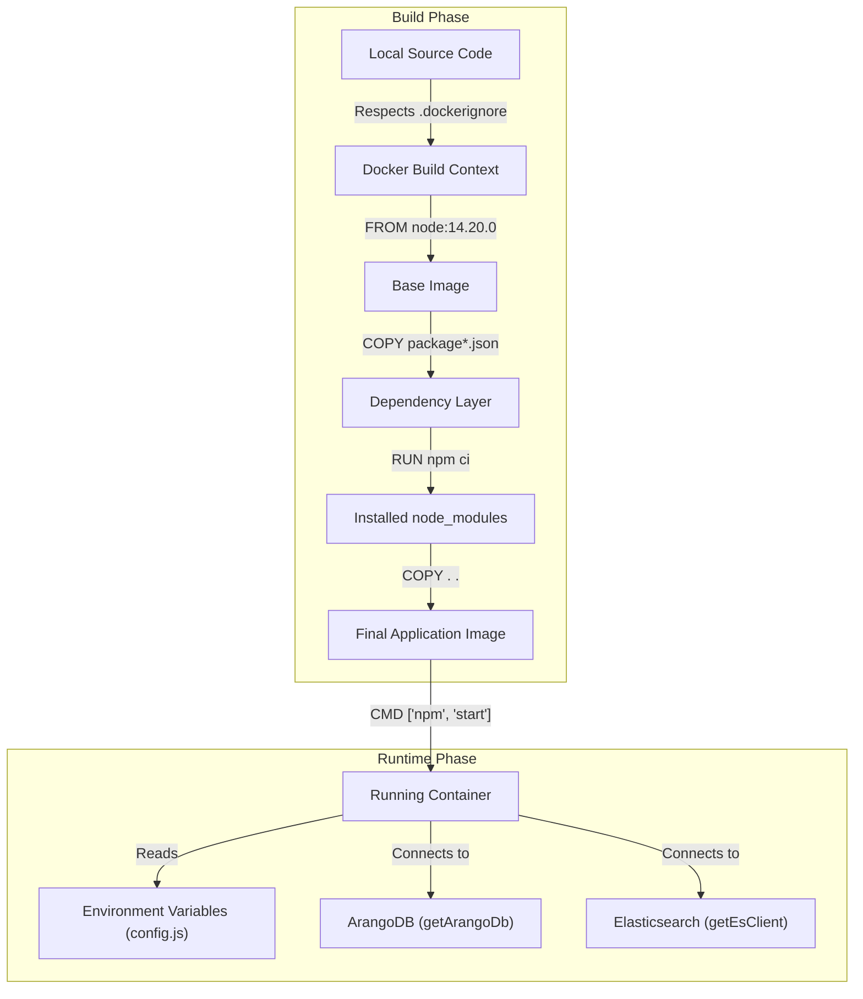

# Deployment

Relevant source files

The following files were used as context for generating this wiki page:

- [.dockerignore](.dockerignore)
- [.gitignore](.gitignore)
- [Dockerfile](Dockerfile)

The **Ingenium Data Sync Service** is designed to run as a containerized microservice, ensuring portability and consistent behavior across development, staging, and production environments. Deployment focuses on a robust build process that leverages Node.js 14 LTS and strict environment hygiene to prevent configuration leakage and minimize image size.

### Deployment Architecture Overview

The service is packaged using a multi-layer Docker build strategy. It is intended to be deployed alongside its primary dependencies—**ArangoDB** and **Elasticsearch**—typically managed via an orchestrator like Docker Compose or Kubernetes. The service utilizes the `npm start` command as its entrypoint, which triggers the connection resilience logic and sync lifecycle defined in `index.js`.

### System Containerization Flow

The following diagram illustrates the relationship between the local development environment, the Docker build process, and the final runtime state of the `ingenium_data_sync_service`.

**Container Build and Execution Flow**

**Sources:**
- [Dockerfile:1-17]()
- [config/config.js:1-115]()
- [db/db.js:1-40]()

---

### Docker Container Configuration

The service uses a specific version of the Node.js runtime (`node:14.20.0`) to ensure compatibility with its dependency tree [Dockerfile:2-2](). The container configuration follows industry best practices for layer caching by separating the installation of `node_modules` from the copying of the application source code. This ensures that subsequent builds are significantly faster if the `package.json` or `package-lock.json` files have not changed [Dockerfile:8-11]().

For details on the specific instructions and multi-container orchestration examples, see **[Docker Container Configuration](#6.1)**.

### Environment and Build Hygiene

To maintain a secure and clean production environment, the repository includes comprehensive `.gitignore` and `.dockerignore` files. These configurations prevent the accidental inclusion of sensitive information (such as `.env` files), local development artifacts (such as `node_modules` or `logs`), and build metadata (such as `.tsbuildinfo` or `.nyc_output`) [ .gitignore:1-105](), [ .dockerignore:1-18](). 

This isolation is critical for:
- **Reproducible Builds**: Ensuring the container only contains what is explicitly defined in the source.
- **Security**: Preventing secrets and local credentials from being baked into the image.
- **Performance**: Reducing the size of the Docker build context and the final image.

For details on ignore-file conventions and environment variable management, see **[Environment and Build Hygiene](#6.2)**.

---

### Related Components

| Component | Role in Deployment | Reference |
| :--- | :--- | :--- |
| `Dockerfile` | Defines the container image build steps. | [Dockerfile:1-18]() |
| `.dockerignore` | Filters files sent to the Docker daemon. | [.dockerignore:1-18]() |
| `.gitignore` | Prevents local artifacts from entering version control. | [.gitignore:1-105]() |
| `package.json` | Defines the `start` script used by the container. | [Dockerfile:17-17]() |

**Sources:**
- [Dockerfile:1-18]()
- [.dockerignore:1-18]()
- [.gitignore:1-105]()
