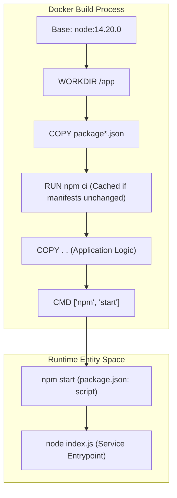
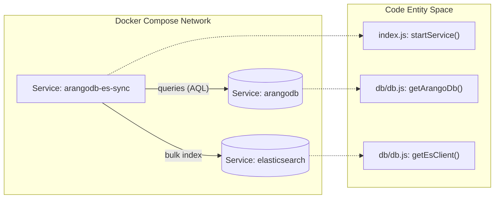

# Docker Container Configuration

<details>
<summary>Relevant source files</summary>

The following files were used as context for generating this wiki page:

- [Dockerfile](Dockerfile)
- [README.md](README.md)

</details>


This page documents the containerization strategy for the Ingenium Data Sync Service. The service is designed to run as a stateless containerized process that synchronizes data between ArangoDB and Elasticsearch. The configuration emphasizes build efficiency through layer caching and operational reliability via proper signal handling and orchestration.

## Dockerfile Implementation

The `Dockerfile` follows a multi-stage approach to optimize build times and ensure a consistent runtime environment based on Node.js 14.

### Base Image and Environment
The service uses `node:14.20.0` as the official base image [Dockerfile:2-2](). The working directory is set to `/app` [Dockerfile:5-5](), which serves as the root for all application artifacts.

### Dependency Caching Pattern
To optimize the build process, the `Dockerfile` implements a dependency-caching layer pattern. By copying `package.json` and `package-lock.json` before the rest of the source code, Docker can cache the `node_modules` layer. This layer is only rebuilt if the dependency manifests change.

1. **Copy Manifests**: `COPY package*.json ./` [Dockerfile:8-8]().
2. **Install Dependencies**: `RUN npm ci` [Dockerfile:11-11](). The use of `npm ci` (Clean Install) ensures a reproducible build by strictly adhering to the `package-lock.json`.
3. **Copy Source**: `COPY . .` [Dockerfile:14-14](). The remaining application logic is added after dependencies are installed.

### Execution Form
The container starts using the **exec form** of the `CMD` instruction: `CMD ["npm", "start"]` [Dockerfile:17-17](). This form allows the Node.js process to receive Unix signals (like `SIGTERM` or `SIGINT`) directly from the Docker daemon, enabling graceful shutdowns.

**Build Logic Flow**


Sources: [Dockerfile:1-17](), [README.md:96-97]()

---

## Docker Compose Orchestration

For local development and production deployments, the service is typically orchestrated alongside its dependencies: ArangoDB and Elasticsearch. The configuration relies on environment variables to wire these services together.

### Service Connectivity
The sync service connects to ArangoDB via `ARANGO_URL` and to Elasticsearch via `ES_HOST` [README.md:141-142](). In a Docker Compose environment, the service names (e.g., `arangodb`, `elasticsearch`) act as the hostnames for internal networking.

### Lifecycle Management
The `depends_on` property ensures that the `arangodb-es-sync` container starts after its target databases [README.md:144-146](). Additionally, `restart: unless-stopped` is used to ensure service availability if the Node.js process crashes due to transient network failures [README.md:147-147]().

**System Topology**


Sources: [README.md:135-148](), [db/db.js:1-38]()

---

## Configuration Reference

The container is configured primarily through environment variables passed at runtime.

| Variable | Role in Container | Default Value |
| :--- | :--- | :--- |
| `ARANGO_URL` | Endpoint for ArangoDB instance | `http://127.0.0.1:18529` |
| `ES_HOST` | Hostname for Elasticsearch | `127.0.0.1` |
| `ES_PORT` | Port for Elasticsearch | `19200` |
| `LOG_LEVEL` | Verbosity of Winston logger | `info` |

### Image Build Command
To build the image locally using the provided `Dockerfile`:
```bash
docker build -t data-sync-service .
```
Sources: [README.md:117-129](), [README.md:153-153]()

## Deployment Best Practices
1. **Signal Handling**: Always use the exec form `["npm", "start"]` to ensure the service responds to `docker stop` commands immediately.
2. **Environment Isolation**: Sensitive credentials like `ARANGO_ROOT_PASSWORD` should be passed via environment variables or Docker Secrets rather than hardcoded in the image [README.md:143-143]().
3. **Resource Constraints**: In production, it is recommended to limit the memory of the container, as the chunked processing logic (`INIT_SYNC_CHUNK_SIZE`) can consume significant RAM when processing large document sets [README.md:128-128]().

Sources: [Dockerfile:17-17](), [README.md:128-143]()
