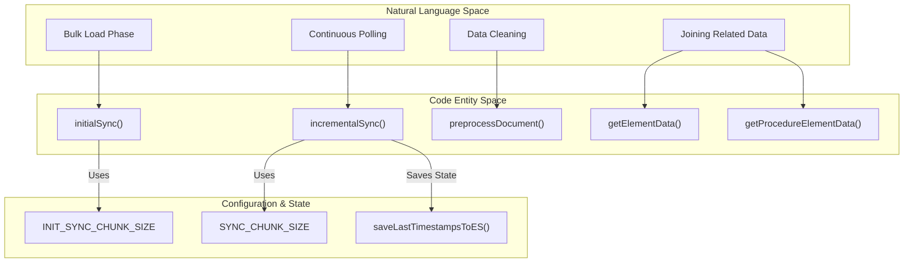
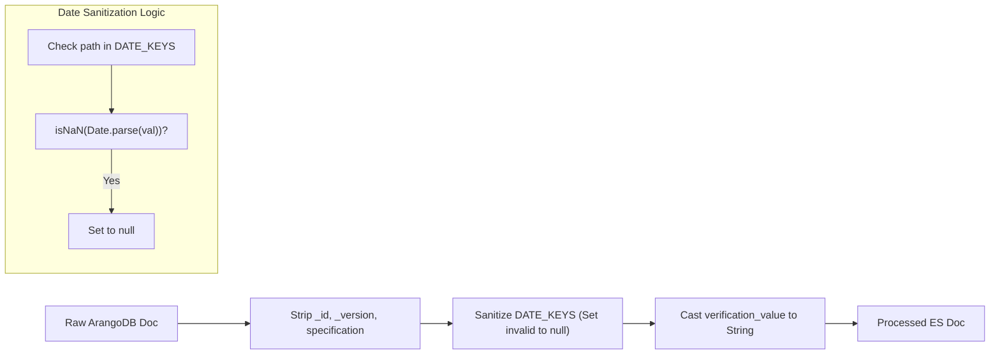

# Document Synchronization Pipeline

Relevant source files

The following files were used as context for generating this wiki page:

- [document/document.js](document/document.js)
- [tests/preprocess_example.js](tests/preprocess_example.js)

The document synchronization pipeline is responsible for the transformation, denormalization, and transfer of data from ArangoDB collections to Elasticsearch indices. It supports two primary modes: a high-throughput initial bulk load and a continuous incremental polling mechanism based on revision watermarks.

## Pipeline Overview

The pipeline logic is primarily contained within `document/document.js`. It handles the lifecycle of a document from its raw state in ArangoDB to a "search-ready" format in Elasticsearch. This involves stripping database-specific metadata, sanitizing date fields to prevent Elasticsearch mapping errors, and performing complex AQL joins to denormalize related entities.

### Natural Language to Code Entity Mapping: Sync Logic

The following diagram maps high-level synchronization concepts to their specific implementations in the codebase.

Title: Sync Logic Mapping

Sources: [document/document.js:1-2](), [document/document.js:58](), [document/document.js:155](), [document/document.js:255]()

---

## Initial Synchronization (`initialSync`)

The `initialSync` function is designed for the first-time population of Elasticsearch. It utilizes a chunked bulk-loading strategy to balance memory usage and throughput.

1.  **Trigger Condition**: The process checks if the document count in an ArangoDB collection exceeds `INIT_SYNC_TRIGGER_ELEM_COUNT` [document/document.js:2]().
2.  **Chunking**: Documents are fetched in batches defined by `INIT_SYNC_CHUNK_SIZE` [document/document.js:2]().
3.  **Processing**: Each document in the chunk is passed through `preprocessDocument` [document/document.js:58]().
4.  **Special Handling**: For specific collections like `element` or `procedureElement`, additional denormalization is performed via `getElementData` or `getProcedureElementData` [document/document.js:155-255]().

Sources: [document/document.js:1-255]()

---

## Incremental Synchronization (`incrementalSync`)

Once the initial sync is complete, the service enters an infinite polling loop (managed in `index.js`) that calls `incrementalSync`.

*   **Revision Watermarking**: It queries ArangoDB for documents where the `_rev` (revision) timestamp is greater than the last recorded timestamp for that collection.
*   **Checkpointing**: After a successful batch sync, the latest timestamp is persisted to the `syncdata` index in Elasticsearch using `saveLastTimestampsToES` [document/document.js:1]().
*   **Chunk Size**: Uses `SYNC_CHUNK_SIZE` for smaller, more frequent updates [document/document.js:2]().

Sources: [document/document.js:1-3]()

---

## Document Preprocessing and Sanitization

The `preprocessDocument` function is critical for maintaining Elasticsearch index integrity. Elasticsearch is strict about data types, particularly dates and object structures.

### Key Transformations
*   **Field Stripping**: Removes ArangoDB internal fields `_id` and `_version` to avoid conflicts [document/document.js:64-65]().
*   **Specification Removal**: Deletes the `specification` field to reduce document size [document/document.js:68]().
*   **Date Sanitization**: Iterates through a comprehensive list of known date fields (`DATE_KEYS`) [document/document.js:5-33](). If a field contains an empty string or an invalid date, it is set to `null` to prevent Elasticsearch ingestion errors [document/document.js:101-141]().
*   **Type Casting**: Ensures `verification_value` and custom script `outputs` are stored as Strings to maintain schema consistency [document/document.js:50-52](), [document/document.js:89-96]().

### Preprocessing Flow
Title: Document Preprocessing Data Flow

Sources: [document/document.js:5-97](), [tests/preprocess_example.js:3-52]()

---

## Denormalization via AQL Joins

For complex entities, the service performs "Join-on-Sync" to provide a flattened, searchable document in Elasticsearch.

### `getElementData`
This helper joins data for the `element` collection by executing multiple AQL queries [document/document.js:155]():
1.  **Execution**: Fetches the associated `execution` document [document/document.js:157-163]().
2.  **Venue**: Joins the `venue` associated with that execution [document/document.js:175-181]().
3.  **RunRecord**: Joins the `runRecord` edge data [document/document.js:188-195]().
4.  **ProcedureVersion**: Joins versioning metadata if a `version_id` exists [document/document.js:203-210]().

### `getProcedureElementData`
Similar to `getElementData`, this function denormalizes `procedureElement` documents by joining `procedureVersion` details to provide context about the procedure the element belongs to [document/document.js:255]().

| Function | Primary Collection | Joined Collections |
| :--- | :--- | :--- |
| `getElementData` | `element` | `execution`, `venue`, `runRecord`, `procedureVersion` |
| `getProcedureElementData` | `procedureElement` | `procedureVersion` |

Sources: [document/document.js:155-255]()
