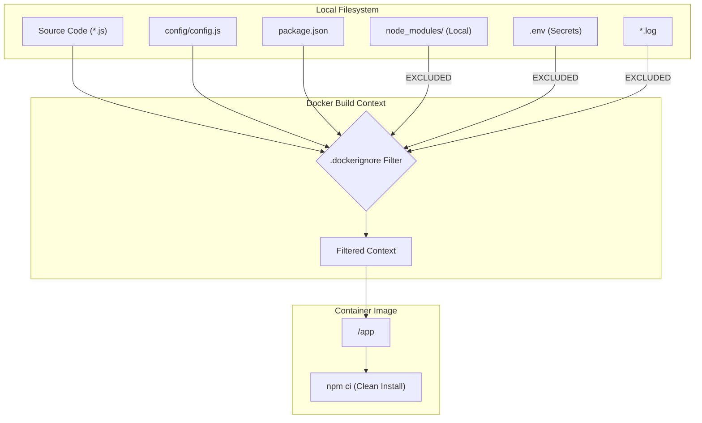
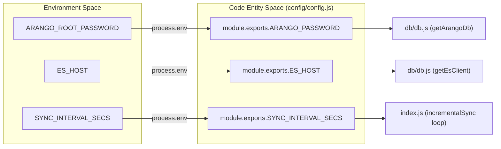

# Environment and Build Hygiene

Relevant source files

The following files were used as context for generating this wiki page:

- [.dockerignore](.dockerignore)
- [.gitignore](.gitignore)
- [config/config.js](config/config.js)

The Ingenium Data Sync Service maintains strict environment and build hygiene to ensure reproducible deployments, prevent sensitive data leakage, and maintain a clean container footprint. This is achieved through comprehensive exclusion rules in `.gitignore` and `.dockerignore`, coupled with a centralized configuration management strategy that decouples secrets from the codebase.

## Dependency Isolation and Build Integrity

A core principle of the service's build process is dependency isolation. By excluding local artifacts and environment-specific files, the service ensures that the build environment (e.g., a developer's laptop) does not contaminate the runtime environment (e.g., a production Docker container).

### Exclusion Strategies

The service utilizes two primary exclusion files to manage the boundary between the source code and the build/runtime artifacts:

1.  **`.gitignore`**: Prevents local development artifacts, logs, and secrets from being committed to the version control system.
2.  **`.dockerignore`**: Optimizes the Docker build context by preventing unnecessary files from being sent to the Docker daemon, which reduces image size and prevents cache invalidation.

### Key Artifacts Excluded

| Category | Patterns | Rationale |
| :--- | :--- | :--- |
| **Dependencies** | `node_modules/`, `bower_components/`, `jspm_packages/` | Ensures that the `npm ci` command in the Dockerfile installs fresh, platform-specific binaries rather than copying local versions. |
| **Secrets** | `.env`, `.env.test` | Prevents hardcoded credentials (like `ARANGO_ROOT_PASSWORD`) from entering the image or repository. |
| **Logs/Temp** | `*.log`, `pids`, `*.tmp`, `coverage/`, `.nyc_output` | Prevents ephemeral runtime data and test coverage reports from bloating the build. |
| **Build Info** | `*.tsbuildinfo`, `dist`, `.next`, `.nuxt`, `.cache` | Excludes intermediate build outputs and caches from various frameworks and TypeScript. |
| **Cloud/Local DB** | `.serverless/`, `.dynamodb/` | Excludes artifacts related to Serverless framework or local DynamoDB instances. |

**Sources:** [ .gitignore:1-105 ](), [ .dockerignore:1-18 ]()

## Build Context Flow

The following diagram illustrates how the `.dockerignore` file acts as a gatekeeper during the `docker build` process, ensuring only necessary source files are copied into the container image.

### Build Context Filtering Logic

**Sources:** [ .dockerignore:1-18 ](), [ .gitignore:41-41 ]()

## Environment Variable Management

The service relies on environment variables for all operational parameters. These are centralized in `config/config.js`, which provides a schema for the service's configuration and establishes defaults for local development.

### Configuration Mapping
The `config.js` file maps system environment variables to internal application constants. This allows the same codebase to run in different environments (Dev, Test, Prod) simply by varying the injected environment variables.

| Code Entity | Environment Variable | Default Value |
| :--- | :--- | :--- |
| `ARANGO_URL` | `ARANGO_URL` | `'http://127.0.0.1:18529'` |
| `ARANGO_PASSWORD` | `ARANGO_ROOT_PASSWORD` | `'password'` |
| `ES_PORT` | `ES_PORT` | `19200` |
| `INIT_SYNC_CHUNK_SIZE` | `INIT_SYNC_CHUNK_SIZE` | `100000` |

**Sources:** [ config/config.js:1-15 ]()

### Secret Management Best Practices
1.  **Never Commit `.env`**: The `.gitignore` file explicitly blocks `.env` [ .gitignore:72-74 ]().
2.  **Container Injection**: In production, variables like `ARANGO_ROOT_PASSWORD` should be injected via the container orchestrator (e.g., Kubernetes Secrets or Docker Compose `environment` blocks) rather than being baked into the image.
3.  **Type Safety**: The `config.js` implementation includes basic type coercion and validation, such as using `parseInt()` and `isNaN()` checks for numeric sync parameters [ config/config.js:8-13 ]().

## Code Entity to Environment Mapping

The following diagram bridges the "Natural Language Space" of environment configuration to the "Code Entity Space" within `config/config.js`.

### Configuration Entity Association

**Sources:** [ config/config.js:1-15 ](), [ .gitignore:72-74 ]()

## Clean Build Verification

To ensure build hygiene is maintained, the following patterns are enforced via `.gitignore`:

*   **TypeScript Hygiene**: Although the project primarily uses JavaScript, `.tsbuildinfo` is excluded to prevent local incremental build state from affecting CI/CD pipelines [ .gitignore:48-48 ]().
*   **Editor/OS Noise**: Patterns like `*.swp`, `*.bak`, and `*~` are excluded in both Git and Docker contexts to prevent temporary editor files from being indexed or containerized [ .dockerignore:14-17 ](), [ .gitignore:13-17 ]().
*   **Runtime PIDs**: Process ID files (`*.pid`, `pids`) are excluded to ensure that stale lock files from a local run do not interfere with the service inside a container [ .gitignore:13-16 ]().

**Sources:** [ .gitignore:1-105 ](), [ .dockerignore:1-18 ]()
