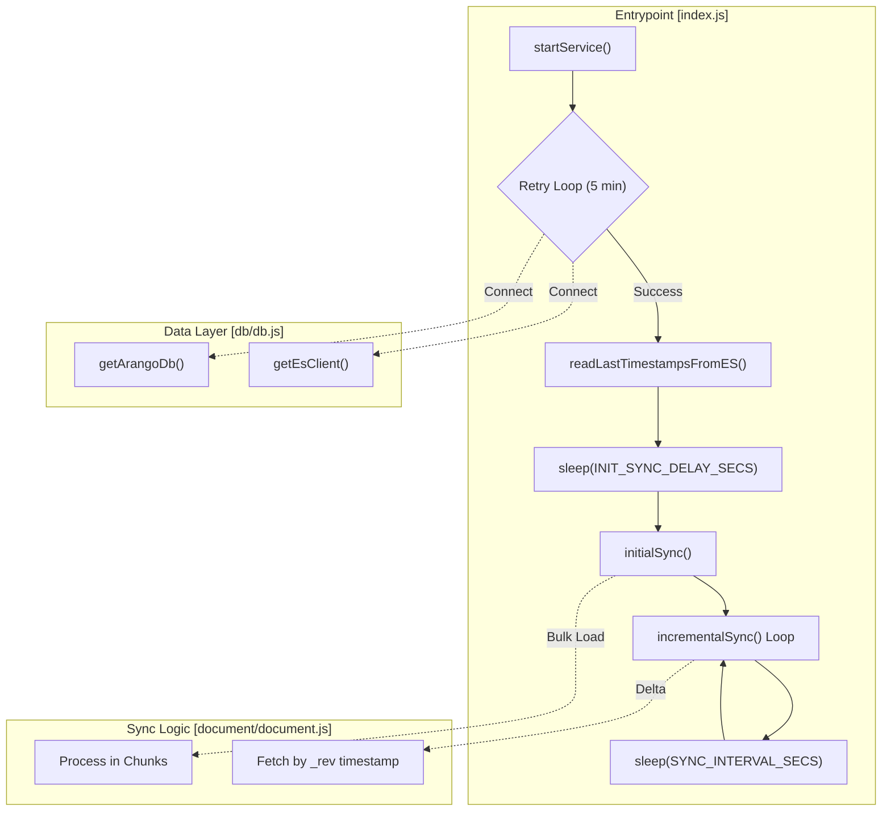
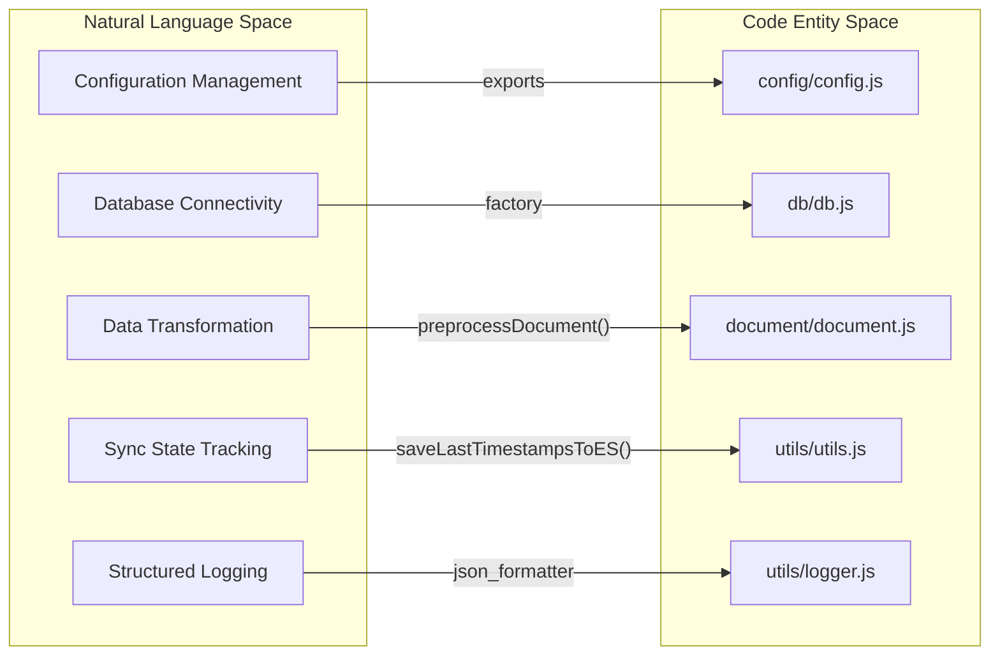

# Getting Started

<details>
<summary>Relevant source files</summary>

The following files were used as context for generating this wiki page:

- [README.md](README.md)
- [package-lock.json](package-lock.json)
- [package.json](package.json)

</details>


This page provides a comprehensive guide for setting up the Ingenium Data Sync Service in a local or development environment. The service is designed to bridge ArangoDB and Elasticsearch, ensuring data consistency through both initial bulk loading and continuous incremental updates.

## Prerequisites

Before beginning the installation, ensure your environment meets the following requirements:

*   **Node.js**: Version `14.0.0` or higher is required [package.json:32-34]().
*   **ArangoDB**: Version 3.7+ instance [README.md:36-36]().
*   **Elasticsearch**: Version 7.x or 8.x cluster [README.md:37-37]().
*   **Network**: Connectivity between the host running this service and the database instances [README.md:38-38]().

## Installation

To set up the project locally, follow these steps:

1.  **Clone the Repository**:
    ```bash
    git clone https://github.com/JPL-Devin/ingenium_data_sync_service.git
    cd ingenium_data_sync_service
    ```
    [README.md:43-46]()

2.  **Install Dependencies**:
    The project uses `npm` for package management.
    ```bash
    npm install
    ```
    [README.md:49-49]()

## Configuration

The service relies on environment variables for configuration. Create a `.env` file in the project root based on the following parameters:

### Database Connectivity
| Variable | Default | Description |
| :--- | :--- | :--- |
| `ARANGO_URL` | `http://127.0.0.1:18529` | Connection URL for ArangoDB [README.md:119-119]() |
| `ARANGO_USER` | `root` | ArangoDB administrative user [README.md:120-120]() |
| `ARANGO_ROOT_PASSWORD` | `password` | Password for the ArangoDB user [README.md:121-121]() |
| `ARANGO_DB_NAME` | `ingenium` | Target ArangoDB database name [README.md:122-122]() |
| `ES_HOST` | `127.0.0.1` | Elasticsearch host address [README.md:123-123]() |
| `ES_PORT` | `19200` | Elasticsearch REST API port [README.md:124-124]() |

### Sync Behavior
| Variable | Default | Description |
| :--- | :--- | :--- |
| `SYNC_INTERVAL_SECS` | `30` | Delay between incremental sync polls [README.md:125-125]() |
| `INIT_SYNC_DELAY_SECS` | `60` | Wait time before the first sync starts [README.md:126-126]() |
| `INIT_SYNC_TRIGGER_ELEM_COUNT` | `500000` | Threshold to switch to chunked sync [README.md:127-127]() |
| `INIT_SYNC_CHUNK_SIZE` | `100000` | Number of documents per bulk chunk [README.md:128-128]() |
| `LOG_LEVEL` | `info` | Minimum level for Winston logger [README.md:129-129]() |

**Sources**: [README.md:54-77](), [README.md:117-130]()

## Development Workflow

The project provides several `npm` scripts to facilitate development and testing.

### Available Scripts
*   `npm start`: Runs the service using `node index.js` [package.json:7-7]().
*   `npm run dev`: Runs the service using `nodemon` for automatic restarts on file changes [package.json:8-8]().
*   `npm test`: Executes the test suite using `jest` [package.json:9-9]().
*   `npm run lint`: Checks code quality using `eslint` [package.json:10-10]().
*   `npm run format`: Formats code using `prettier` [package.json:11-11]().

### Service Initialization Flow
The following diagram illustrates how the service initializes and enters its main execution loop.

**System Initialization and Lifecycle**

**Sources**: [package.json:7-8](), [README.md:105-114]()

## Implementation Details

The service is structured into modular components to separate concerns between database connectivity, data transformation, and state management.

### Component Map
The following diagram maps high-level system responsibilities to specific code entities within the repository.

**Code Entity Mapping**


### Core Logic Entities
1.  **`startService()`**: Located in `index.js`, this is the main entry point that manages the connection retry logic and orchestrates the transition from initial sync to incremental polling.
2.  **`initialSync()`**: Defined in `document/document.js`, this function handles the first-time migration of data from ArangoDB to Elasticsearch using bulk operations.
3.  **`incrementalSync()`**: Defined in `document/document.js`, this function performs periodic polling of ArangoDB for documents modified since the last recorded timestamp.
4.  **`preprocessDocument()`**: A critical transformation function in `document/document.js` that sanitizes date fields and removes internal metadata before indexing into Elasticsearch.

**Sources**: [package.json:5-5](), [README.md:105-114](), [README.md:161-169]()
