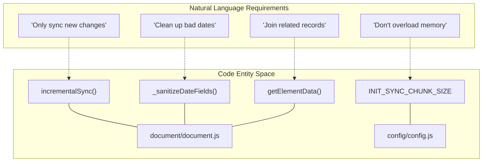
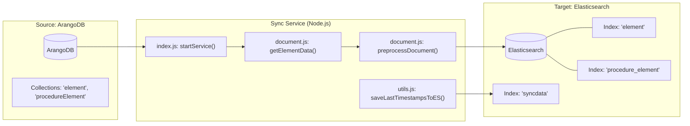

# Glossary

Relevant source files

The following files were used as context for generating this wiki page:

- [README.md](README.md)
- [config/config.js](config/config.js)
- [db/db.js](db/db.js)
- [document/document.js](document/document.js)
- [index.js](index.js)
- [tests/preprocess_example.js](tests/preprocess_example.js)
- [tests/rev_test.py](tests/rev_test.py)
- [utils/logger.js](utils/logger.js)
- [utils/utils.js](utils/utils.js)

This page provides a comprehensive reference of domain-specific terms, architectural concepts, and technical definitions used within the Ingenium Data Sync Service. It bridges the gap between high-level system requirements and the underlying implementation details.

## Core System Concepts

The following terms describe the high-level operational phases and data structures used to synchronize ArangoDB and Elasticsearch.

| Term | Definition | Code Reference |
|:---|:---|:---|
| **Initial Sync** | The one-time process of migrating historical data from ArangoDB to Elasticsearch upon service startup or when no state exists. | `initialSync` in [document/document.js:108-108]() |
| **Incremental Sync** | The continuous polling process that identifies and syncs only modified documents based on revision timestamps. | `incrementalSync` in [document/document.js:109-109]() |
| **Watermark** | A stored timestamp (derived from ArangoDB `_rev`) used to track the last successfully synchronized document for a specific collection. | `lastTimestamps` in [index.js:72-72]() |
| **Denormalization** | The process of enriching a document with data from related collections (e.g., joining `element` with `execution`) before indexing in Elasticsearch. | `getElementData` in [document/document.js:155-155]() |
| **Sanitization** | The cleaning of document fields (specifically dates and IDs) to ensure compatibility with Elasticsearch mapping requirements. | `preprocessDocument` in [document/document.js:58-58]() |

**Sources:** [README.md:105-114](), [index.js:72-88](), [document/document.js:58-212]()

---

## Technical Domain Terms

### ArangoDB Revision Decoding
ArangoDB uses a custom Base64-like encoding for its `_rev` (revision) field, which internally contains a nanosecond-precision timestamp. The sync service relies on decoding these strings to determine which documents are newer than the current watermark.

**ArangoDB Revision Alphabet:**
`-_ABCDEFGHIJKLMNOPQRSTUVWXYZabcdefghijklmnopqrstuvwxyz0123456789`

**Implementation Details:**
The decoding logic accumulates 6-bit values from the first 11 characters of the revision string to reconstruct the 64-bit integer timestamp.

### Sync State Management (`syncdata`)
The service maintains its state in a dedicated Elasticsearch index named `syncdata`. This allows the service to remain stateless; if the container restarts, it retrieves its last known progress from this index.

### Logic Flow: Natural Language to Code Entity Space

The following diagram maps the logical requirements of the synchronization process to the specific functions and files that implement them.

**Sync Process Mapping**

**Sources:** [document/document.js:5-141](), [document/document.js:155-212](), [utils/utils.js:8-35](), [tests/rev_test.py:4-48]()

---

## Component Definitions

### Configuration & Connectivity
*   **`ARANGO_COLLECTION_NAMES`**: An array defining which ArangoDB collections are targeted for synchronization. Defaults to `['element', 'procedureElement']` [config/config.js:6-6]().
*   **`getArangoDb`**: A factory function that initializes the `arangojs` driver with authentication and database context [db/db.js:12-20]().
*   **`getEsClient`**: A factory function that initializes the `@elastic/elasticsearch` client [db/db.js:22-24]().

### Data Transformation
*   **`DATE_KEYS`**: A nested array defining the paths to all date-related fields in the Ingenium schema that require sanitization [document/document.js:5-33]().
*   **`camelToSnakeCase`**: A utility used to transform ArangoDB collection names into Elasticsearch index names (e.g., `procedureElement` becomes `procedure_element`) [utils/utils.js:4-6]().
*   **`json_formatter`**: A custom Winston log formatter that ensures all service output follows a structured JSON schema for consumption by log aggregators [utils/logger.js:6-15]().

### System Architecture: Data Flow to Code Entities

This diagram illustrates how data flows from the source ArangoDB instance through the service's transformation logic into the target Elasticsearch indices.

**Data Flow Architecture**

**Sources:** [index.js:12-91](), [db/db.js:1-29](), [document/document.js:58-97](), [utils/logger.js:17-23](), [config/config.js:1-15]()
