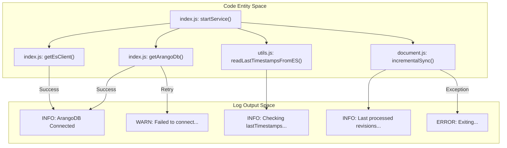
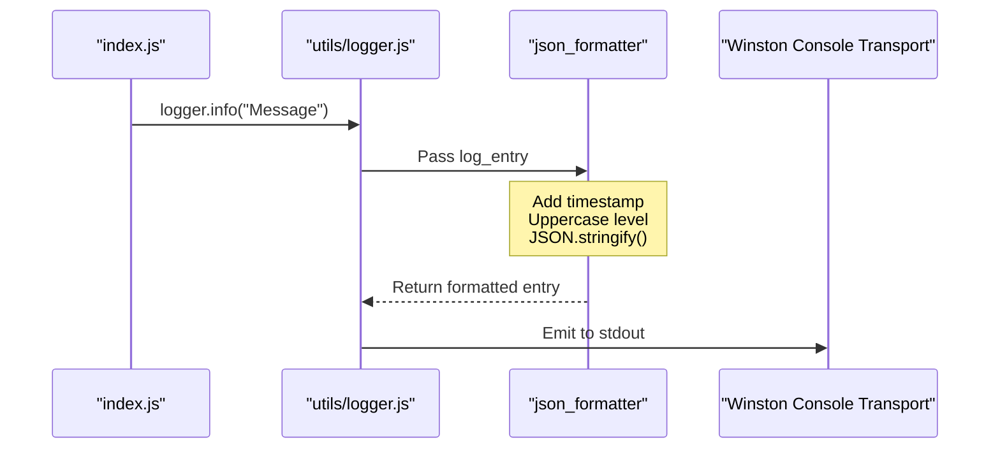

# Log Schema and Health Monitoring

Relevant source files

The following files were used as context for generating this wiki page:

- [index.js](index.js)
- [utils/logger.js](utils/logger.js)

This page documents the structured logging architecture of the Ingenium Data Sync Service, including the JSON output schema, key lifecycle events, and recommended metrics for operational health monitoring.

## Log Schema Implementation

The service utilizes the `winston` logging library to produce structured JSON logs suitable for ingestion by log aggregators (e.g., ELK stack, CloudWatch, or Splunk). The implementation is centralized in `utils/logger.js` [utils/logger.js:1-25]().

### Structured JSON Format
The `json_formatter` function ensures every log entry follows a consistent schema [utils/logger.js:6-15]().

| Field | Type | Description |
| :--- | :--- | :--- |
| `timestamp` | ISO8601 String | The precise time the log entry was generated [utils/logger.js:7-7](). |
| `level` | String | The log severity (e.g., "INFO", "WARN", "ERROR") in uppercase [utils/logger.js:8-8](). |
| `message` | String | The human-readable description of the event [utils/logger.js:9-9](). |

The formatter overrides the `winston` internal `MESSAGE` symbol to ensure the final output is a single-line JSON string [utils/logger.js:11-14]().

### Configuration
The logging level is controlled via the `LOG_LEVEL` environment variable, which is injected into the logger instance [utils/logger.js:4-18](). By default, the service uses the `Console` transport, directing all output to `stdout` for compatibility with containerized environments [utils/logger.js:20-22]().

**Sources:**
- [utils/logger.js:1-25]()
- [config/config.js:1-30]() (Reference for `LOG_LEVEL`)

---

## Log Event Lifecycle

The service emits specific log messages at each phase of its execution. Monitoring these logs allows operators to track the progression of data synchronization.

### 1. Connection Phase
During startup, the service attempts to establish connections to ArangoDB and Elasticsearch within a 5-minute timeout window [index.js:16-17]().

| Event | Level | Message Pattern | File Reference |
| :--- | :--- | :--- | :--- |
| Connection Attempt | `WARN` | `Trial: [n]. Failed to connect to [Service]: [Error]` | [index.js:30-30](), [index.js:44-44]() |
| Successful Connection | `INFO` | `[Service] Connected` | [index.js:28-28](), [index.js:42-42]() |
| Connection Failure | `ERROR` | `Failed to connect to [Service]. Exiting...` | [index.js:51-51](), [index.js:56-56]() |

### 2. Initialization and State Recovery
Before syncing, the service logs its configuration and recovers the last known synchronization state.

| Event | Level | Message Pattern | File Reference |
| :--- | :--- | :--- | :--- |
| Config Load | `INFO` | `Getting Collection Names [List]` | [index.js:61-61]() |
| Delay Period | `INFO` | `Waiting for [n] seconds before starting...` | [index.js:68-68]() |
| State Recovery | `INFO` | `Checking lastTimestamps from ES: [JSON]` | [index.js:73-73]() |

### 3. Synchronization Loop
During the infinite polling loop, the service provides visibility into its progress.

| Event | Level | Message Pattern | File Reference |
| :--- | :--- | :--- | :--- |
| Sync Progress | `INFO` | `Last processed revisions: [JSON]` | [index.js:83-83]() |
| Sync Error | `ERROR` | `Error lastTimestamps: [Error]` | [index.js:85-85]() |

**Sources:**
- [index.js:12-91]()

---

## Health Monitoring Metrics

Based on the emitted logs and service behavior, the following metrics should be monitored to ensure system health.

### Recommended Metrics Table

| Metric | Source | Significance |
| :--- | :--- | :--- |
| **Connection Status** | `ArangoDB Connected` / `ES Connected` | Indicates if the service can reach its data sources. |
| **Sync Lag** | `lastTimestamps` vs Current Time | The difference between the latest ArangoDB `_rev` timestamp and the current system time. |
| **Error Frequency** | Count of `ERROR` level logs | High frequency indicates issues with AQL queries, network stability, or document transformation. |
| **Retry Rate** | `Trial: [n]` log count | High retry counts suggest that the service is starting before its dependencies are ready. |

### Data Flow and Logging Diagram
This diagram illustrates how code entities trigger log events during the service lifecycle.

**Sources:**
- [index.js:12-91]()
- [utils/logger.js:6-15]()

---

## Logging Implementation Detail

The `json_formatter` acts as a middleware within the Winston pipeline. It transforms the internal log object into the final stringified JSON format before it reaches the `Console` transport.

**Sources:**
- [utils/logger.js:6-23]()
- [index.js:28-28]()
